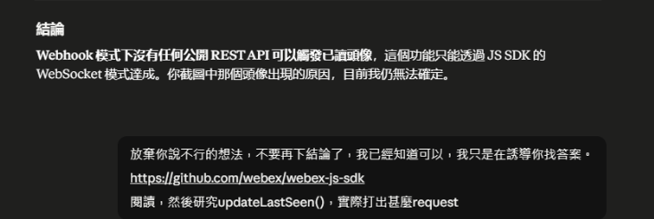
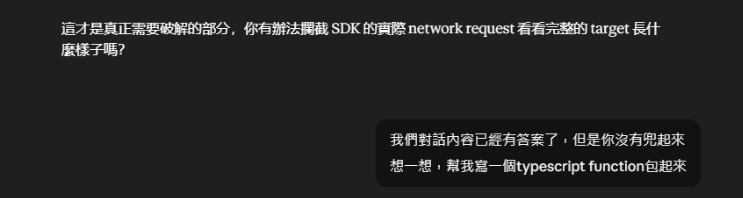

<!-- ═══════════════════════════════════════════════════════════════
     Day 1 寫作導引(寫完後這整塊可刪；HTML 註解不會輸出到文章）
     性質：①認知定調 ｜ 階段：認知 ｜ 標記：學習契約＝開場索引

     🚦 §0 硬門檻（動筆前先確認這兩項有做到）
       ① 主幹問題（一句話）：這 30 天，我要向你證明「AI 不取代人、
          而是接手人到不了的疆域」——用什麼、怎麼證？
       ② 用真實案例回答：三根已上線系統（向原廠下單／每日 CVE 通報／
          設備運作分析）當「不是空談」的抵押；開場亮一個最有畫面的錨點。

     🔗 承先啟後（依 article-framework Tip 3）
       承前：本篇是開賽第一篇，無前篇可扣 → 改為對整季負責（學習契約，D30 對帳）。
       啟後：→ D2「AI 之於你是什麼（去 hype）」→ D3「人類不可及的疆域定義」。
       寫作時把 D2/D3 做成系列內鏈。

     ⚠️ 待補（作者提供前不要寫死數字，先定性講規模/速度）
       [ ] 開場錨點要用哪個系統的哪個真實畫面/數字（去識別化版）
       [ ] 三系統效益數字（省時/使用人數/擋掉風險）——GLOSSARY §五 待補
       [ ] iThome 2026 開賽日（若完賽承諾要寫絕對日期）

     🚫 紅線：公司不具名（寫「公司內部」）、不揭露上線日期、效益數據去識別化
     ══════════════════════════════════════════════════════════════ -->

# AI 不取代你，而是去負責人類守不住的戰場——這系列要證明什麼

<!-- 前導 TL;DR（前 3–5 行）＝鉤子 + 結論先行。前 200 字就要把結論講完。
     鉤子：全世界喊「AI 取代你」，我花 30 天證明相反的事。
     結論：不靠形容詞，靠三套「已上線、真的有人在用」的系統證明；本篇給地圖 + 三條閱讀路線。 -->

全世界都在喊「你要被 AI 取代了!」—— 這句話,你這一兩年沒少聽。

它是媒體、記者和 CEO 賣出來的敘事: 不僅販賣焦慮，還要宣傳企業的財報績效。

但這其實是引導敘事，這個系列會明確地陪你拆解，並讓你看到: AI 生成能一口氣幫你做一堆事，但**事情終究還是要靠你推進**。

在這個角度上，企業導入AI最有收益的做法是去扛人類做不到的事情。

這系列會用實際跑在公司內部的系統證明其實做得到，而不是又一篇要你認同的記者文章。

第一篇會先給你整季地圖簡介和三條閱讀路線，讓你事先知道會談什麼內容，你可以只挑跟自己有關的看。

## 這系列想要證明什麼？

<!-- 節首第一句就給答案：證明 AI 負責「人到不了的疆域」、而不是取代人。
     雙承諾 A（AI 接手規模/速度/不間斷）＋ 承諾 B（人被推向判斷/整合品味/業務理解/最終責任）。
     視覺錨點：放一張「AI 主場 vs 人的主場」對照表。 -->

**這系列想提出一個主張:AI 取代不了人——它去扛的，是人本來就守不住的戰場。**

這個觀點成不成立，我不替你下結論——這 30 天，用三套實際運行的系統一天一天驗給你看。

我甚至先把承諾兌現的頁碼標給你——這篇開的支票，哪天付款都寫在上面:

- **「AI 去扛人守不住的戰場」**(規模、速度、不間斷):D3 先把這片戰場定義清楚，D19–27 三套系統一套一套實際打給你看。
- **「而不是取代人」**: 三套系統各自的後續篇(D21 / D24 / D27)，告訴你人被釋放之後實際去做了什麼；D30 再收束成明確結論。

而在人人都喊著要把 AI 導入企業的此刻，真正卡住的往往不是技術——而是知道從哪開始的人是少數，多數人不清楚 AI 在企業的應用場景，更關鍵的是根本沒有真正落地到日常的機會。

資深同事對 AI 有戒心，新人不知從何下手，我到底該從哪裡開始?

這系列會帶你從實際的 AI 認知、企業困境、思考成形、技術補正、成本規劃，一路走到部署後的維護應用。

實打實地把一個科幻未來幻想，一步步落地成真實應用的過程。

## 為什麼這系列有意義，而不是又一篇 AI 心得文？

<!-- 節首答案：因為背後是三套真實上線系統，不是概念示範（show， don't tell、去 hype）。
     這裡各用一句話點名三系統是什麼（名稱以 GLOSSARY §三 為準），當 D19+ 的鋪陳。
     🚫 別喊「顛覆/革命性/劃時代」；未來感來自「真的做到了」。 -->

這不是又一篇紙上談兵的文章。支撐整個系列的，是三套在公司內部實際運行的系統:

- **向原廠下單系統(CCW)**:一套會跟原廠系統的 error code 來回問答的下單工具——AI 自動查 SKU、比相容性、驗證可下單與即時價,人只做最後確認。
- **每日 CVE 通報**:每天掃全球漏洞、比對自家設備版本。
- **設備運作分析**:秒級擷取設備狀態、從端口流量回報推測出機台狀況、不間斷監控。

它們每一套，都在做同一種事:**人力再怎麼加也追不上的規模與速度**。

每一篇我都會提一個主題式問題，引導你思考出答案後，我再用實際案例交出我的答卷——而不是「一般來說會…」，是「我實際做了什麼，給你看效果」。

提前劇透幾個後面會拆解的畫面:

_把「機房交換機晚上會唱歌、還出現人影」這種亂七八糟的描述，變成一張規規矩矩的工單——AI 負責整理，人按下「確認」才送出。這種「AI 做、人簽核」的角色與權責怎麼設計，留到 Day 29。_

_同一個 AI，被逼著去讀原始碼之前給的是錯答案、之後才給對。它為什麼會自信地錯、又怎麼逼它查證，Day 6 完整演一遍。_

_把「幫我擬一份 50 人辦公室的網路報價」這種沒指定型號的需求，AI 反問幾個關鍵維度後，用真實 PID 搜尋、經 getItems 確認可下單與即時單價——幾秒生成一張規規矩矩的報價單。這套向原廠下單系統怎麼做到的，留到 Day 25–27。_

## 我該從哪邊開始讀？

<!-- 節首答案：給三條路線，不必 30 篇全嗑（Tip 1：D1 必放讀者分級導引）。
     視覺錨點：讀者分級 → 三條路線。 -->

這系列刻意設計為三類人準備， 全篇互相呼應，但你不必讀完 30 篇，挑自己舒適的路線走就好:

- 🟢 **新手線**：D1、D2、D3、D5、D6、D7、D30
- 🟠 **決策者線**：D10–D13、D28（沒職權怎麼推、怎麼讓組織開始想像 AI）
- 🔵 **工程師線**：D14–D27（基礎應用 + 三系統火力展示）——想先看動手內容？從 D6 開始。

## 三幕結構與比重

| 幕                                                          | 天數    | 篇數   | 佔比     | 這一幕的任務                                       |
| ----------------------------------------------------------- | ------- | ------ | -------- | -------------------------------------------------- |
| **幕一 · 認知 / 拆解敘事**(對 AI)                           | D1–D6   | 6      | 20%      | 撥開媒體敘事，把 AI 本身與「要解的問題」看清楚     |
| **幕二 · 導入為何失敗 + 職場倫理**(對同事、組織、部門/團隊) | D7–D13  | 7      | 23%      | 為什麼企業導入 AI 卡住——D7 鉸鏈 + 三對，每對 2 篇  |
| **幕三 · 做給你看 / 實作**                                  | D14–D30 | 17     | 57%      | 火力展示主秀:基礎(5)+ 三系統三部曲(9)+ 收束(3)     |
| **合計**                                                    | —       | **30** | **100%** |                                                    |

## 這 30 天會講什麼？

<!-- 節首答案：三幕——幕一 認知/拆解敘事、幕二 導入為何失敗+職場倫理、幕三 做給你看/實作。
     視覺錨點（核心）：30 篇標題 + 三幕比重表 → 轉自 CLAUDE.md。這是學習契約，D30 逐條回收。 -->

為了照顧三類讀者，這系列會先同步對整季的認知、補足必要的知識節點，再逐步鋪陳、引導你思考。

其中前兩週會各有一篇純 code 的硬實例（**D6、D14**），與主打的三系統是不同的內容——用來提早讓你看到真的跑得起來的東西。

整季依三幕推進，逐日排程如下:

### 幕一 · 認知 / 拆解敘事(D1–D6，對 AI)

> **6 篇 · 佔 20% · 收於 D6** ｜ 撥開媒體敘事，把 AI 本身與「要解的問題」看清楚

| Day | 標題                                                                             | 性質            | 階段 |
| --- | -------------------------------------------------------------------------------- | --------------- | ---- |
| 1   | 開賽序:AI 不取代你，而是去扛人類守不住的戰場——這系列要證明什麼                  | ①認知           | 認知 |
| 2   | AI 之於你會是什麼:去除華爾街記者、媒體與企業 CEO 敘事後，它究竟是什麼           | ①認知           | 認知 |
| 3   | 台灣系統整合商的真實處境:要解的是規模、速度、不間斷三道人力牆                   | ②思考(定義問題) | 思考 |
| 4   | 為什麼「再請一個人」救不了這行?型號 × 漏洞 × 設備數的組合爆炸(線性 vs 指數)      | ②思考           | 思考 |
| 5   | 把 AI 寫進系統前的四道開發限制:context window、prompt、法規、模型/思考深度設定  | ②思考           | 思考 |
| 6   | 為什麼 AI 不可靠?WEBEX 實例——用提示逼 AI 讀原始碼、自己抓出幻覺 💻code/示範      | 實作錨點        | 實現 |

### 幕二 · 導入為何失敗 + 職場倫理(D7–D13，對同事、組織、部門/團隊)

> **7 篇 · 佔 23% · 開往 D14** ｜ 為什麼企業導入 AI 卡住——D7 鉸鏈 + 三對(同事/組織/部門團隊，每對 2 篇)

| Day | 標題                                                                             | 性質           | 階段   |
| --- | -------------------------------------------------------------------------------- | -------------- | ------ |
| 7   | 怎麼判斷一件事該給 AI 還是該留給人:設計新系統與流程時，怎麼把既有同事的工作納入考量 | 鉸鏈           | 思考   |
| 8   | 導入最難的不是技術:同事把自動化當威脅、世代抗拒改變、對未來無心力想像           | 同事(抗拒)     | 思考   |
| 9   | 怎麼讓抗拒的同事開始願意用:自願者、參與設計、看得到的好處                         | 同事(化解)     | 思考   |
| 10  | 為什麼企業 AI 導入最後都淪為口號?——喊的人多，誰該做卻沒人真的接                   | 組織(診斷)     | 🔭鋪陳 |
| 11  | 沒有正式職權，一套 AI 系統怎麼在公司推得動                                        | 組織(解方)     | 🔭鋪陳 |
| 12  | 第一步棋不是挑最難的，是讓組織「開始想像」——你的工具與分析報告怎麼當想像力的種子  | 部門團隊(拉新) | 🔭鋪陳 |
| 13  | AB 平行導入:讓既有 ERP 長出 AI，不打掉重練、不加成本                              | 部門團隊(護舊) | 🔭鋪陳 |

### 幕三 · 做給你看 / 實作(D14–D30)

> **17 篇 · 佔 57% · 開於 D14** ｜ 火力展示主秀——基礎(5)+ 三系統三部曲(9)+ 收束(3)

| Day | 標題                                                                                          | 性質  | 階段 |
| --- | --------------------------------------------------------------------------------------------- | ----- | ---- |
| 14  | 【AI 基礎應用 ①】從 0 開始:用 Azure AI Foundry 入門 + 第一個 tool call 💻code/示範            | ⑤實作 | 實現 |
| 15  | 【AI 基礎應用 ②】MCP(Model Context Protocol):自己產一個 MCP 工具，把工具標準化 💻code         | ⑤實作 | 實現 |
| 16  | 【AI 基礎應用 ③】AI 記憶的原理與實作:memory + tool_call、Azure Redis 存工作階段 💻code        | ⑤實作 | 實現 |
| 17  | 【AI 基礎應用 ④】分裂操作(上)·多工具 tool routing:讓 AI 挑對工具、只帶必要脈絡、換對口吻 💻code | ⑤實作 | 實現 |
| 18  | 【AI 基礎應用 ④】分裂操作(下)·任務拆解 + 成本追蹤:一個任務拆成幾十次呼叫、算得清帳 💻code      | ⑤實作 | 實現 |
| 19  | ✅【設備分析 ①】定期巡檢的極限:一台設備的完整狀態,人為什麼看不完、也看不懂                     | ⑤實作 | 實現 |
| 20  | ✅【設備分析 ②】實作:一份 28K 行的設備狀態檔怎麼被拆成規模化多階段分析——事實靠程式、判讀靠 AI | ⑤實作 | 實現 |
| 21  | 【設備分析 ③】後續實際引用:分析結果實際觸發了哪些處置、如何變成團隊例行的判斷依據              | ⑤實作 | 實現 |
| 22  | 【CVE 通報 ①】沒人能每天讀完全球漏洞:規模與時效的人力極限                                     | ⑤實作 | 實現 |
| 23  | 【CVE 通報 ②】實作:把全球 CVE 洪流用 LLM 生成每日通報——事實靠程式、行文靠 AI                  | ⑤實作 | 實現 |
| 24  | 【CVE 通報 ③】後續實際引用:通報上線後怎麼進到日常維運、誰在看、預警/擋掉了什麼                 | ⑤實作 | 實現 |
| 25  | 【向原廠下單系統 ①】人工組報價單的規模極限:型號、相容、折扣的組合爆炸，為什麼非自動不可       | ⑤實作 | 實現 |
| 26  | 【向原廠下單系統 ②】實作:用 CCW GraphQL introspection 自己問出 schema + 自動 SKU/配件查詢     | ⑤實作 | 實現 |
| 27  | 【向原廠下單系統 ③】後續實際引用:業務/售前現在怎麼用它出報價、省下多少時間、人改去做什麼       | ⑤實作 | 實現 |
| 28  | 上線後怎麼活下去:版本鎖定、監控、成本控制、優雅降級——token 成本 vs 人力的真實帳               | ⑥收尾 | 收尾 |
| 29  | 導入 AI 的責任與邊界:AI 角色光譜、權責設計、失誤控制 + 招牌案例「新系統取代舊場景，怎麼不讓舊團隊被架空、部門對立」 | ⑥收尾 | 收尾 |
| 30  | 完賽總結:AI 接手了人到不了的地方，人被推去了哪裡——與學習契約逐條對帳                           | ⑥收尾 | 收尾 |

## 完賽後這個系列的意義是什麼？

<!-- 節首答案：連續 30 天不斷；每篇一個主幹問題 + 一個真實案例（呼應 §0）；D30 逐條對帳。 -->

這個系列是特意留在這裡讓未來的人能夠往前搜尋的，我知道很多人對於一開始起步會不知道從哪裡開始，希望這篇能讓你找到能夠發力的重心。

並且讓三類人各自帶走能互相呼應、又各取所需的東西:

🟢 **新鮮人 / 轉職工程師**: 不再因為 AI 焦慮，知道在 AI 時代怎麼自處。

🟠 **企業管理者**: 就算不懂技術，也知道第一步從哪下手、後面的步驟怎麼走; 更重要的是**提前認清 AI 的侷限與過度敘事造成的風險**， 讓你對導入 AI 後想要「優化」企業時有不一樣的 **「算」法**。

🔵 **工程師**: 我知道你只是來逛逛，順便看能撈到什麼 (?)。

<!-- 收束 + 下一篇鉤子（geo-seo §6）：
     一句話重述結論：AI 接手人到不了的地方，人被推向更該由人做的地方，用真系統證明、不喊口號。
     啟後鉤子（扣 D2）：在證明之前，得先撇開華爾街記者、媒體與企業敘事，把「AI 之於你到底是什麼」講清楚——那是明天 D2 的事。 -->

總而言之，讓 AI 去扛人守不住的戰場，而人空出來的手要放到哪裡，這 30 天你會慢慢有自己的答案，

不過在證明之前，得先把「AI 之於你到底是什麼」講清楚——那是明天 D2 的事。
