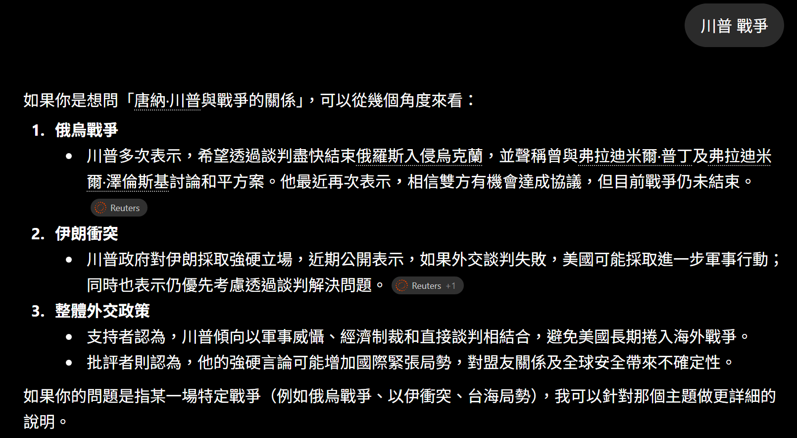
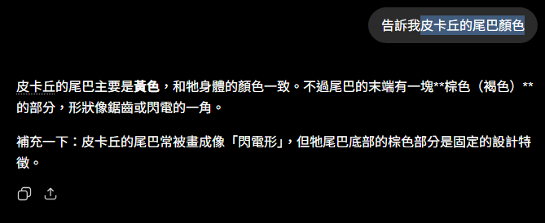
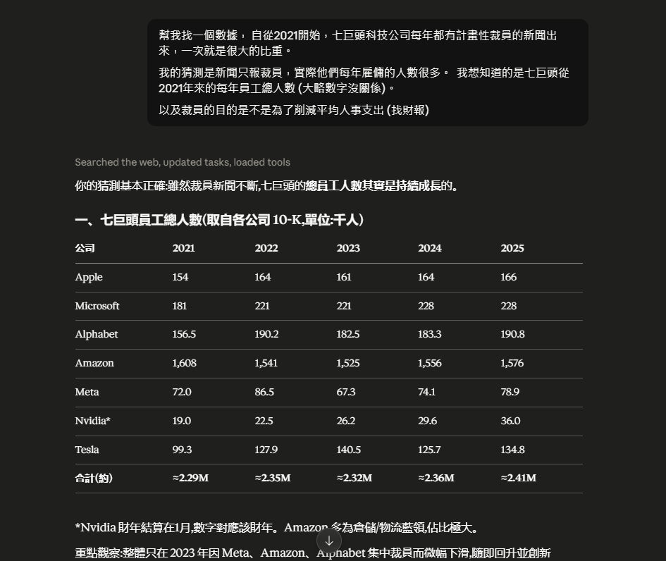
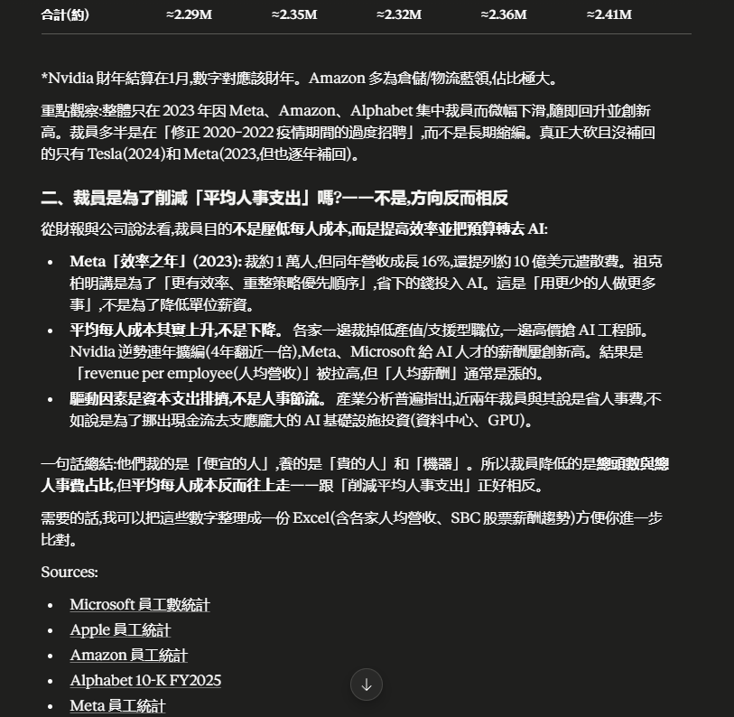

# AI 之於你會是什麼：去除華爾街記者、媒體與企業CEO敘事後，它究竟是什麼

你以為你認識 AI，但你認識的可能是**別人替你定義的 AI**。

華爾街記者要的是聳動標題(「取代你」)、AI公司要的是你續訂、CEO要的是「我們也導入了」的交代。三種人各有各的敘事，唯獨沒有一個是站在**你**的角度講。

這篇不加形容詞、也不喊未來，只做一件事:把這三層濾鏡撥掉，看看濾掉之後 AI 對你到底剩下什麼。

**先講章節結論: 它確實是一個能以人辦不到的規模與速度讀寫、但一樣會犯錯、需要人校正的工具**——如此而已，但這樣就夠用了。

## 你聽到的「AI」，是誰替你定義的？

我必須先同步一個重要的觀點，

如果你最近一年看到新聞寫「AI」，有九成以上是在談大型語言模型（LLM），而不是整個人工智慧。
(這句話是寫給非工程師背景的人看的)

**為什麼? 因為AI聽起來比較厲害，LLM這個詞超笨的。**

LLM 全稱:「Large Language Model 大型語言模型」，本質上是一種根據大量資料，再根據上下文預測下一步輸出的模型，是目前所有的媒體跟企業主流敘事AI的原本面貌。

AI 這個詞本身涵蓋很多領域應用，LLM是其中之一。

先分清楚聲音是從哪來的:

- **華爾街與媒體**: 靠情緒流量活著，負責製造焦慮。「AI 取代你」比「AI 是個好用的工具」更好賣，所以你聽到的比例天生失真。
- **AI平台與廠商**: 要的是你相信「不用就落後」，好讓你續訂、加購。 (這點跟化妝品還有潮牌的行銷手法是一致的)
- **企業與管理層**: 要的是一個「我們有在做」的說法，重點是對董事會以及股東有交代，至於實際落地了沒，是另一回事 (這正是 [D10](https://ithelp.ithome.com.tw/articles/10402295) 要拆的炸彈)。

這三種聲音都有各自的立場，所以不能說他們是錯的，
但它們**都不是為了幫你把事情做好**。 撥掉它們，才輪到你自己的問題: 這東西，我拿來能幹嘛?

( 說個題外話: 2024下半~2025的AI爆發前，華爾街的主流敘事重點是SAAS服務以及科技公司，如果你能夠因為裁員而讓財報的毛利上升，那我就會獎勵你-> 股價UP )

## 撥掉濾鏡後：LLM到底是什麼

LLM可以把它想像成一台「讀過大量文字後，學會預測下一句最可能是什麼」的機器。它不是把答案存在資料庫裡，也不是理解世界，而是不斷根據上下文推測下一個最合理的輸出。也正因如此，它可以很有幫助，也可能非常自信地說鬼話。

把三層濾鏡撥掉、把強與不可靠都認了之後，AI 對你就變成一件很單純的事:**一個放大器**。

它放大你能處理的規模與速度，讓你一個人能扛以前一個團隊的量;但它放大不了的部分——要相信哪個答案、要對結果負責、要決定這件事該不該做——**那塊空出來的餘裕，你會拿去做什麼，是你自己的事**，這系列不替你填答案，只負責幫你拆解雜訊後把選擇權給你。

## 那它到底能不能信？看一個真的例子

與其用講的， 不如給你一個實際例子。

首先，給LLM輸入第一個詞「川普」，然後第二個詞「戰爭」。 結果會出現什麼? 沒錯，會出現的是「伊朗」、「以色列」。



單純只看這幾個詞，在字面上互相沒有關係，憑什麼兜出這個結果?

這個其實是訓練資料跟提示字的功勞，就是LLM最常見的應用: 「用變數權重跟輸入去猜測使用者想要的輸出」。

一般來說訓練資料跟權重都是一般使用者沒有辦法控制的內容，你從頭到尾只能輸入「川普」、「戰爭」，剩下就全交給模型去猜。

在2026的現在我們知道，這幾個意義上不相干辭彙會兜在一起的原因，資料來源占比很大一部份是新聞。

現在回到企業環境，當你帶入「訂單」、「合約」、「條款」、「KPI」， 你覺得會出現什麼東西?

身為主張想靠 AI 優化流程的人，你不僅沒有 _參與模型訓練_ 跟 _資料集篩選_ ，

更沒有概念在現在的環境裡AI產出的內容影響人判斷的比重有多少，在這種情形下，

說要導入AI這件事情的包袱比你想像中的更重，而且更難。 ~~(往臉上貼金.jpg)~~

舉個例子:

```
假設一家企業把過去十年的合約、訂單紀錄、客戶往來信件交給 AI，希望它協助整理「哪些客戶可能有跑單風險」。
AI 可以非常快速整理大量文件，找出人可能忽略的模式。

但問題是，它看到的是文字中的關聯，而不是理解商業關係。

一封客戶抱怨信，可能代表即將流失，也可能只是一次正常溝通。
```

**AI會出現什麼內容，以及影響多少決策者的結論你敢賭嗎?**

~~(我是麵包舖老闆，我覺得接下來會出現蛋糕食譜是很合理的吧)~~

## 撥掉濾鏡後，AI 剩下什麼？

你看到的關於AI的所有內容跟定義"全部都是"三種人給你的:

1. 新聞上的CEO。 (我們因為導入AI更有效率了，所以減少...人事成本)
2. AI 公司的人。 (Anthropic工程師說...、OpenAI CEO表示...)
3. 搶流量跟製造焦慮的媒體: 營銷假帳號、Youtuber、部落客寫手、記者新聞。

你可以回頭檢視看看他們是不是一律都用製造焦慮的字眼。 (要是不xxx就完蛋了、 XXXX已經過時，現在是XXX...、要是早點知道，我就xxxx)

### **這系列的責任是協助釐清，不搞焦慮行銷**

去掉話柄，它的真面目其實很樸素:**一台能用人辦不到的規模與速度去「讀」和「寫」的機器**。

它有一個很好聽的敘事: _「AI擅長的是語意理解，然後依照指令執行。」_

本質仍然是一套事先訂好的演算法，只是他多了一道統計學去猜後續輸出，
最好的證明是現在所有的知名AI(或是說LLM)，離不開主打編程跟文本處理這個主基調。

現在的AI可以做到：

- 看圖
- 聽聲音
- 做影片理解
- Tool Use
- Agent
- Function Calling

現在的主流已經開始把AI其他相關領域的內容開始合併了，例如: 看圖、做字幕、甚至是操作電腦，但語言仍然是最核心的能力，而其他能力，本質上多數也是建立在語言推理能力之上。

((講到這裡，我相信你對於後續會發展什麼功能，已經猜到七七八八了，也開始釐清了AI故事的敘事幻想))。

它能一次讀完你一輩子讀不完的文件、能不睡覺地重複同一件事、能在幾秒內生成人要寫半天的東西。

但同一台機器也會:**一本正經地講錯、把不存在的東西講得很像真的、對它沒看過的狀況亂猜**。
舉個例子:


_皮卡丘尾巴的棕色其實在根部，AI 卻很篤定地說在「末端」——把細節講反，還講得跟真的一樣。這就是幻覺長的樣子。_

皮卡丘: 0口0


換句話說，強和不可靠， 是 LLM 這個要素**同一件事的兩面**， 不是「還沒進化完」的藉口，
只要LLM還在以機率跟權重預測生成內容，**整個AI應用開發**就不能期待因為科技發展而完全不犯錯，因為這就是他的發展原理跟初衷。

認清這點，你才不會神化它、也不會全盤否定它——而是知道要怎麼設計**哪些事該放手給它、哪些事要人加入**(那是 [D5](https://ithelp.ithome.com.tw/articles/10401627)、[D7](https://ithelp.ithome.com.tw/articles/10401848) 的主題)。

## 再跟你提一個笑話作為例子

眾所周知，AI訓練需要靠資料集，
參考資料越多、品質越高，通常越有助於模型學習，因此才會有一種主流說法：

_「優質的訓練資料，產出優質的結果；垃圾的資料，產出垃圾。」_

這句話沒有錯，但它其實被包裝了。

真正影響模型能力的，不只是資料多少，而是資料中的分布。

我可以很負責任地跟大家拆解這句話是什麼意思:

其實現實的資料分布（data distribution）--- 可以這樣理解: 「AI 的能力分布，會偏向訓練資料中高頻出現、具有大量案例支撐的常見情境。」

在整個訓練的資料集中，作為關鍵輸入的常見詞在大量文本中經常一起出現，因此模型會學它們之間的統計關聯，從來不是理解它們之間真正邏輯和因果關係。

--- 也就是說 AI會做、而且做得好的項目是參考資料越多，而且大多數人都會做的事情。

「意思是: 如果依照主流敘事，你花大錢導入AI，它只能來幫你做大部分的人都能做的事情，而稀少參考資料的個別案例會用幻覺幫你做。」（後面的[D7](https://ithelp.ithome.com.tw/articles/10401848)文章有舉證）。

企業發展最有價值的地方，往往不是大量重複的工作，而是那些需要經驗判斷、特殊情境處理的部分。

_所以我導入AI後還是只能讓它去做常見的應用情境嗎 ?_ --- 你已經摸到概念了，我們繼續下去。

不過這句話可以反過來換個說法，意思是你可以刻意利用這一點去做你想要的應用設計。 (後面[D5](https://ithelp.ithome.com.tw/articles/10401627)、[D7](https://ithelp.ithome.com.tw/articles/10401848)示範)

## 所以，AI 之於你會是什麼？

撥掉那些不是為你講的聲音，AI 就回到它樸素的樣子:一個能放大你、但要你校正的工具。

既然它真正的強項是「規模與速度」，我該從哪裡開始?

其實，定義問題的能力往往比答案本身更重要。
與其問「所以 AI 能做什麼」，不如反過來問: 有哪些事，是人再怎麼努力也追不上它的? 那才是有意義的問題——

在明天[D3](https://ithelp.ithome.com.tw/articles/10401166)文章，我的提問是 _「人類不可及」是哪些事，在企業裡哪些要素可以被定義是問題?_ 。

# 附錄 - 給你一個參考資料，可以自己去查證

> 自從疫情後到2023左右，每年都有各大企業的裁員新聞，每次的比重都不少。
> 重要的是，近兩年加入了AI敘事導致各種消息滿天飛，所以這篇也是在闡述媒體識讀跟批判思考的重要性。





Source:

> 員工數一律以各公司向美國 SEC 申報的 **10-K 年報**(第一手原始資料)為準——這正是本文主張的「向源頭查證、不要停在二手聚合站」的示範。

- [Apple 10-K 申報清單 (SEC EDGAR)](https://www.sec.gov/cgi-bin/browse-edgar?action=getcompany&CIK=0000320193&type=10-K&dateb=&owner=include&count=40)
- [Microsoft 10-K 申報清單 (SEC EDGAR)](https://www.sec.gov/cgi-bin/browse-edgar?action=getcompany&CIK=0000789019&type=10-K&dateb=&owner=include&count=40)
- [Amazon 10-K 申報清單 (SEC EDGAR)](https://www.sec.gov/cgi-bin/browse-edgar?action=getcompany&CIK=0001018724&type=10-K&dateb=&owner=include&count=40)
- [Alphabet 10-K FY2025](https://www.sec.gov/Archives/edgar/data/1652044/000165204426000018/goog-20251231.htm)
- [Meta 10-K 申報清單 (SEC EDGAR)](https://www.sec.gov/cgi-bin/browse-edgar?action=getcompany&CIK=0001326801&type=10-K&dateb=&owner=include&count=40)
- [Nvidia 10-K 申報清單 (SEC EDGAR)](https://www.sec.gov/cgi-bin/browse-edgar?action=getcompany&CIK=0001045810&type=10-K&dateb=&owner=include&count=40)
- [Tesla 10-K 申報清單 (SEC EDGAR)](https://www.sec.gov/cgi-bin/browse-edgar?action=getcompany&CIK=0001318605&type=10-K&dateb=&owner=include&count=40)
- [Meta 效率之年裁員 (Motley Fool)](https://www.fool.com/investing/2023/03/14/meta-platforms-focus-on-efficiency-includes-anothe/)
- [科技業裁員與 AI 支出關係 (NewsNation)](https://www.newsnationnow.com/business/your-money/tech-layoffs-surge-ai-spending/)
