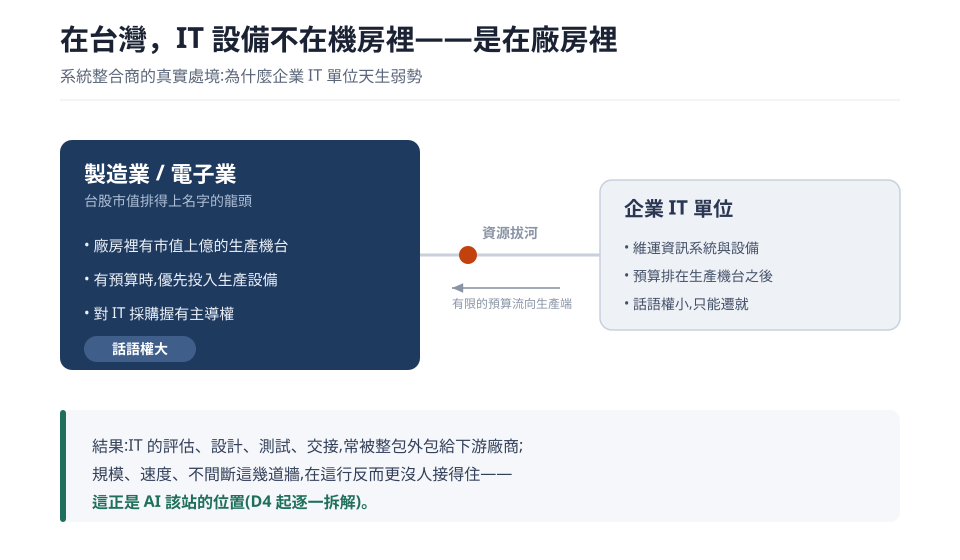

<!-- ═══════════════════════════════════════════════════════════════
     Day 3 寫作導引(寫完後這整塊可刪；HTML 註解不會輸出到文章）
     性質：②思考（開場重拳，把「人類不可及」立起來）｜ 階段：思考 ｜ 分級：🟢 新手友善

     🚦 §0 硬門檻（動筆前先確認這兩項有做到）
       ① 主幹問題（一句話）：「人類不可及」具體是哪些事？它長什麼樣？
       ② 用真實案例回答：剖析台灣 SI 產業現況 → 把問題收斂到規模/速度/不間斷三道人力極限
          （不間斷在這行 = 人員輪替的交接斷點/知識留不住；無疲勞非本篇重點，讓給 D19 設備分析定義）。

     🔗 承先啟後（依 article-framework Tip 3）
       承前：D2 把 AI 還原成「規模與速度的放大器」→ 本篇正面定義那片
             「定義問題」的疆域是什麼。
       啟後：→ D4「這行實際撞到的規模牆(組合爆炸)」把疆域落到系統整合商
             → D5「交給 AI 前先認清極限」。做成系列內鏈。

     🚫 紅線：公司不具名、不揭露上線日期、數據去識別化
     🧭 認知鐵則：講「AI 負責什麼(規模/速度)」可具體；講「人被推向哪」留白
     ══════════════════════════════════════════════════════════════ -->

# 「人類不可及」是哪些事？規模、速度、不間斷——系統整合商 AI 的真正戰場

<!-- 前導 TL;DR（前 3–5 行）＝鉤子 + 結論先行。
     鉤子：這行大家賣一樣的設備、比一樣的價，最後只能削價；能拉開差距的，是做得到對手做不到的事。
     結論（因果鏈）：導入 AI 前要先看懂自己的產業；看懂之後會發現，這行真正卡住的是規模、速度、不間斷(在這行 = 人員輪替的交接斷點、知識留不住)
                   這幾道「人再怎麼加班加人也追不上」的極限——而讓 AI 先去扛這道極限，長出來的能力就是延續與差異化的手段。 -->

D1 說要證明「AI 負責人到不了的地方」，D2 把 AI 還原成「規模與速度的放大器」。今天要回答的是:在你自己的產業裡，那片「人到不了的地方」具體長什麼樣?

先講結論:**導入 AI 不是先挑工具，是先看懂自己的產業**。看懂之後你會發現，這行卡住的往往不是誰不夠努力，而是規模、速度、不間斷這幾道人力極限——人再怎麼加班、加人都追不上;而在這行，「不間斷」現形為人員輪替的交接斷點、知識留不住。而**讓 AI 先去扛這道極限，長出來的就是同業一時做不到的能力**:那正是在削價競爭裡拉開差距、活得比別人久的地方。

所以這篇不談抽象口號，我拿自己所在的「系統整合商」當實例，走一遍 **剖析產業 → 定義問題 → 指出 AI 該接手哪一段** 的完整過程。你的產業未必跟我一樣，但這套「先看懂、再定義」的方法，你可以搬過去自己套。

_也請同業的大佬提出我見解不對的地方。_

## 台灣系統整合商現況

系統整合商(解決方案整合商)，這個概念本質是高知識人才集中的代名詞。

但是在台灣有一個很有趣的現況，我稱之為"綜合條件下的妥協"。

在產業本身因為硬體與產品代理毛利長期被原廠控制的情況下，逐漸朝「賣軟體授權」或「賣加值服務」(賣人)情況發展，

所以現今大多系統整合商對於IT資訊設備 (網路設備、伺服器....等) 的態度是把工作當引進國外商品的概念。

比較難聽的說法是把自己當 **「水貨商」**來經營。 (我最多幫你安裝、更新、維修、換新.... 啪，沒了)

> 台灣的資訊服務商,大致可以歸成三種經營模式(抽象化,不指涉特定公司):

- **代理投資型**: 技術問題外包原廠、員工以業務為主，公司經營重心偏向投資佈局(到處插股相似產業)。
- **外包零售型**: 不自養工程師、技術以外包為主，專心接大單或轉手國外代理貨品，主業更像大資本的通路零售。
- **精管高流動型**: 走高度集中、精細管理的風格，人員流動快、平均年資偏短。

重要的是，讀完本篇的分析你會發現:這三種選擇，其實都是被下面那個結構逼出來的、非常合理的經營決策。

## 為何會如此? 台灣獨步於全球、獨特的 IT 困境

眾所周知，IT科技產業或是說資訊設備是高門檻跟高毛利的代表，尤其是需要有自用機房設備資訊的產業，其所需要的資本數額非常大。

但是台灣有更強勢的產業，沒錯就是**製造業**，嚴格說起來是**電子業**以及**電子零組件**那一票在台股市值上排得出名字的龍頭公司，

(在台灣，IT設備不是在機房裡，是在廠房裡的呢)

所以導致了大多進口國外資訊設備的 **「水貨商」**，業績比重很大一部份在 製造業、金融業、保險人壽業。

> 那這樣有什麼問題呢?

這點導致了有個很有趣的現象，就是IT單位在製造業其實是弱勢，當公司有資金或是預算的時候優先投入的肯定都是市值上億的生產機台。

(所以IT單位大多情況的話語權沒有製造端大聲)

但是公司要營運，實際的需求現狀大家也都知道都是需要資訊系統跟設備的，所以造就了很獨特的台式遷就文化。

> IT單位跟製造單位出現了搶資源的拔河情況。

這樣間接導致了什麼結果呢 ?

## 這個結構,逼出三個「待不久」

這些前提導致的現狀，沒辦法用 A→B 這樣線性推導出來——它逼出了三個環環相扣的「待不久」:

1. 客戶方的採購窗口待不久:　

這點其實很有趣，平均每２年會換人，因為IT設備是高成本的投入設備，所以能夠作為採購窗口負責人的門檻本來就相對很高。
而IT技能天生也是高門檻的代表，所以這幾年造就了把評估、設計、測試、報告 直接給下游廠商全部代償的甩鍋奇特現象 (當然這些是加錢的好藉口)。

2. 公司業務待不久:

呈接上題，IT技能天生是高門檻的代表，所以解決事情跟能夠和客戶侃侃而談的能力是非常少見的，
最常見的也都是客戶直接跨過不懂情況的業務去找工程師的例子。

這些都需要經驗累積，沒有Sense的業務其實倒得很快。 近五~十年因為"科技業"這三個字的Title太響亮了，幾乎跟高薪畫上等號，所以一窩蜂都是轉行業別的業務或是白紙新人業務。

3. 原廠科技公司人員自己也待不久:

欸? 沒想到吧?

真正的主因其實是近期美股的風氣 (從2020到2024年的SaaS投資風潮)、以及近兩年 (2025-2026現今-AI狂熱)，
以及為了爭取AI資本支出進行資金競爭的取捨，導致的情形，
因為華爾街會獎勵你關於AI項目的推動、加上裁員導致的財報單位時間毛利上升、AI資本支出敘事 (見D2附錄)。

成因人人各有說法，這裡不細究。重點是:連最上游、資源最多的原廠自己都會震盪。

我碰過的一個例子——原廠推的新版合作夥伴認證計畫，原本預計某年全面換標上路，後來卻因為原廠自己的組織調整而不了了之，計畫本身就中斷了。**連原廠的推動計畫都會因組織變動而斷掉**——這正是「不間斷」在這行的另一個形狀:不是機器停機，是推動的人與計畫留不住。

## 那我應該怎麼做?

首先，這篇的主軸重點是你要將AI設計導入公司時，你必須要先知道怎麼剖析企業的商業模型、業界環境、以及你所在的公司員工生態。
(後面D7-之後的*企業跟員工篇*會提我怎麼實際設計跟操作的)

依照前面的分析，我可以很負責任的提出幾個重點，能夠被我加入到AI的項目上:

> 1. 一個現實問題: AI是把工具，所以交到不同人手上會長成不同的東西。

我的預設是: 未來哪天總會出現一個普隆共高階主管，還是拿著AI優化企業當作大旗，進行他所謂的砍人作為他的績效表現—— 但這不是 AI 的問題，是拿它的人的選擇 (這正好接回 D2:工具是什麼，由拿它的人定義，也正好本系列會明確帶到這樣做的代價是什麼)。

我的應對是: 我走出來提出我的見解(這個系列整篇以及—— 系列提到的實際運作系統)，並且把AI這個應用搶先打進企業裡面
——然後讓跑起來的系統替我的論述辯解。

> 2. 所以你會用AI優化掉人嗎?

優化掉後事情誰做? 當工作內容需要更新或是改善誰來處理? 答案肯定是做AI的人，當AI做成功之後，人反而消失了，只是在自找麻煩而已。

> 3. 那你定義出的困境跟解決方法是什麼?

首先，藉由前面的分析以及理解可以提出幾個重點:

1. 交接問題。 (無論是對自己人還是對客戶都是需要一個系統做為中介方，為雙方隨時提供佐證資訊)
2. 延續問題跟差異化問題。 (必須要有手段跟方法能夠在同性質的廠商中拉開差距，不然現況衍伸的削價競爭只會導致衰落)。 (詳細見實作篇D19、D22、D25)。
3. 資料能見度問題。 (因為人員交接、業務本身的生態、系統建置問題...等，有很多資訊是旁人或後來的人撿不回來的，也就是本系列主打的所謂規模、速度問題)。

因為此系列的篇幅跟受眾設計，我特別點到的這幾點應該是受益最普遍的範例。

## 收束:把三個困境，對回規模、速度、不間斷

今天從大環境、客戶結構、到普遍運作現狀走了一遍，定義出上面三個真正卡住的困境。把它們對回這篇開頭的三道人力極限，就是這系列要交給 AI 的戰場:

- **交接問題 ＝ 不間斷**: 人與計畫留不住，知識在每次輪替、每次組織變動裡漏掉。
- **延續與差異化 ＝ 規模**: 要在同質廠商裡拉開差距，靠的是對手做不到的規模化能力，不是繼續削價。
- **資料能見度 ＝ 速度**: 交接、生態、建置遺留讓資訊撿不回來，要即時看得見，人力尺度追不上。

這三道極限，就是後面三套系統(D19、D22、D25)要替你翻過去的東西。接下來 D4，我們先把「規模」這道牆搬到系統整合商的日常裡，看它到底有多高——動手拆解，從哪開始。
