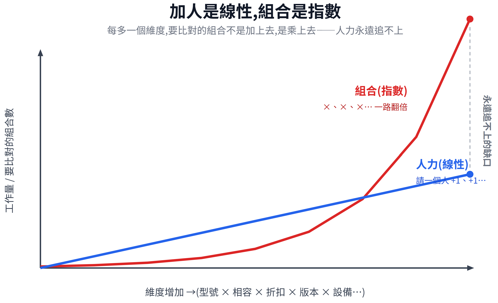

# 系統整合實際撞到的規模牆：型號、漏洞、設備數的組合爆炸

[D3](https://ithelp.ithome.com.tw/articles/10401166) 說「規模」是人到不了的疆域。這篇把它落到系統整合商的日常——看這面牆在真實工作裡長什麼樣。

**事情的難度不在單件事有多深，而難在每件事都在「相乘」**。一張報價單背後是型號 × 相容 × 折扣、一次漏洞盤點是漏洞 × 版本、一輪巡檢是設備 × 狀態；加人是線性，組合是指數——這就是規模牆。

_這篇我拿自己的產業當例子，示範怎麼把「哪一段能交給 AI」拆開；你的場景未必一樣，重點是讀完你能講出自己的版本。_

## 什麼是「組合爆炸」？為什麼加人沒用？

IT 是知識型人力高度集中的產業:每一個決策與設計都靠經驗累積，而經驗正是 AI 目前接不了的一塊。

其實連「整合」這個詞本身就是乘法——**應用 × 創造 × 維護**；而你要處理的東西，從來不是單一維度，是**幾個維度相乘**出來的。

假設你要出一張報價單，要考慮的是「客戶要的型號」×「這些型號彼此相不相容」×「搭哪些配件」×「套哪一階折扣」。每多一個維度，事後要設定或是維護的可能性不是加上去，是**乘上去**。 維度一多，組合數就從你數得完，變成你這輩子都比不完。

而你能派上去的，是人。請一個人，產能 +1; 請十個人，產能 +10，這是**線性**。

組合數卻是**指數**在漲。兩條線畫在同一張圖上，你會看到人力那條線很快就被組合那條線甩開——而且是永遠追不上，不是暫時落後。這不是誰的錯，是**結構天生如此**。

所以這本來就不是人腦該硬扛的戰場——商品規格的多維組合是商業現實，不是誰製造的麻煩，只是它的尺度超出了人腦的工作記憶。

## 規模牆之一：一張報價單背後的組合有多少？

以一張報價單為例，它同時壓在兩個角色身上。

**業務**這邊轉的是商務組合:這幾個型號**還在不在售**、彼此**相不相容**、要**配哪些模組/配件**才完整、能套**哪一階折扣**、有沒有**更划算的替代型號**。

**售前(PreSales)**那邊轉的是技術組合:客戶的**既有環境**吃不吃得下、不同廠牌之間有沒有**意外的互斥**、設定上有沒有**誤區**、怎麼避免出一張**裝不起來的無效單**。

這裡面任何一個環節，單獨看都不難，要做成功也不難。

難的是它們要**同時成立**，既需要時間、也需要事前驗證；而且組合數大到超出任何人能逐一比完的範圍——一個資深業務也只能靠經驗抓個大概，抓不到最優。

這不是他不夠強，是這個隨著時間不斷變化的量級本身就是一個天然的產業門檻。

這道門檻，[D25–27](https://ithelp.ithome.com.tw/articles/10405044) 會用「向原廠下單系統」翻過去。

## 規模牆之二與之三：漏洞和設備數，怎麼把牆疊得更高？

第二面牆是**漏洞 × 設備版本**。全球每天新增的漏洞是一個量、你在管的設備各自跑什麼版本是另一個量，要知道「今天哪個漏洞打中我哪台設備」，是這兩個量的**交叉比對**。漏洞天天新增、版本各不相同，這張比對表大到沒有人能每天手動跑完——而且慢一天，風險就多曝一天。這面牆 [D22–24](https://ithelp.ithome.com.tw/articles/10404400) 用「每日 CVE 通報」翻。

第三面牆是**設備數 × 狀態項**。你在管的每一台設備，都有一堆狀態要盯(在線、負載、溫度、異常訊號…)。設備數乘上狀態項，再乘上「要一直盯著」的時間維度，就是一面**又寬又守不住**的牆——人排班輪值也補不滿。而真要掌握其中任一台的完整狀態，那份狀態檔又是幾萬行、還得跨領域才看得懂——這正是 [D19–21](https://ithelp.ithome.com.tw/articles/10403790)「設備運作分析」要接的。

三面牆疊起來，你會發現它們其實是同一種東西:**維度相乘，加人無效**。

## 撞到這面牆時，人通常怎麼辦？

撞到組合爆炸，人其實只有三條路，而且每條都有代價:

- **硬扛**: 加人、加班，用線性產能追指數組合——每多一個維度，要追的量就翻倍，線性永遠補不滿指數的缺口。
- **降精度**: 憑經驗鎖定幾組常見組合、放掉長尾——快，但覆蓋不到全集，最優解可能就落在沒比到的那一塊。
- **不做**: 有些事(像每天讀完全球漏洞)，在人力尺度上根本沒有「做得完」這個選項——不是取捨掉，是這條路不存在。

這三條路都不是誰偷懶，是**被規模逼出來的合理選擇**。而這正是後面三套系統要切進來的位置——不是取代誰，是去接手那件「人怎麼選都有缺口」的事，把人從硬扛裡鬆開。至於鬆開之後那份時間往哪去，留到引用篇([D21](https://ithelp.ithome.com.tw/articles/10404120)/[D24](https://ithelp.ithome.com.tw/articles/10404771)/[D27](https://ithelp.ithome.com.tw/articles/10405470))用真實例子讓你自己看。

## 收束：事情難在「相乘」

型號、漏洞、設備數——系統整合的規模牆，是三組實實在在的組合爆炸：型號 × 相容 × 折扣、漏洞 × 版本、設備 × 狀態。加人是線性，組合是指數，人力永遠追不上。這面牆，就是後面三套系統要替你翻過去的東西。

到這裡，「問題長什麼樣」算是定義清楚了。下一個 phase 換個方向——**不再問「到底有多難」，改問「AI 這工具本身，又有哪些限制」**。

因為「規模牆逼你交給 AI」，不代表閉著眼睛就丟得出去。真正動手把 AI 寫進系統，你會撞到它自己的邊界:一次能讀多少上下文（context window）、prompt 能不能穩定控制它、法規准不准這樣用、原廠給的「思考深度／聰明度」又該怎麼設。這些繞不開的設計限制，是明天 [D5](https://ithelp.ithome.com.tw/articles/10401627) 要開始拆的。

_這篇是我對自己產業的答卷以及系列後續展示的鋪陳；你的產業未必一樣，但「先把問題定義清楚，再決定哪一段交給 AI」這套走法，你需要搬去寫自己的版本。_
