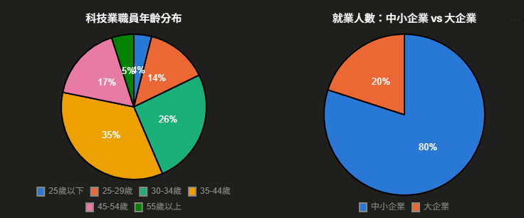
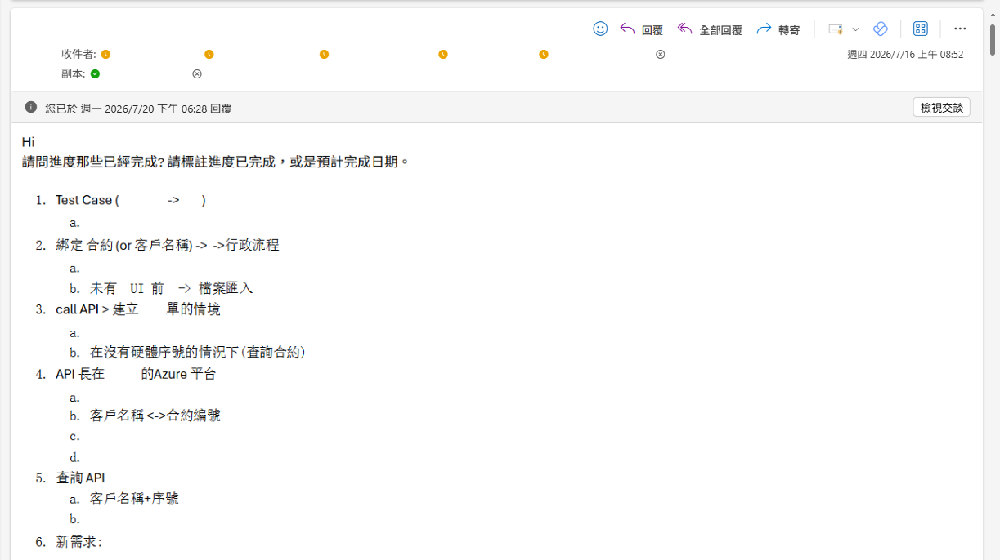

# 導入 AI 最難的不是技術，是人:同事抗拒的三個真實理由——威脅感、改變不安、無力想像

上一篇([D7](https://ithelp.ithome.com.tw/articles/10401848))是整個系列的錨點——我們用「可逆、可查證、誰扛責」三問，把「該交給 AI」和「該留給人」的判斷框架立起來。從這一篇起，我們正式進入 **Phase 2:職場政治與導入阻力的拆解**。

先來導讀一下這一幕會走過哪裡:

| Day | 標題                                                                                     | 性質                  |
| --- | ---------------------------------------------------------------------------------------- | --------------------- |
| 8   | 導入最難的不是技術:同事把自動化當威脅、世代抗拒改變、對未來無心力想像                    | 幕二 · 同事(抗拒)     |
| 9   | 怎麼讓抗拒的同事開始願意用:自願者、參與設計、看得到的好處                                | 幕二 · 同事(化解)     |
| 10  | 為什麼企業 AI 導入最後都淪為口號?——喊的人多，誰該做卻沒人真的接                          | 幕二 · 組織(診斷)     |
| 11  | 沒有正式職權，一套 AI 系統怎麼在公司推得動                                               | 幕二 · 組織(解方)     |
| 12  | 第一步棋不是挑最難的，是讓組織「開始想像」——你的工具與分析報告怎麼當想像力的種子         | 幕二 · 部門團隊(拉新) |
| 13  | AB 平行導入:讓既有 ERP 長出 AI，不打掉重練、不加成本 (埋政治伏筆:不讓舊團隊被架空 → [D29](https://ithelp.ithome.com.tw/articles/10405912)) | 幕二 · 部門團隊(護舊) |

## 為什麼說「導入 AI 最難的不是技術」?

**因為技術問題會收斂，人的問題不會。** 技術卡關再難，都有 log 可查、有文件可讀、有社群可問，你花時間總能把它逼到一個解;

但「同事就是不用」這件事，沒有 stack trace、沒有 SOP，你把系統打磨到完美，他照樣可以碰都不碰。

我看過技術上明明跑得動的系統，在辦公室裡就是推不動。

不是因為做得爛，是因為導入從來不是一個純技術動作——**你是在改變一群人每天怎麼工作、怎麼看待自己的價值。** 那不是部署一支程式，而是動到一個人怎麼看待「自己還重不重要」。

> 在拆解抗拒之前，先給你一組數據——不是拿來分類誰，是幫你看清眼前這個人「從哪來」。

## 這張圖該怎麼讀?先看每個世代「幾歲才遇到 AI」

以下依同一批年齡層（基準為2026年），推算約略出生年，並對照台灣科技史上幾個關鍵時間點（HiNet撥接1995、ADSL寬頻1999-2000、iPhone引進2008、ChatGPT問世2022年底、竹科成立1980、台積電成立1987），此表為歷史時間點推論。

| 年齡層（2026） | 約略出生年 | 幾歲開始接觸網際網路                                                               | 幾歲接觸生成式AI（2022年底ChatGPT問世）     | 出社會時遇到的科技業發展階段                                                                             |
| -------------- | ---------- | ---------------------------------------------------------------------------------- | ------------------------------------------- | -------------------------------------------------------------------------------------------------------- |
| 55歲以上       | 1971年以前 | 約25-30歲才第一次用網路（1995年HiNet撥接開通時）                                   | 約52歲以上                                  | 出社會約1988-1993年，正逢台積電成立(1987)後竹科規模化、PC產業起飛的奠基期                                |
| 45-54歲        | 1972-1981  | 約20歲前後才普及（1995-2000撥接/ADSL年代）                                         | 約41-50歲                                   | 出社會約1994-2003年，正逢筆電代工、晶圓代工全球化高峰                                                    |
| 35-44歲        | 1982-1991  | 童年到青少年期（1999-2000寬頻ADSL鋪開時約9-18歲）                                  | 約31-40歲，職涯中期                         | 出社會約2004-2013年，正逢半導體代工全球化、智慧型手機/面板產業起飛                                       |
| 30-34歲        | 1992-1996  | 童年就有網路（2000年前後約4-8歲），少年期出現智慧型手機（2008年iPhone時約12-16歲） | 約26-30歲，剛出社會不久                     | 出社會約2014-2019年，正逢台積電先進製程獨霸全球、地緣政治半導體戰略興起                                  |
| 25-29歲        | 1997-2001  | 出生時網路已存在，國小國中就有智慧型手機（2008年iPhone時約7-11歲），數位原生代     | 約21-25歲，大學或初出社會階段               | 出社會約2019-2024年，正逢AI浪潮起飛＋半導體地緣政治焦點期                                                |
| 25歲以下       | 2001年以後 | 完全的網路原生代，出生即有寬頻與智慧型手機                                         | 約15-24歲，國高中或大學階段就開始用生成式AI | 現在或未來幾年進入職場，是第一批「AI優先」的科技業新血，直接面對AI人才需求熱潮與先進封裝、供應鏈重組議題 |

- 科技業職員年齡集中在30-44歲（合計超過六成，為 2020 年統計，近年只會再往上推移），是目前的中堅世代。
- 各年齡層對「網路」與「AI」的接觸路徑不同：年長世代是先立業、後遇網路與AI；年輕世代則是天生網路原生，且在學生時期就已接觸生成式AI，形成「AI優先」的新世代科技人才。
- 2026年的25-29歲、30-34歲，恰好對應2020年版的「25歲以下」與「25-29歲」，說明科技業的世代交界正逐年往上推移。

> ### 這組數據不是拿來預測誰會反對——你等一下會看到，三種抗拒每個世代都有各自的版本。它的用處是幫你看清眼前這個人的「科技生命線」:他是先立了業才遇到網路和 AI、還是一出生就泡在裡面。同一種抗拒，對這兩種人，你得用完全不同的講法。

**世代不決定「會不會抗拒」，但決定「抗拒長什麼樣、你要用什麼語言跟他談」。** 帶著這個視角，我們來拆這三種抗拒。

## 抗拒一:當「自動化」被聽成「你要被裁掉」

**第一種，也是最直覺的一種:他把「自動化」聽成了「你要被取代」。** 你說「這系統幫你省時間」，他心裡翻譯成的是——「這系統證明了你可以被省掉」。

想像那位做了十年、對機房設備瞭若指掌的資深同事。他的價值長在哪?長在「這件事別人做不到、只有我熟」。

哪台設備最近脾氣不對、哪個型號的韌體有雷，他閉著眼睛都知道。現在一套新系統進來，把「只有我會」變成「系統也會，而且更快、還不會累」——對你那是效率提升，對他那是**十年累積的稀缺性，一夜被稀釋**。

這裡有個殘酷的落差，正好接回 [D7](https://ithelp.ithome.com.tw/articles/10401848):客觀上，被取代的是「逐台巡、逐條比」那件重複苦工，**不是他這個人**——他的判斷、他對現場的手感，還在「該留給人」那半。

但**情緒上，他感受到的是自己被瞄準了。** 理性上的位置還在，不等於情緒上感覺得到。這個落差，就是第一種抗拒的來源。

而且要說清楚:**這種恐懼是合理的。** 他不是不懂科技才害怕，恰恰是因為他太懂這一行怎麼淘汰人——他親眼看過技術換代把人洗掉。你不能怪一個看過潮水的人怕水。

## 抗拒二:為什麼光是「改變」就讓人不安?

**第二種，常被貼上「世代」的標籤——但根本不是年紀問題。** 「他年紀大了學不動」是最偷懶的解釋。真正讓人不安的，是另一件更難說出口的事:**一個當了十年的專家，在用新系統的那一刻，被打回一個什麼都不會的新手。**

這不是「學一個新介面」的成本，是自我認同的落差。昨天他還是那個大家有問題都來請教的人;今天他要在比他年輕十歲的同事面前，開口問「這個按鈕是做什麼的」。

**專業者的抗拒，常常來自尊嚴，不是能力。** 學不學得會是其次，「要從被請教的人變回開口問的人」這件事本身，就足以讓人本能地想躲。

而且這不是老員工的專利。年輕世代也有他們版本的抗拒——怕被工具綁死、怕自己變成只會按按鈕、把判斷力外包出去的人。

所以這從來不是單純的「新人 vs 老人」對立，而是**每一個位置上的人，面對改變，都有各自要守的東西。** 看懂這一點，你才不會把它簡化成「說服老人」的問題。

## 抗拒三:最容易被冤枉的一種——他不是不想，是「沒力氣想像未來」

**前兩種抗拒的核心是「怕」;第三種完全不同，它的核心是「累」。** 而這一種，最常被冤枉。

想像未來，其實是一件需要「餘裕」的事——需要時間、需要安全感、需要「相信明天會更好」的心理空間。

但你要一個同事開始想像 AI 導入後的美好未來時，他正處在什麼狀態?手上的工單排到下週、電話一直響、今天的巡檢還沒跑完。你要他從這種滿載狀態裡，額外擠出力氣，去想像一個**還沒發生、還不確定會不會真的更好**的未來——**這對他是奢侈品。**

所以當他說「有空再研究」「先忙完手上的再說」，你很容易讀成他消極、不配合;但更可能的真相是:**他不是不想，是真的沒有餘裕想。** 這裡還有一個弔詭的時間差——AI 本來就是要來空出餘裕的，可是在導入的那個當口，他還沒拿到那份餘裕，卻要先付出想像的力氣。

**你要人用「還沒到手的餘裕」去支付「現在就要的想像成本」。** 想通這一層，你對這種抗拒的火氣會小很多。

## 看懂了嗎?這三種抗拒，沒有一種是在「反對 AI」

把三種抗拒攤開，你會發現它們指向同一件事: **他們反對的不是 AI 這個技術，是「自己在新世界裡到底是誰」的那份不確定。**

| 你聽到的表象                     | 底層真實來源                      | 常被誤解成       |
| -------------------------------- | --------------------------------- | ---------------- |
| 「這個沒必要吧」「以前也沒問題」 | 威脅感:怕十年價值一夜歸零         | 頑固、守舊       |
| 「我學不動這些新東西啦」         | 改變不安:專家被打回新手的尊嚴落差 | 能力不足、跟不上 |
| 「有空再研究」「先忙完手上的」   | 無力想像:日常滿載，沒餘裕想未來   | 消極、不配合     |

看懂這張表，最大的用處是:**你不會再把抗拒的同事當成要剷除的障礙，而是當成要讀懂的訊號。** 中間那欄(真實來源)才是你要處理的東西;左邊那欄(表象)只是它冒出來的樣子，右邊那欄(誤解)則是多數導入失敗的起點——**你用錯欄位去回應，力就使錯了地方。**

這也正好補上 [D7](https://ithelp.ithome.com.tw/articles/10401848) 沒說完的話:你按三問把他的位置留好了，那是「客觀上位置還在」;

但這三種抗拒告訴你，**客觀留位置不夠——他得主觀上感覺得到那個位置，而且要有餘裕去相信它。**

> **要從何開始解? 我是怎麼解的?，就是明天 [D9](https://ithelp.ithome.com.tw/articles/10402180) 要走的路。**

## 總而言之

- **導入 AI 的瓶頸通常不在技術，在人**: 技術問題會收斂，人的抗拒不會自動收斂——系統做到完美，他還是可以不用。
- **抗拒 ≠ 不講理**: 威脅感、改變不安、無力想像，三種都是合理的人性反應，不是缺點。
- **抗拒的同事不是絆腳石**: 他抗拒的不是 AI，是「看不到、或還沒餘裕去找自己在新世界的位置」。
- **資深者的抗拒常來自尊嚴，不是能力**: 被打回新手的那一下，傷的是自我認同，不是學習曲線。
- **「沒力氣想像未來」最容易被冤枉**: 那是餘裕問題，不是態度問題——而餘裕正是 AI 要給的，只是存在時間差。
- **讀懂抗拒的表象 / 真實來源 / 誤解三欄**: 回應要打在「真實來源」那欄，打在表象或誤解上只會更僵。

診斷到這裡，結論其實很反直覺: **同事的抗拒不是要「克服」的障礙，是要協助他「讀懂」的訊號。** 而且你會發現一件事——**你越想「說服」他，他往往越抗拒**，因為「說服」這個動作本身，就在放大「你要改變我」的威脅感，正中第一種抗拒的紅心。

所以化解的路，不是把道理講得更用力。

明天 [D9](https://ithelp.ithome.com.tw/articles/10402180) 會講三段我打算實施、正在實施、而且方向完全相反的做法: **讓自願者先上車、讓他參與設計、給他看得到的好處**——每一個都對應今天診斷出的一種抗拒。

所以別急著替他下定論。他後面會回來的——三套系統上線之後的引用篇([D21](https://ithelp.ithome.com.tw/articles/10404120)、[D24](https://ithelp.ithome.com.tw/articles/10404771)、[D27](https://ithelp.ithome.com.tw/articles/10405470))會陸續回頭處理這條「取代焦慮 → 實際分工」的線,其中 [D27](https://ithelp.ithome.com.tw/articles/10405470) 收得最完整。怎麼變的，從明天開始講。

下面這張是一封真實信件——關於開發進度的往來。我手動把關鍵字幾乎全遮掉了，留下一片片空白;放它不是為了內容，是想讓你知道:這篇講的抗拒與導入，是我正在真實推進、有人在等進度的事，不是紙上談兵。

## 附錄

科技業職員年齡分布
經濟部「科技產業園區員工人數及薪資性別統計分析」，109年（2020年）職員（白領）年齡結構資料

- 網址：https://www.moea.gov.tw/Mns/DOS/content/wHandMenuFile.ashx?file_id=26802

就業人數：中小企業 vs 大企業
經濟部中小及新創企業署《中小企業白皮書》（2024／2025年版），中小企業就業人數約占全國就業人數近8成

- 參考新聞稿：https://www.moea.gov.tw/Mns/populace/news/News.aspx?kind=1&menu_id=40&news_id=121491

補充說明：左邊那張是科技業（科技產業園區）的官方年齡統計，算是精準的科技業資料；右邊那張是「全國」企業規模與就業占比，不是科技業獨有的數字——因為公開資料庫沒有單獨拆出「科技業依員工人數分」這一項，所以是拿全國數字當作概念參考，不是科技業專屬統計。
