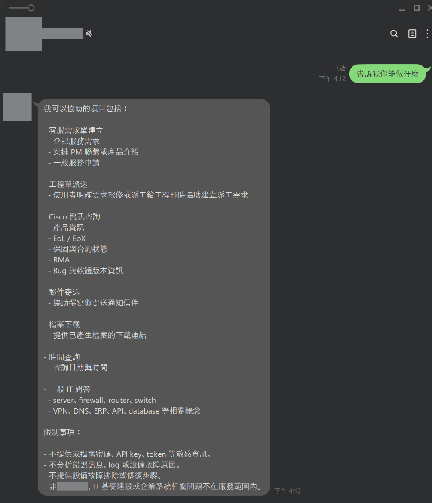
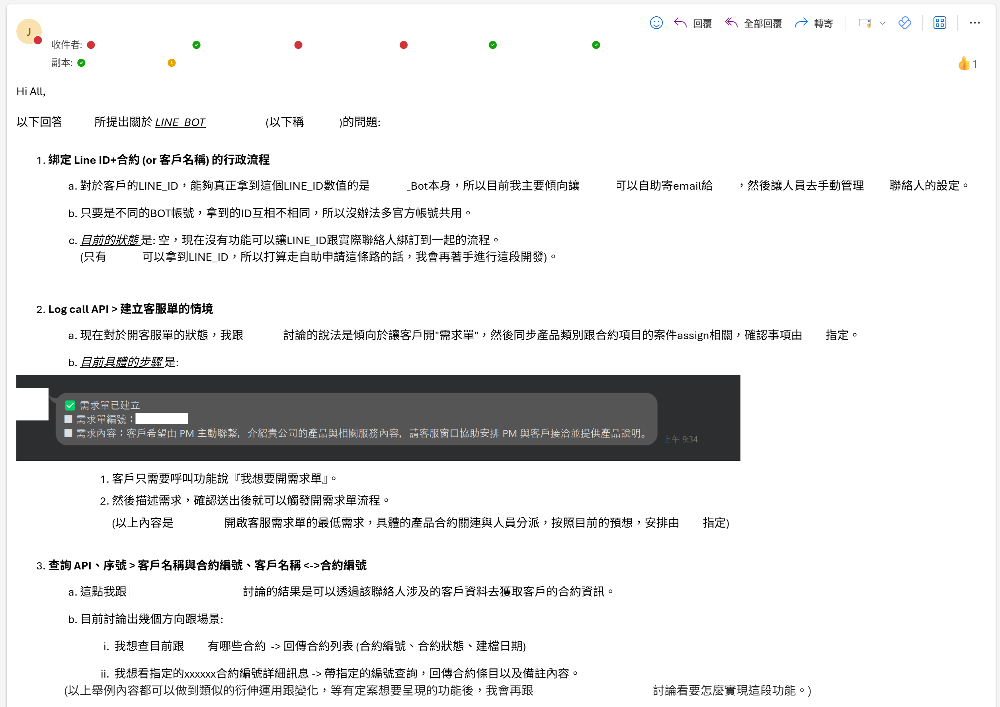

# 怎麼讓抗拒的同事開始願意用 AI?不是把道理講得更用力——自願者、參與設計、看得到的好處

昨天([D08](https://ithelp.ithome.com.tw/articles/10402082))我們把抗拒拆成三種概念: 把 AI 聽成裁員威脅(媒體敘事)、專家被打回新手的尊嚴落差(經驗無用論)、日常滿載沒餘裕想像未來(職場責任)。

診斷完，結論很簡單: **你越想「說服」，他往往越抗拒。**

> 因為「說服」這個動作本身，就在放大「你要改變我」的威脅感。
> (備註: 這個是心理學的範疇，稍微提一下但此篇不展開)

所以化解的路不是把道理講得更用力，而是**換一個施力方向**——三段做法，每一段都在做同一件事: **把主導權交回給他。**

先講清楚這篇的性質: 三段做法都是我真實刻意做出的設計，但**只有一段已經有結果**，另兩段還在跑。

我會老實標出來哪段是哪段。把還沒發生的事寫成結論，這篇就沒有意義了。

## 為什麼「把道理講得更用力」反而讓他更抗拒?

**因為說服是一個改變對方的動作，而抗拒的來源正是「被施力」本身。**

回想 [D08](https://ithelp.ithome.com.tw/articles/10402082) 的三種抗拒: 威脅感是「我的價值要被拿走」、尊嚴落差是「我要被迫變回新手」、無力想像是「我被要求先付出餘裕」。三種的共同點——**主詞都是別人在動他。**
這件事情跟「要取代他」本質上並無不同。

你再怎麼加強論述，也只是把「別人在動我」這件事講得更大聲。道理講得越漂亮，他感覺到的威脅就越大。

所以這三段做法的共同邏輯只有一句: **不是我來動他，是他自己動。**

| [D08](https://ithelp.ithome.com.tw/articles/10402082) 診斷的抗拒             | 錯誤施力(越用力越糟)   | 這篇的做法         | 換掉的是什麼               |
| -------------------------- | ---------------------- | ------------------ | -------------------------- |
| ① 威脅感: 怕十年價值歸零   | 全員一起上、由上而下推 | **讓自願者先上車** | 拆掉「被迫」               |
| ② 尊嚴落差: 專家變新手     | 做好系統交給他用       | **讓他參與設計**   | 從被處置的對象變成共同作者 |
| ③ 無力想像: 享受前須先付出 | 畫願景、講未來會更好   | **給看得到的好處** | 用 show 取代 tell          |

這張表右邊那欄，其實就是 [D07](https://ithelp.ithome.com.tw/articles/10401848) 那條線在「人」身上的延伸。[D07](https://ithelp.ithome.com.tw/articles/10401848) 說劃界的同時要劃權——**權不只是組織圖上的職權，在同事這一層，它最先長出來的樣子就是「這件事我有份」。**

## 第一段: 為什麼要讓「自願者」先上車，而不是全員一起推?

**因為威脅感的來源是「被迫」，而自願直接拆掉了「被迫」這個前提。**

### 我實際做了什麼: 一個 LINE Bot，接上他每天已經在用的功能

> 我實際做了個 LINE 的 AI 專案(LINE Bot)，接上幾個他平時會用的功能，讓他的日常工作以更小成本的方式執行。

_他每天都在 LINE 上，所以 AI 就做在 LINE 上。注意下半截的「限制事項」——能做什麼要講清楚，不能做什麼更要講清楚，那是 [D07](https://ithelp.ithome.com.tw/articles/10401848) 三問劃出來的線。_

光是做這件事情就能夠達到幾個好處:

- **他會提需求做改善**: 因為這不會完美達成他的日常工作，他會關注並提出設計需求。
- **他開始想像**: 讓他有 AI 應用開發的想像空間，而不是停留在媒體敘事的印象、以及文字或 PPT 上面的標題。

第一點值得停一下，因為它跟直覺相反: **「不夠完美」本身就是留給他的空位。** 一個剛好夠用、但明顯還差一點的東西，會讓他很自然地講出「這裡如果能這樣就好了」——而那句話，就是他自己走進設計裡的第一步。做得太完整，反而沒有那道縫。

由上而下宣布「大家從下週開始用」，對抗拒者是三重打擊: 他沒得選、他要在同儕面前變新手、他還得自己想清楚這對他是好是壞。三種抗拒一次全踩。

換成自願制，同一套系統的意義就翻轉了:

- 先動的是**本來就有點好奇、或痛點最深的那個人**——他有動機，不需要被推。
- 他成為同儕裡的**參照點**，而不是被指派的示範樣本。
- 還沒準備好的人保有**「我可以先不動」**的餘地——這條退路本身就在降低威脅感(它跟 [D13](https://ithelp.ithome.com.tw/articles/10402728) 的平行導入是同一個道理，只是縮小到個人尺度)。

## 抗拒的人變成了追進度的人

**這是「已經發生」的結果，而結果出現的方式跟我原本的預期不一樣。**

我原本以為 _自願者策略_ 是一件我需要特別去跨過的第一道坎—— 去挑人、去邀請、去說明。

實際發生的是: **在我還沒正式邀人之前，他看到蛛絲馬跡或幾張截圖，需求先自己浮出來了。** 有人主動來問進度、要我安排開發進度。

[D08](https://ithelp.ithome.com.tw/articles/10402082) 最後那封遮到剩大片空白的信件，就是這件事的證據。

當時我放它是為了說明「這篇講的東西是真的在推」;現在回頭看，它其實還說了一件更重要的事——**信裡的角色不是被我說服的人，是來催我的人。**

那封信我回了什麼、回得多具體，放在文末附錄。

這件事值得轉換一下思考方式:

- 抗拒者的位置是**被動的** (你要來改變我)。
- 需求方的位置是**主動的** (我要你把這個做出來)。
- 中間我沒有做任何說服——**我沒有強推。**

**不強推不等於什麼都不做，它是把「要不要」的決定權留在對方手上。**

我目前看到的是: 當 AI 落在他每天真的會經過的地方、又讓他少花一點力氣，就不需要另外花功夫說服別人。

## 第二段: 為什麼要讓他「參與設計」，而不是把系統做好了給他用?

> **因為「做好給他用」這個動作，本身就在宣告他是被處置的對象。**

[D08](https://ithelp.ithome.com.tw/articles/10402082) 的第二種抗拒是尊嚴落差——一個當了十年的專家，在用新系統的那一刻被打回新手。如果系統是別人做好、交下來的，那個落差是最大的: 他不只不熟這個工具，還在這個工具的形成過程裡完全缺席。

如果他從設計階段就在裡面，落差的方向會反過來——**他不是這套系統的新手，他是它的「來源」之一。**

他那十年「哪台設備脾氣不對、哪個型號的韌體有雷」的手感，變成系統判斷的一部分。

這也正是 [D07](https://ithelp.ithome.com.tw/articles/10401848) 那條線在這裡的兌現。[D07](https://ithelp.ithome.com.tw/articles/10401848) 說: 劃界的同時要劃權，而**第一種要交出去的權，就是參與設計的權**——他有權在系統長成之前就對它有意見，不是等它長好了才被通知怎麼用。

(筆者備註: 講白一點，這件事本來就是開發的基本功——系統做出來之前要給使用者看過。我是後來才發現它有第二層意義: **你在做這件基本功的同時，順手就把設計權交出去了。** 同一個動作，一個是工程紀律，一個是化解抗拒。)

> 我原本還準備了第二套說法，結果不需要了。

**同樣是需求拉力: 來追進度的人，要的不只是「什麼時候可以用」，是「來改設計」。**

這個差別很關鍵。「什麼時候可以用」是使用者的問法;「我們來開設計」是共同作者的問法。他要的不是一個做好的東西，是**進到那個還沒定型的過程裡**。

而我要說的是——**「使用者變成需求者」這個轉換，是我刻意留出空間、讓它自己發生的。** 空間留對了，就不需要說服;我原本準備的那套「怎麼邀他進設計」的說法，一句都沒用上。

## 第三段: 為什麼要給「看得到的好處」，而不是畫未來的願景?

**因為願景是 tell，好處是 show——而 [D08](https://ithelp.ithome.com.tw/articles/10402082) 的第三種抗拒，本質上是付不出想像的成本。**

回到 [D08](https://ithelp.ithome.com.tw/articles/10402082) 那個弔詭的時間差: AI 本來就是要來空出餘裕的，但在導入的那個當口，他還沒拿到那份餘裕，卻要先付出想像的力氣。**你要人用「還沒到手的餘裕」，去支付「現在就要的想像成本」。**

願景解不了這個時間差，它只是把帳單開得更大——你講的未來越宏大，他要付的想像成本越高。
最重要的是，如果是對於 AI 應用開發沒有概念的人，連能做什麼都無從想像。

**能解的只有一件事: 先讓他手上真的少一件煩事。** 不是省下一小時的統計數字，是一件他今天不用再做的具體瑣事。餘裕先到手，想像才付得起。

順序不能顛倒:

1. 先給一個小的、立刻感覺得到的好處。
2. 他手上因此空出一點餘裕。
3. **有餘裕之後，他才有力氣去想「那還能做什麼」。**

畫願景是想跳過第 1、2 步直接收第 3 步的成果。跳不過去。

### 這一段目前的狀態: 進行式

**老實說，還沒有可以拿出來說的結果。**

~~(準確一點講是拿來鋪陳的那個小東西已經有了，但真正要端出來的東西我還在做)~~

我知道要給的是「看得到的好處」，也知道它必須具體到一件可以被指出來的瑣事——但把煩事真的從某個人手上拿掉、而且夠乾淨到讓他自己察覺，這件事需要時間，現在還在磨合的路上。

不過有一個訊號是確定的: **當這套能力真的長出來，圍繞它會多出「原本沒有的位置」——不是把誰的工作省掉，是憑空多出來的。** 這件事在三系統上線後有一個完整的實例，那是 [D21](https://ithelp.ithome.com.tw/articles/10404120) 的主場，這裡先不搶。

## 這三段，現在走到哪了?

**一段有結果，兩段正在進行。**

| 做法           | 對應抗拒   | 目前狀態                                                       |
| -------------- | ---------- | -------------------------------------------------------------- |
| 讓自願者先上車 | ① 威脅感   | ✅ **已發生**: 需求自己浮出來，有人主動追進度                  |
| 讓他參與設計   | ② 尊嚴落差 | 🔶 **一半**: 對方主動要求開設計;設計是否真的因他而改，還在進行 |
| 給看得到的好處 | ③ 無力想像 | 🔷 **進行式**: 設計成立，還沒有可宣稱的結果                    |

我把這張表放在這裡，是因為它比一篇「三步驟成功化解抗拒」的文章誠實。化解抗拒不是一次性的動作，是一個還在跑的過程——而**這系列的規則是 show 真的跑起來的東西，不是 show 我希望它變成的樣子。**

至於你的組織該怎麼帶你身邊那位同事，你會比我清楚得多。我能給的是這三個施力方向，和一個目前為止最反直覺的觀察: **最有效的一段，是我什麼都沒推的那一段。**

## 做個總結

- **化解不是說服**: 三種抗拒的主詞都是「別人在動我」，加強論述只會把那隻手講得更大聲。
- **三段的共同邏輯是把主導權交回去**: 自願拆掉「被迫」、參與設計拆掉「被處置」、看得到的好處拆掉「先付想像成本」。
- **自願者不一定要你去挑**: 不強推留下的空間，可能會讓需求自己浮出來——抗拒者變需求方，比態度軟化更硬。
- **參與設計是第一種要交出去的權**(接 [D07](https://ithelp.ithome.com.tw/articles/10401848) 劃界=劃權): 他有權在系統定型前有意見，而不是定型後被通知。
- **餘裕的順序不能顛倒**: 先拿掉一件煩事 → 空出餘裕 → 才有力氣想像。願景想跳過前兩步，跳不過去。
- **誠實標進行式**: 化解是過程不是結果;把還沒發生的寫成結論，傷的是自己的可信度。

同事這一層講完了——診斷([D08](https://ithelp.ithome.com.tw/articles/10402082))、化解(D09)，一對收完。

但你會發現一件事: 就算你把身邊的人一個一個帶上車了，一到「**整個組織要不要導入**」，又是另一種卡法。那個卡法不在任何一個人身上，而是在一個更難處理的地方——**大家都在喊要導入，但沒有人真的接。**

為什麼企業的 AI 導入最後常常淪為口號?從明天 [D10](https://ithelp.ithome.com.tw/articles/10402295) 開始講。

## 附錄

下面這封信是回覆前面那段「他來提需求」的實際樣子。我把人名、收件者與客戶資訊都遮掉了，留下的是:**同事提出問題 → 我逐條回覆現在做得到什麼、哪一段還是空的、下一步打算怎麼開發。** 這封信不是我發出去推銷系統的，是回覆別人問出來的問題。

_信裡有一段我特別想指出來:「目前的狀態是: 空，現在沒有功能可以做到」。我把還沒做到的事直接寫成「空」，比寫成「規劃中」有意義得多——而這封信最後變成了開發追蹤清單。_
