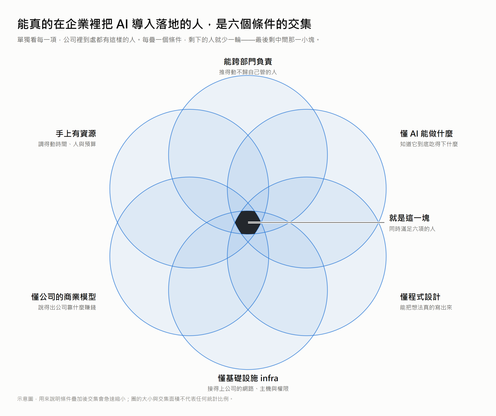

# 誰該在公司裡推動 AI 導入?六個條件的交集，比你想的小很多

昨天(D10)一路撞下來的結論是:這件事沒有天生的 owner，而願意接的人會發現自己空手，無從開始。

但昨天結尾那個問題還沒回答——**這件事到底該是誰?**

今天先把條件疊起來給你看，然後回答一個更實際的問題:**如果那個人在你公司裡不存在，或者那個人就是你、而你沒有任何職權——這件事還推得動嗎?**

推得動，但你可以用的東西會跟有職權的人完全不同，而且手段很活。 而如果你是那個能給職權的人，你要給的東西其實很具體。

## 六個條件，缺哪一個就會用哪一種方式失敗

**需要的是六個條件同時成立的人。** 而這六項都是必要條件，不是加分項——缺哪一項，就會用哪一種方式失敗。

_中間那一小塊就是能真的把事情做完的人。六個圈單獨看都不稀奇——難的是同時成立。_

把缺口一個一個看過去，失敗的形狀很好認:

- **缺「能跨部門負責」**:你會卡在昨天那道牆上。要整理的資料在別人的系統裡，而你沒有立場請人家改自己的表格。東西做得出來，但餵不進真實資料。
- **缺「懂 AI 能做什麼」**:你會把力氣放在它做不到的事情上，或者反過來，做出一個 demo 很漂亮、一放進真實規模就崩掉的玩具。你會不知道該在哪裡停。
- **缺「懂程式設計」**:你會停在「想得到但做不出來」。架構講得清楚、簡報畫得漂亮，但沒有一行會動的東西——而 D10 說過，會動的東西才是你唯一能拿去換職權的籌碼。
- **缺「懂基礎設施 infra」**:你會做出一個只能在自己筆電上跑的東西。接不上內網、拿不到權限、沒有地方部署——demo 完就結束了。
- **缺「懂公司的商業模型」**:你會做出乾淨、正確、但不值錢的東西。技術上無可挑剔，只是沒人在乎那個流程有沒有變快。
- **缺「手上有資源」**:你會永遠在自己的下班時間做它。這件事不會失敗，它會**無限期地一直快要完成**。

六種失敗完全不同，但結局一樣:那個東西沒有進到任何人的流程裡(D10 的判準)。

## 為什麼「找一個這樣的人」通常找不到?

<!-- 節首答案：因為這六圈不是同一種東西——四圈是個人長的，只有兩圈是組織給的。
     ⭐ 這是本篇最重要的洞見，也是拍二在 D11 的支點:
        你招不到一個「自帶你公司職權」的人。 -->

**因為這六個圈不是同一種東西。**

把它們分成兩堆，問題會突然變得清楚:

- **懂 AI 能做什麼、懂程式設計、懂基礎設施、懂公司的商業模型**——這四樣是**個人長出來的**。要時間、要待過現場、要自己去踩。招聘可以買到其中幾樣，最後那樣得待久了才會長出來。
- **能跨部門負責、手上有資源**——這兩樣是**組織給的**。它們不是能力，是**位置**。沒有人能自己帶著它們來上班。

**六個圈裡有四個要你自己長，只有兩個得靠別人給——而卡住的，幾乎總是那兩個。**

於是「找不到這種人」根本不是招聘問題。**你招不到一個自帶你公司職權的人**——那兩個圈只能由這家公司自己畫給他。

反過來看也一樣:一個已經有職權、有資源的人，不會因為坐上那個位置就自動長出另外四圈。

所以現實裡最常見的狀況是這樣:**組織裡確實有人已經長出了那四圈，但他手上沒有另外兩圈**——而擁有那兩圈的人，沒有前面四圈。

六個圈散在不同人身上，交集是空的。這就是 D10 那顆球會一直被傳下去的真正原因:**不是沒人想接，是沒有一個人手上是完整的。**

## 如果你是能給職權的那個人，你要給什麼?

<!-- 節首答案：給那兩個「只有組織能給」的圈——而且要具體到可以執行，
     不是口頭支持。
     ⭐ 拍二正面落點:對決策者寫「你要給他什麼」。
     ⚠️ §3:用「授權/名義/資源/邊界」，不用「權力」;不寫成「繞過誰」。 -->

**你要給的不是鼓勵，是那兩個他自己長不出來的圈。**

而它們可以拆成幾樣很具體、也很便宜的東西:

- **一個能開口要資料的名義:** 他去找別的部門要一份表格時，對方問「這是誰要的」——這個問題必須有答案。這個名義不需要職級，只需要是真的。
- **一個明確的失敗額度:** 講清楚「這件事做不成不算你的績效問題」。沒有這一條，他會選最安全、也最沒用的題目。
- **讓他有權說不:** 這一項最常被忘記。當有人要求把它擴大到還撐不住的規模，他要能擋。這就是 D07 那句「劃界的同時要劃權」在這裡的樣子。

這幾樣的共同點是: **它們幾乎不花錢。** 花的是決策者願不願意把「失敗的空間」寫下來——而這恰恰是 D10 那個獎勵結構最不願意給的東西，因為它等於承認這件事可能不成。

## 如果沒有人給你呢?

**先想清楚職權到底在做什麼: 它是一個讓別人配合你的理由。**

~~(說白話就是我比較皮，想做導入 AI 這件事情。)~~

「因為主管交代」是一個理由，而且是最省力的一個。但它不是唯一的——如果你手上沒有這個理由，你要找到另一個。

而我目前找到最有效的那個，是**先讓對方的日子變好過**。

這一招 D09 已經出現過，只是尺度不同。當時是對一個抗拒的同事:把 AI 做在他每天已經在用的地方，讓他少花一點力氣，然後他自己來提需求。同一件事放到組織尺度上，邏輯一模一樣——**你不是去要求別人配合你的專案，你是去解決他手上一件他本來就嫌煩的事。**

差別在於「這是誰的專案」變得不重要了。他配合你，不是因為有人叫他配合，是因為配合對他有好處。

還有第二個理由，比說服更省力: **讓做出來的東西自己講話。**

一份跑得出來的輸出、一個真的會動的畫面，在會議室裡的說服力遠高於任何簡報——因為簡報講的是「將會怎樣」，而東西擺在那裡講的是「現在就是這樣」。這也是為什麼 D10 說真的落地都從小到不值得宣布的東西開始: **那個小東西的真正用途，是拿去換你原本沒有的那兩個圈。**

所以順序是反過來的。

不是「先給我職權，我才做得出來」，而是**先做出一個小的，告訴你我能變，再用它去換職權**。

## 帶走什麼?

<!-- 依 Tip 2:可遷移的帶走重點，每點對回主幹問題。 -->

- **企業導入 AI 這件事需要六個條件同時成立**:能跨部門負責、懂 AI 能做什麼、懂程式設計、懂基礎設施、懂公司的商業模型、手上有資源。缺任何一項，失敗的方式都不一樣，但結局一樣。
- **六個圈裡四個要自己長，只有兩個得靠別人授權**: 懂 AI、程式、infra、商業模型是個人長出來的技能和經驗; 跨部門與資源是組織給的位置——而很難動手的幾乎總是這兩個。
- **要給的東西很具體**: 一個能開口要資料的名義(協助跨組織行事)、一個講清楚的失敗額度、以及有權說不(避免無限上綱)。
- **職權的功能是「讓別人配合你」**: 沒有職權時，就換一個理由——協助對方處理事情，讓對方主動配合你開發。
- **小東西的真正用途是拿去換圈**: 不是先拿到職權才做得出來，是先做出一個小的，再用它去換。

讀到這裡，你大概已經知道自己站在哪一邊。

如果那兩個「只有組織能給」的圈在你手上，那麼你要找的人，不是履歷上寫著 AI 的人，是**已經自己長出另外四圈的那個人**——他可能已經在你公司裡，只是手上什麼都沒有。

如果你就是那個什麼都沒有的人，那你手上其實還有一樣東西: **你可以先做出一個小的。** 小到不需要任何人核准，但真的會動。

不過這裡有一個兩邊都躲不掉的問題: **那個「小的東西」，要挑哪一件事?**

這一步挑錯，前面所有東西都會白費——

挑了一件最難、最重要、最多人盯著的事，它會在還沒證明自己之前就被判死。

挑了一件太邊緣的事，做成了也沒有人在乎。

而我後來發現，挑第一步棋的時候，「難不難」根本不是主要的考量。

> **第一步棋真正要解決的，往往不是那個問題本身。**

明天 D12 就講這一步該怎麼挑: 它真正的目的是**讓組織開始想像**。
