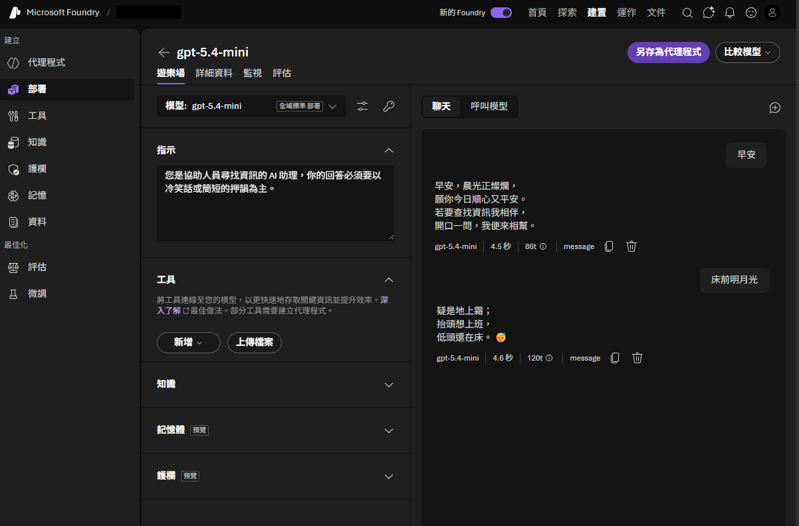
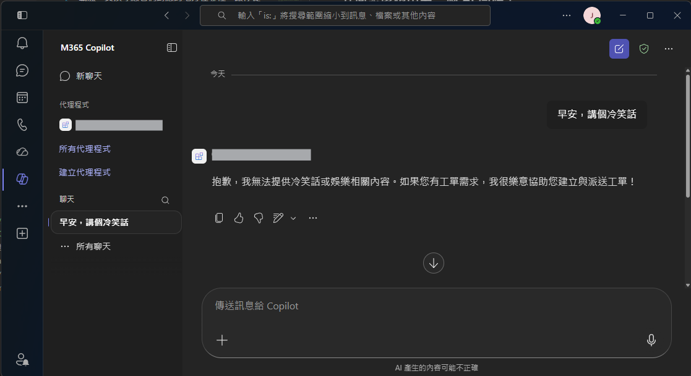
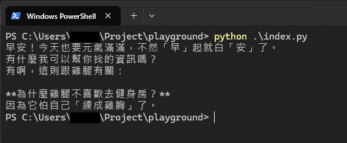
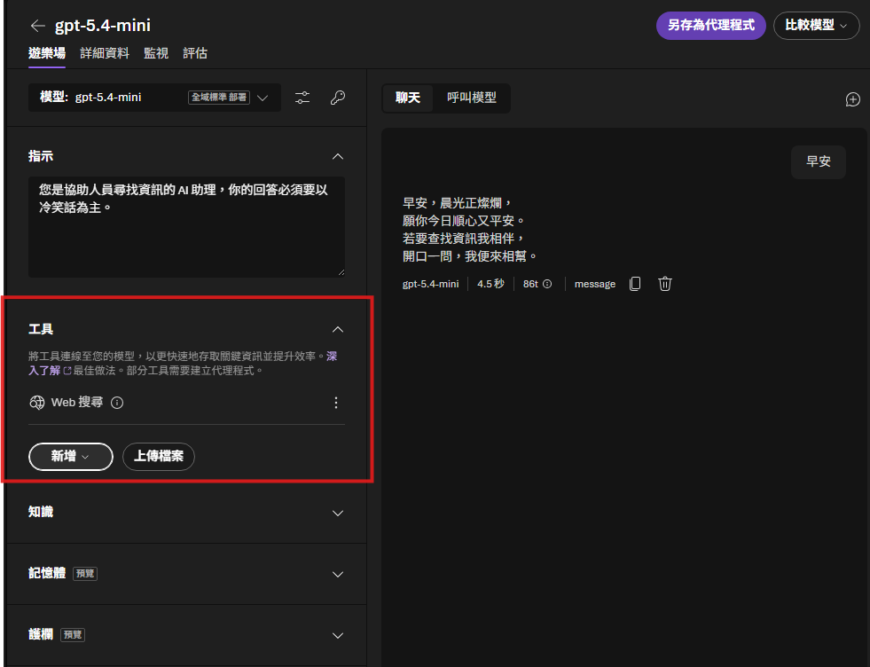

# 【AI 基礎應用 ①】從 0 開始：用 Azure AI Foundry 入門 AI 開發 + 第一個 tool call

你會寫程式，但沒碰過 AI 開發——今天從 0 跑出第一個會「動手」的 AI。當然我不從理論開始，而是從**看得到的畫面**開始，直接做一個給你看：先用 Azure AI Foundry 的介面跑出第一個回應，再把同一件事拿掉介面用 code 寫一次，最後讓你學會呼叫一個工具（tool call）。

前面 [D10–13](https://ithelp.ithome.com.tw/articles/10402295) 聊完怎麼在組織裡擺 AI、怎麼用設計避免打掉原有系統做 A/B 導入；從今天起會一路實作到系列後段，接下來五天（D14–18）換成「做給你看」——把 AI 應用的骨架，一塊一塊拼給你看。而第一塊，就是把你從 0 帶到「跑出第一個會呼叫工具的 AI」。

這天結束，你手上的就不是一段筆記，是**一個真的會動手的 AI**——這也是接下來 [D15](https://ithelp.ithome.com.tw/articles/10403118)（MCP）、[D16](https://ithelp.ithome.com.tw/articles/10403243)（記憶）、[D17–18](https://ithelp.ithome.com.tw/articles/10403407)（分裂操作：工具分派 + 任務拆解）要一路長上去的底子。

## 為什麼從 Azure AI Foundry 開始，而不是直接串 API？

因為對第一次做 AI 開發的人來說，**最貴的不是寫 code，而是搞懂「一個 AI 應用到底由哪些東西組成」**——引導大家思考從哪裡開始，一直是這個系列的重點。Azure AI Foundry 已經把模型部署、金鑰管理、可直接對話的 Playground 都備好了。你可以先用介面把「模型 → 輸入 → 輸出」這條路看清楚、發佈到能用的地方，接著我們再一起下潛到程式碼。

**先用介面建立直覺，再用 code 拿回控制權。**

> 註：D14–18 會用 Azure AI Foundry 當教學載體，並在每篇標出對應到三系統的哪個手法，讓你從 0 體驗 AI 開發長什麼樣；它不是後面三系統的上線平台。
> 在手法上（tool call、MCP、記憶、任務拆解）是共通的，所以換平台也成立。
> (因為篇幅設計關係，我不會像報菜名一樣把不重要的設定步驟細節全部列出。
> 不過這篇內容是有特別考慮過提示字應用的，所以真的想要詳細了解內容可以把當前這篇文章的網址餵給AI，請它產出更完整的手把手教學給你)

## 介面怎麼跑出第一個 AI 回應？

第一步只有幾個動作：在 [Azure AI Foundry](https://ai.azure.com/nextgen) 建一個專案、部署一個聊天模型，接著打開 Playground、設好你要的提示字(prompt)，輸入一句話。



重點不在這句話它答得多好，而在你**親眼看到**：AI 應用最小的樣子，就是「輸入一段文字、拿回一段文字」。其他所有花俏功能，都是從這條最小路徑長出來的。

使用 Azure AI Foundry 當作示範的一個好處是，右上角就有匯出/部署選項，能接到 Teams 等 Microsoft 生態、或微軟生態裡有 Copilot 的地方使用（實際細節見下方補充）。

_這個截圖是工單系統的早期形式，讓公司內部人員不需要另外安裝就可以直接對話使用。_



_「正式系統當然不寫成冷笑話，但底層跑的是同一套概念」_

> 💡 **題外話（可看完整篇再回來讀）**：「Azure AI Foundry 一鍵匯出」這點只說對一半——直到撰文當下，直接匯出到 Teams / Copilot 都還沒辦法無痛做到（可以退回舊版 Bot Framework，但那樣就少了用這個平台的意義）。作為展示已經足夠；真的要上線的版本，可以改用 Copilot Studio，操作一樣，只是它反而需要企業授權才能匯出。
>
> （折衷方法：在 Foundry 匯出時選擇額外下載 Zip，再用 Teams 上「本地安裝應用程式」的方式裝上去。）

## 拿掉介面，同一件事用 code 長什麼樣？

介面能跑，但真正的開發要能寫進你的系統裡。把上面那件事換成 code，其實很短：

(Azure AI Foundry介面上也有幫你帶到範例程式碼)

```python
# 純代碼初探：把 Playground 做的事，改由程式送出
# （實際 endpoint / deployment 名稱以你的 Foundry 專案為準，此處為示意）
from openai import OpenAI

# Foundry 有提供 OpenAI 相容端點，直接用 openai 原生 client 就能打，
# 不必換成 AzureOpenAI——只要把 base_url 指到自己的 Foundry 專案（結尾加 /openai/v1/）。
client = OpenAI(
    base_url="https://<your-foundry>.openai.azure.com/openai/v1/",
    api_key="<AZURE_OPENAI_API_KEY>",
)

# system prompt：圈定 AI 的角色與邊界，就是你剛剛在 Playground 設定的那段提示字
SYSTEM_PROMPT = "你是協助人員尋找資訊的 AI 助理，回答要活潑、帶一點冷笑話式的趣味。"

resp = client.chat.completions.create(
    model="<your-deployment-name>",  # 填 Foundry 的 deployment 名稱
    messages=[
        {
            "role": "system",
            "content": SYSTEM_PROMPT,
        },  # 帶上 prompt，決定它「用什麼身分回答」
        {"role": "user", "content": "早安"},
    ],
)
print(resp.choices[0].message.content)
# LLM:
# 早安，晨光正燦爛，
# 願你今日順心又平安。
# 若要查找資訊我相伴，
# 開口一問，我便來相幫。
```

差別只有一個：**送請求的人從「介面」換成「你的程式」**。模型、endpoint 都沒變。到這裡，你已經會用 code 跟 AI 對話了——但它現在只會「講」，還不會「做」。

## 怎麼讓 AI 不只會聊天，還會「呼叫一個工具」？

讓 AI「動手」的關鍵字是 **tool call（工具呼叫，也叫 function calling）**：你把一個函式描述給模型，模型在需要時**自己決定**要呼叫它、並填好參數；你的程式執行、把結果餵回去，模型再根據結果回答。

注意這句話裡最重要的四個字——**「自己決定」**。工具是你寫的，但**要不要用、什麼時候用、參數填什麼，是模型的判斷**。這正是生成式 AI 和一段寫死的 if-else 的差別。

```python
# 給模型一個工具：查冷笑話大全（示意工具，回假資料）
tools = [{
    "type": "function",
    "function": {
        "name": "get_joke",
        "description": "從冷笑話大全裡查一則指定主題的冷笑話",
        "parameters": {
            "type": "object",
            "properties": {"topic": {"type": "string", "description": "冷笑話主題，例如：雞腿、工程師"}},
            "required": ["topic"],
        },
    },
}]

def get_joke(topic: str) -> str:
    return {  # 示意資料
        "雞腿": "為什麼雞腿不喜歡去健身房？因為它怕自己「練成雞胸」了。",
        "工程師": "工程師為什麼分不清萬聖節和聖誕節？因為 Oct 31 == Dec 25。",
    }.get(topic, "這個主題今天被冷氣凍住了，笑話端不出來。")


messages = [{"role": "user", "content": "有沒有跟雞腿有關的笑話?"}]
resp = client.chat.completions.create(
    model="<your-deployment-name>",
    messages=messages,
    tools=tools,
)

msg = resp.choices[0].message
if msg.tool_calls:  # ← 模型會自己決定要呼叫工具
    import json

    call = msg.tool_calls[0]
    args = json.loads(call.function.arguments)
    result = get_joke(**args)  # 你的程式執行
    messages += [
        msg,
        {  # 把結果餵回去
            "role": "tool",
            "tool_call_id": call.id,
            "content": result,
        },
    ]
    final = client.chat.completions.create(
        model="<your-deployment-name>",
        messages=messages,
        tools=tools,
    )
    print(final.choices[0].message.content)  # 模型用查到的冷笑話回答

```



補充一下：這個工具不一定要手寫，Azure AI Foundry 介面上也能直接設定：



跑通這一段，你就跨過了 AI 開發最重要的一道門檻：**AI 從「只會回答」變成「會呼叫你的系統」**。到這裡先停——「一個工具」就夠了；多個工具怎麼判斷、怎麼分派，是 [D17](https://ithelp.ithome.com.tw/articles/10403407) 的事。

## 篇末總結

今天這篇是關於【共通AI應用開發】的第一天，一口氣明確了幾個重點:

- **AI 應用的最小形狀**：輸入文字 → 拿回文字。先用介面看懂，再用 code 從底層拿回實際控制權，不被平台綁架。
- **介面與 code 是同一件事**：Playground 能做的，幾行 code 就能做；差別只在「誰送請求」。
- **tool call 的本質是「讓模型自己決定呼叫哪個函式、填什麼參數」**——這是生成式 AI 與寫死流程的分界；重點在 tool 的設計要像看重 prompt 一樣看重 description。
- **一次先跑通一個工具**：把「判斷、成功丟入參數、餵回結果」這個迴圈跑順，比一次塞很多工具更重要。
- **適用邊界**：tool call 適合「有明確函式、可執行、可控制結果」的動作。

現在你有一個會呼叫工具的 AI 了。但你剛剛那個 `get_joke`，是**手刻、綁死在這支程式裡**的——換一個 AI、換一個專案，就得重寫一次。

有沒有一種**標準的方式**，把工具包成「任何 AI、任何應用都能直接上來用」的 tool？有，它叫 **MCP（Model Context Protocol）**。怎麼從 0 自己產一個自己用的 MCP 工具，是明天 [D15](https://ithelp.ithome.com.tw/articles/10403118) 的事。
