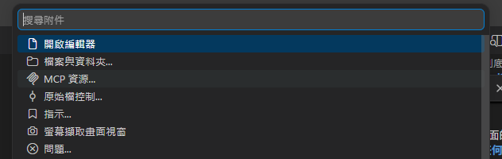
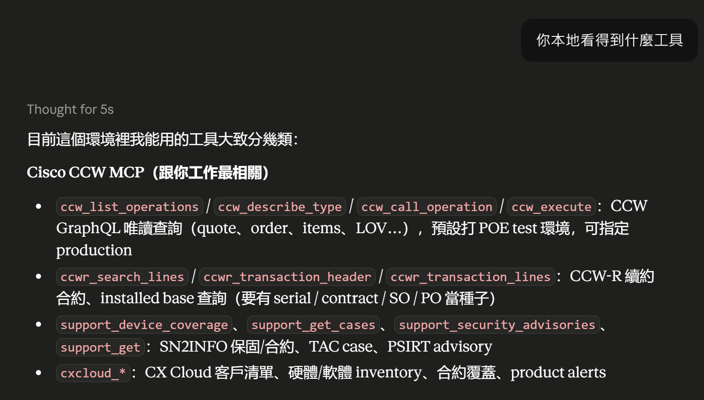
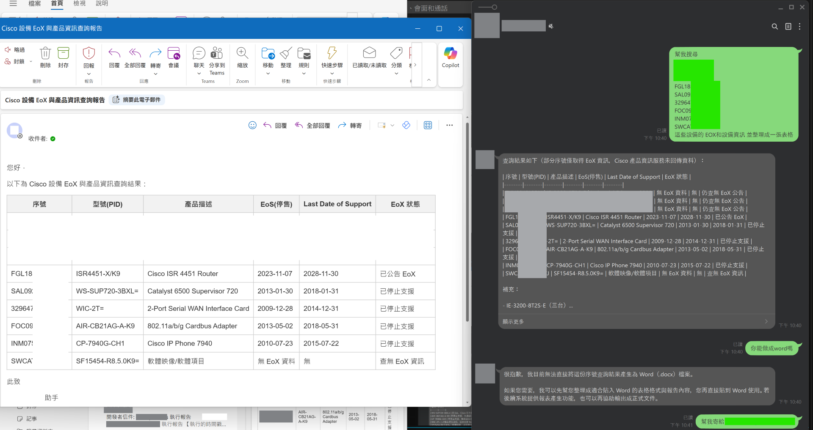

# 【AI 基礎應用 ②】MCP(Model Context Protocol):自己產一個 MCP 工具，把工具標準化

昨天([D14](https://ithelp.ithome.com.tw/articles/10402885))你讓 AI 呼叫了一個工具。但那個 `get_joke` 是**手刻、綁死在那支程式裡**的——換一個 AI、換一個專案、換一個同事來接，都得重寫一次。

有沒有一種**標準插頭**，讓工具寫一次、到處能接?有，它叫 **MCP(Model Context Protocol)**——一個由 Anthropic 提出、如今已經跨生態的開放通用標準。你把工具包成一個 **MCP server**，任何支援 MCP 的 host(Claude、各種 IDE、agent 框架)都能連上來用，不必為每個 AI 各寫一份。

今天用 Python 的 **FastMCP** 從 0 產一個 MCP 工具，跑起來給你看。

## 為什麼需要 MCP?手刻工具的問題在哪?

[D14](https://ithelp.ithome.com.tw/articles/10402885) 的工具很好用，但它有兩個綁死:

1. **綁死在一支程式**:工具函式、schema、呼叫迴圈全寫在同一個檔案裡，別的專案要用就得複製貼上。
2. **綁死在一個 AI**:換一個模型、一個框架，tool 定義的格式、餵回結果的方式可能都不一樣。

MCP 用一個很好記的比喻解決它:**工具的 USB-C**。你把工具做成一個標準介面的 **server**，host 端(用工具的那一方)照同一套協定來接——**工具寫一次，任何 host 都能插上來用**。

**function calling 是「模型怎麼呼叫工具」的機制;**

**MCP 是「工具怎麼被標準化封裝、跨 host 共用」的協定。**

## MCP 到底是什麼?

其實也不用一口氣認識這麼多名詞，就當作是你在做一個可以被所有 LLM 呼叫的工具即可。

所以對於你的 MCP tool 要能夠被呼叫到有兩個途徑: 1. 走 HTTP 協定 2. stdio

MCP 是一個 **client-server 協定**:

- **MCP server**:你寫的那一端，**暴露工具**(tools)、資料(resources)、提示範本(prompts)。

- **Host**:實際在跑 AI 的應用(Claude、IDE、你的 agent)，裡面內建一個 **MCP client**，負責連上你的 server。 (這邊以 vscode 作為範例)
  

- **傳輸(transport)**:client 和 server 怎麼通訊。**本機開發、單機 host 用 stdio**(host 直接把 server 當子行程拉起來，零網路設定、最省事);**要常駐、多人共用、跨網路時改走 HTTP(Streamable HTTP)**。

流程是:host 啟動你的 server → client 問「你有哪些工具?」→ server 回一份清單 → AI 需要時，client 呼叫某個工具、拿回結果。**你只負責把工具寫好並暴露出去，怎麼連接與呼叫由 LLM 跟你的描述檔處理。**

## 怎麼從 0 產一個 MCP 工具?

用 Python 的 **FastMCP**，把 [D14](https://ithelp.ithome.com.tw/articles/10402885) 那個 `get_joke` 變成標準工具，只要一個裝飾器:

```python
# server.py — 一個最小的 MCP server(stdio transport)
# 安裝：pip install mcp
from mcp.server.fastmcp import FastMCP

mcp = FastMCP("joke-tools")           # 給這組工具一個名字

@mcp.tool()
def get_joke(topic: str) -> str:
    """從冷笑話大全裡查一則指定主題的冷笑話。

    Args:
        topic: 冷笑話主題，例如：雞腿、工程師
    """
    # 示意資料；實務上這裡會查你的資料庫 / API
    return {
        "雞腿": "為什麼雞腿不喜歡去健身房？因為它怕自己「練成雞胸」了。",
        "工程師": "工程師為什麼分不清萬聖節和聖誕節？因為 Oct 31 == Dec 25。",
    }.get(topic, "這個主題今天被冷氣凍住了，笑話端不出來。")

if __name__ == "__main__":
    mcp.run()                         # 預設就是 stdio transport
```

看懂三個重點:

- **`@mcp.tool()`** 把一個普通函式**升級成 MCP 工具**——函式簽章變成參數 schema、docstring 變成工具說明，host 就是靠這些決定何時呼叫、怎麼填參數(所以 docstring 要寫好)。
- **`FastMCP(...)`** 是這組工具的容器，可以掛很多個 `@mcp.tool()`。
- **`mcp.run()`** 起 server，預設走 **stdio**——host 用「啟動這個指令、透過標準輸入輸出溝通」的方式接它。

跟 [D14](https://ithelp.ithome.com.tw/articles/10402885) 比，差別是:工具**從「埋在呼叫迴圈裡」變成一個獨立、可被任何 host 接的 server**。

## 怎麼把它接上 host 來用?

支援 MCP 的 host(Claude 桌面版、多種 IDE、agent 框架)接 stdio server 的方式，通常就是一段設定，告訴它「用哪個指令把 server 起起來」:

```json
{
  "mcpServers": {
    "joke-tools": {
      "command": "python",
      "args": ["/abs/path/to/server.py"]
    }
  }
}
```

`args` 這裡**填絕對路徑最保險**——host 啟動 server 時的工作目錄未必是腳本所在處，填相對路徑常常會找不到檔案。

host 啟動後，它裡面的 MCP client 會自動列出 `joke-tools` 有哪些工具，AI 需要時就呼叫 `get_joke`——**你完全不用改 server，同一個 server 能被不同 host 共用**。這正是「工具寫一次、到處接」的兌現。

舉一個我的實際應用例子:



## MCP over HTTP 跟一般 Web server 差在哪?

走 HTTP 的 MCP server 不是給瀏覽器看的網頁服務(http method)，而是只講 MCP 協定(JSON-RPC)、對象是 LLM 不是人的端點。

設計工具時要記得: LLM 每次呼叫工具都是獨立請求，工具間不會自動共享上次狀態——像「取得原廠 Token」這種昂貴步驟要在工具內做快取，而非每次重跑。

下圖這套內部小工具正是這樣設計的:



> 這是我們內部一個查 Cisco 設備 EoX/EOL 的小助手，它的呼叫流程是:呼叫 → 取得原廠 Token → 送出 Request → 回傳結果。

工具要不要快取、快取放哪，方法很多，那是你依場景做的判斷——這裡先讓你看見的是「每次呼叫都是獨立的」這件事情。

## MCP 還是 function calling?什麼時候用哪個?

先說結論:**它們不是二選一，是不同層次。**

- **function calling([D14](https://ithelp.ithome.com.tw/articles/10402885))**:模型「決定呼叫哪個工具、填什麼參數」的底層機制。
- **MCP(今天)**:把工具**標準化封裝成 server**，讓它跨專案、跨 AI、跨 host 共用。

一個簡單的判斷起點:

| 情境                                    | 比較適合                    |
| --------------------------------------- | --------------------------- |
| 單一專案、工具只有這支程式在用          | function calling 直接寫就好 |
| 工具要給多個專案 / 多個 AI / 別的同事接 | 包成 MCP server             |
| 想接現成的生態工具(檔案、Git、資料庫…)  | 用別人寫好的 MCP server     |

至於你的專案該不該全面改用 MCP——那要看你的工具會不會被重複接。**這篇只負責讓你會做一個;要不要用、用到多深，是你自己的判斷。**

## 帶走什麼?

- **MCP 是工具的標準插頭**:工具寫成一個 server、寫一次，任何支援 MCP 的 host 都能接。
- **`@mcp.tool()` 就是升級鍵**:普通 Python 函式 + 一個裝飾器 = 一個 MCP 工具;docstring 與型別註記就是它的 schema。
- **stdio 是本機最省事的 transport**:host 用「啟動指令 + 標準輸入輸出」接你的 server。
- **MCP ≠ function calling**:一個是機制、一個是標準化封裝;單專案自用選前者，要跨 host 共用選後者。
- **適用邊界**:工具會被重複接才值得包成 MCP;一次性、單專案的小工具，直接 function calling 更快。

現在你的工具是標準件了，任何 host 都能接。但接上工具的 AI，還有一個沒解決的問題:**它每次對話都像第一次見面**——你上一句說的話，它下一句就忘了。

一個會用工具、卻沒有記憶的 AI，能做的事很有限。怎麼給無狀態的 LLM 一個記憶、還能配合工具呼叫——那是明天 [D16](https://ithelp.ithome.com.tw/articles/10403243) 的事。
