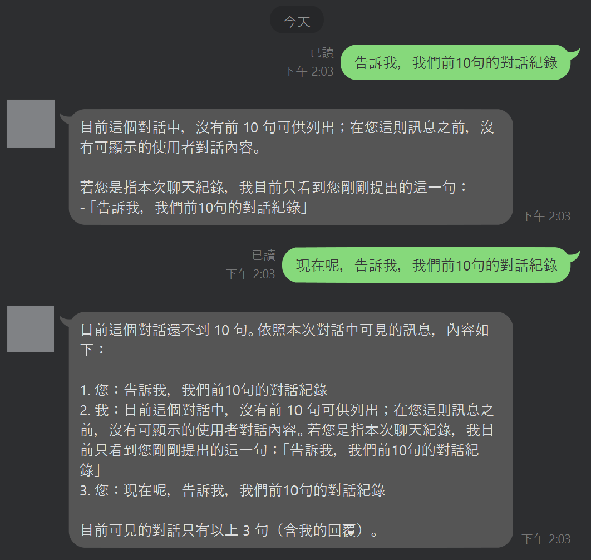

# 【AI 基礎應用 ③】AI 記憶的原理與實作：memory + tool_call 示範、Azure Redis 存工作階段

這幾天你讓 AI 會呼叫工具([D14](https://ithelp.ithome.com.tw/articles/10402885))、還把工具標準化成 MCP([D15](https://ithelp.ithome.com.tw/articles/10403118))。但只要多聊兩句就會發現：**它記不住**。你說「講個雞腿的笑話」它講了，接著你問「換工程師的呢」，它一臉茫然——因為它根本不記得你剛剛在聊笑話。

原因不是它笨，是 **LLM 天生無狀態（stateless）**：每一次呼叫，對模型來說都是全新的一次，上一輪說了什麼，它不會自己記得。

這篇把「記憶」這件事拆開：先講它的原理（其實很樸素），再用 **Azure Redis** 把工作階段存起來，最後接回昨天的工具呼叫——這天結束，你手上是一個**記得上下文、又會動手的 agent**。

## AI 為什麼轉頭就忘？

因為每一次 `chat.completions.create()`，對模型來說都是**獨立、互不相干**的一次請求。它不會在雲端某處替你保存「我們剛剛聊到哪」。你這次送什麼，它就只看得到什麼。

所以「AI 記得我」這件事，其實是個**錯覺**——是應用層每次都把之前的對話一起送回去，製造出「它記得」的效果。認清這點，記憶就從玄學變成工程問題。

## 記憶的本質是什麼？

把上面那句話翻成一行工程定義：**記憶 = 把歷史訊息存起來，下次呼叫時一起帶回去**。

```python
# 沒有記憶：每次都只送當前這句 → 模型看不到上下文
messages = [{"role": "user", "content": "換工程師的呢？"}]  # 「換……的」在指什麼？模型不知道

# 有記憶：把整段對話歷史帶回去 → 模型才有上下文
messages = [
    {"role": "user", "content": "講個雞腿的笑話"},
    {"role": "assistant", "content": "為什麼雞腿不去健身房？因為它怕練成雞胸。"},
    {"role": "user", "content": "換工程師的呢？"},          # 現在模型知道你要的是「工程師主題的笑話」
]
```

差別就這麼簡單。難的不是「要不要帶」，是**「歷史存在哪、怎麼快速存取、多人多對話怎麼分開」**——這就是 Redis 上場的地方。

> 「換工程師的呢」是省略指涉(anaphora)。意思是模型必須拿歷史把「換…的」解析成「工程師主題的笑話」，再決定觸發工具。
> 沒有記憶它連這句話都解析不了。所以記憶的上下文引用正是「讓一個非平凡的生成式判斷變得可能」的東西。

## 怎麼用 Azure Redis 存工作階段？

**Redis 是一個記憶體型的鍵值資料庫，讀寫極快**——正好適合「每次對話都要頻繁存取」的工作階段。做法是以「對話 ID」當 key，把該對話的訊息陣列存成一筆：

```python
import json, os, redis

# 連線 Azure Cache for Redis（host / 金鑰一律走環境變數，勿寫死）
r = redis.Redis(host=os.environ["REDIS_HOST"], port=6380,
                password=os.environ["REDIS_KEY"], ssl=True)

def load_history(session_id: str) -> list:
    raw = r.get(f"chat:{session_id}")
    return json.loads(raw) if raw else []

def save_history(session_id: str, messages: list, ttl=3600):
    r.set(f"chat:{session_id}", json.dumps(messages), ex=ttl)  # ex：過期時間
```

以 `session_id` 為 key，**不同使用者、不同對話天然隔開**；加上 `ex`（TTL）讓舊對話自動過期，記憶就不會無限膨脹。

## 記憶接上工具呼叫後，agent 長什麼樣？

把 [D14](https://ithelp.ithome.com.tw/articles/10402885) 的工具呼叫迴圈和今天的記憶合起來，就是一個最小但完整的 agent：**讀歷史 → 帶歷史呼叫模型 → 有工具就執行並餵回 → 寫回歷史**。

```python
def chat(session_id: str, user_input: str) -> str:
    messages = load_history(session_id)              # ① 從 Redis 讀記憶
    messages.append({"role": "user", "content": user_input})

    resp = client.chat.completions.create(
        model="<your-deployment-name>", messages=messages, tools=tools,
    )
    msg = resp.choices[0].message

    if msg.tool_calls:                               # ② 模型自己決定用工具（先處理一個，多工具分派留給 D17）
        call = msg.tool_calls[0]
        result = get_joke(**json.loads(call.function.arguments))
        # msg 是回傳「物件」,先轉成 dict 才能 json.dumps 存進 Redis
        messages += [msg.model_dump(exclude_none=True),
                     {"role": "tool", "tool_call_id": call.id, "content": str(result)}]
        msg = client.chat.completions.create(
            model="<your-deployment-name>", messages=messages, tools=tools,
        ).choices[0].message

    messages.append({"role": "assistant", "content": msg.content})
    save_history(session_id, messages)               # ③ 寫回記憶
    return msg.content
```


_同一個問題「我們前幾句聊了什麼」，對話一開始答不出來，累積幾輪後就能逐條回放——記憶不是模型自己記得，是每次把歷史帶回去的效果。_

畫面裡 AI 能把前面每一句「回放」出來，靠的就是上面那段 `chat()`：每次把歷史讀出來、帶回去、再寫回。而同一份被帶回的歷史，也讓工具用得上上下文——你接著追問「換工程師的呢」，模型知道你還在聊笑話、照樣會呼叫工具。**記憶讓對話與工具都接得上上文**，這兩件事合起來才像個能用的助理。

## 該把什麼放進 Redis？一個設計取捨

實作到一半，你會遇到一個很自然的問題：使用者傳了一個檔案（PDF、圖片），這東西要不要也存進 Redis？

**答案是不要——這是一個該想清楚的設計取捨。** Redis 是記憶體資料庫，強項是「小而頻繁」的存取；把大檔案 blob 塞進去，會吃掉昂貴的記憶體、也拖慢它最該快的地方。比較好的分工是：

- **大檔案** → 放物件儲存（如 Azure Blob Storage），拿到一個 URL / reference。
- **Redis** → 只存這個 reference 和輕量的工作階段狀態。

同樣是「記住這個檔案」，選擇「Redis 存指標、Blob 存本體」而不是「全塞 Redis」，換來的是成本與速度——**這種取捨判斷，就是工程師在 AI 應用裡真正在做的事**。

## 最後總結一下

- **LLM 無狀態**：「AI 記得你」是應用層每次把歷史帶回去製造的效果，不是模型自己記得。
- **記憶 = 存歷史 + 每次帶回**：難點不在概念，在「存哪、怎麼快取、多對話怎麼隔開」。
- **Redis 存工作階段**：以對話 ID 當 key 天然隔離、用 TTL 讓記憶自動過期，不會無限膨脹。
- **記憶 × 工具**：讀歷史 → 帶歷史呼叫 → 執行工具餵回 → 寫回歷史，是 agent 的最小完整迴圈。
- **放對地方的取捨**：小而頻繁的狀態放 Redis，大檔案放物件儲存只存 reference——判斷放哪，是你的活。

現在你的 AI 記得上下文、也會用工具了。但當工具從一個變成五個、十個，你會撞到下一道牆：**一顆通用的 prompt，開始接不住這麼多工具**——它會選錯工具、把上下文塞爆、判斷變差。

怎麼讓 AI 自己把需求**拆解**、把每一步**分派**給專精的工具，同時讓 context 保持專注、成本還算得清楚？那是明天 [D17](https://ithelp.ithome.com.tw/articles/10403407) 的核心——**分裂操作**。
