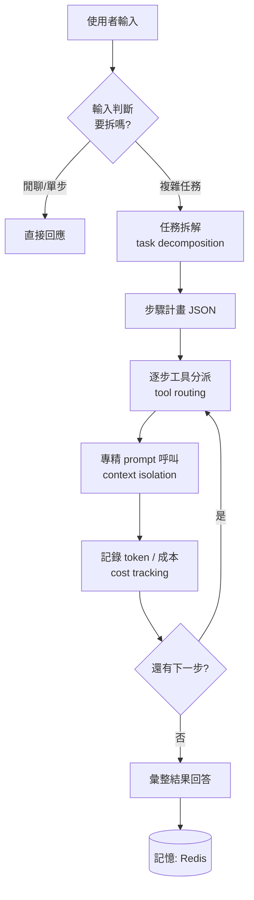

<!-- ═══════════════════════════════════════════════════════════════
     Day 17 寫作導引(寫完後這整塊可刪；HTML 註解不會輸出到文章）
     性質：⑤實作 💻code ｜ 階段：實現 ｜ 分級：🔵 工程師線（火力展示）
     里程碑：這天結束，讀者看到「一個會拆解、分派、算成本的完整運作」。

     🚦 §0 硬門檻
       ① 主幹問題（一句話）：一顆通用 prompt 扛不動多工具時，怎麼讓 AI 自己把需求
          拆解、分派給專精 prompt 的工具，還能控成本？
       ② 用真實案例回答：通用 prompt 塞爆 context 失焦 → 輸入判斷 → 多次工具呼叫
          判斷 → 成本計算/紀錄 → 運作邏輯圖（可運行 code + 圖）。

     🔗 承先啟後（依 article-framework Tip 3）
       承前：D14（會呼叫工具）+ D15（MCP 標準化）+ D16（會記憶）→ 本篇把單一 agent
             升級成「拆解 + 多工具分派」。
       啟後：→ D18 起三系統登場（向原廠下單系統）；點出「同一套拆解分派，
             正式版就是接下來的三系統」。做成系列內鏈。

     ⚑ 命名（本篇統一術語，硬規則）
       - 招牌詞「分裂操作」首次出現須立刻接標準術語：任務拆解（task decomposition）
         / 工具分派（tool routing）。
       - 埋英文關鍵字：prompt specialization、context isolation、cost tracking。

     ⚠️ 待補
       [ ] 通用 prompt 失焦的實際對照（塞很多工具 vs 分派後）
       [ ] 運作邏輯圖：作者版的實際流程圖（可先用下方 mermaid 佔位）
       [ ] 成本紀錄的實際欄位/畫面（去識別化）

     🚫 紅線：公司不具名、不揭露上線日期、成本數字去識別化
     🧭 認知鐵則：凸顯「拆幾步、打哪個工具」是 LLM 的判斷（類別契合），不是寫死
     💰 成本段分工：本篇＝技術上怎麼算/記每次呼叫成本；D28＝商業上划不划算
     ══════════════════════════════════════════════════════════════ -->

# 【AI 基礎應用 ④】AI 分裂操作（任務拆解 / 工具分派）：輸入判斷、多次工具呼叫判斷、成本計算與紀錄 + 運作邏輯圖

<!-- 前導 TL;DR（前 3–5 行）＝鉤子 + 結論先行。
     鉤子：工具從一個變十個，一顆通用 prompt 就開始選錯、塞爆、判斷變差。
     結論：解法是「分裂操作」——AI 先判斷輸入、把需求拆解，再分派給各自用專精
           prompt 的工具，讓每次呼叫的 context 保持專注，順便把成本算清楚、記下來。 -->

前面幾天你讓 AI 會呼叫工具(D14)、把工具標準化成 MCP(D15)、還給了它記憶(D16)。現在把工具加到十個、二十個，你會親眼看到它**開始出錯**：選錯工具、把一堆用不到的工具說明塞進 context 導致失焦、一個複雜請求它硬要一步做完。

問題不在模型不夠強，在**你要它用一顆通用 prompt 同時扛所有事**。這篇的解法，我叫它**分裂操作**——說白了就是兩件標準的事：**任務拆解（task decomposition）** 和 **工具分派（tool routing）**。

核心概念一句話：**與其用一顆什麼都要會的通用 prompt，不如讓 AI 先拆解需求，再把每一步分派給一個「只擅長那件事」的專精 prompt。**

## 為什麼一顆通用 prompt 扛不動？

<!-- 節首答案：因為工具一多，全部塞進同一個 context 會稀釋模型的注意力（context
     失焦）；工具說明彼此干擾、模型更容易選錯、也更貴。這是 context isolation 要解的。 -->

因為 context window 是有限的、模型的注意力也是。當你把二十個工具的說明、一長串對話歷史、外加一堆規則，**全部塞進同一個 prompt**，會發生三件事：

1. **失焦**：關鍵指令被一堆用不到的工具說明淹沒，模型抓不到重點。
2. **選錯**：功能相近的工具擺在一起，模型更容易挑錯那一個。
3. **變貴**：每次呼叫都帶著用不到的一大包，token 成本白白墊高。

這就是為什麼要做 **context isolation（脈絡隔離）**：**讓每一次呼叫，只看到它這一步真正需要的東西。**


_（待補：作者的對照畫面——一大包通用 prompt vs 分派後的專注呼叫。）_

## 什麼是「分裂操作」？拆解 + 分派

<!-- 節首答案：分裂操作 = 任務拆解（把一個請求拆成數個子步驟）+ 工具分派（每個
     子步驟交給對的工具，且用該工具專精的 prompt）。關鍵是「專精 prompt」——
     不是一開始那顆通用對話 prompt。 -->

分裂操作拆成兩個動作：

- **任務拆解（task decomposition）**：把「幫我報一份 50 人辦公室的網路」這種大請求，拆成「查產品線 → 選型號 → 查庫存 → 算價」數個子步驟。
- **工具分派（tool routing）**：每個子步驟交給對的工具，而且**用那個工具專精過的 prompt**——不是一開始跟使用者對話用的通用 prompt。

最後這點是關鍵，也是你問的核心：**呼叫工具用的是「專精 prompt（prompt specialization）」**。查庫存的那一步，它的 prompt 只講「怎麼查庫存」，不夾帶算價、選型的規則——乾淨、專注、便宜。

## 使用者輸入進來，怎麼判斷要拆成幾步？

<!-- 節首答案：先用一個「路由 / 規劃」prompt 讓模型讀懂輸入、輸出一個結構化的
     步驟計畫（要哪些工具、順序）。這一步是 LLM 的判斷，不是寫死。 -->

第一關是**輸入判斷**：來的是一句閒聊，還是一個要跑好幾步的任務？這一步交給一個專門的「規劃」prompt，讓模型讀懂輸入、輸出一個**結構化的步驟計畫**：

```python
# 規劃 prompt：只做一件事——把使用者輸入拆成步驟計畫（回 JSON）
PLANNER_PROMPT = """你是任務規劃器。讀使用者需求，輸出要執行的步驟清單。
每步指定 tool 與該步驟的輸入。只回 JSON：{"steps":[{"tool":..,"input":..}]}"""

def plan(user_input: str) -> list:
    resp = client.chat.completions.create(
        model="<your-deployment-name>",
        messages=[{"role": "system", "content": PLANNER_PROMPT},
                  {"role": "user", "content": user_input}],
        response_format={"type": "json_object"},   # 逼它回結構化，好解析
    )
    return json.loads(resp.choices[0].message.content)["steps"]
```

注意：**「拆成幾步、每步派哪個工具」是模型判斷出來的**，不是你寫死的 if-else。這就是生成式 AI 在這套架構裡實際做的判斷——也是它和純自動化流程的分界。

## 工具要呼叫幾次、怎麼判斷？

<!-- 節首答案：拿到步驟計畫後，逐步執行；每一步用「該工具的專精 prompt」跑，
     必要時同一步可多次呼叫（例如查一批料號）。每步的 context 只帶自己需要的。 -->

拿到計畫後就**逐步執行**。每一步用它自己的專精 prompt，只帶這一步需要的脈絡——這就是 context isolation 落地的樣子。同一步視需要可以**多次呼叫**（例如要查一批料號，就對每個料號各查一次）：

```python
# 每個工具有自己的專精 prompt（只講自己那件事）
TOOL_PROMPTS = {
    "get_stock": "你只負責查庫存。給料號，回庫存數字，不做其他判斷。",
    "get_price": "你只負責查即時價。給料號，回單價，不做其他判斷。",
}

def run_step(step: dict) -> dict:
    sys = TOOL_PROMPTS[step["tool"]]                 # ← 專精 prompt，非通用
    resp = client.chat.completions.create(
        model="<your-deployment-name>",
        messages=[{"role": "system", "content": sys},
                  {"role": "user", "content": json.dumps(step["input"])}],
        tools=[t for t in tools if t["function"]["name"] == step["tool"]],
    )
    # …執行 tool_call、把結果收好（略，同 D15 的工具迴圈）
    return {"tool": step["tool"], "result": ...}

results = [run_step(s) for s in plan(user_input)]     # 逐步分派、必要時多次呼叫
```

## 怎麼算錢、留紀錄？

<!-- 節首答案：每次呼叫都會回 usage（token 數），乘上單價就是這次成本；把每步的
     token/成本記下來，你就能知道一個請求「拆了幾步、花了多少」。
     💰 這裡只講技術面怎麼算/記；「划不划算」的商業帳留 D28。 -->

分裂操作會讓呼叫次數變多，所以**成本要算得清楚**。好消息是每次回應都會附 `usage`（用了多少 token），乘上你的模型單價就是這次的成本——把每一步都記下來：

```python
def log_cost(session_id, step, usage, price_per_1k):
    cost = (usage.total_tokens / 1000) * price_per_1k
    r.rpush(f"cost:{session_id}", json.dumps({          # 存進 Redis / DB
        "tool": step, "tokens": usage.total_tokens, "cost": round(cost, 6),
    }))
    return cost
```

這樣你能回答「這個請求拆成幾步、每步花多少、總共多少」——**cost tracking（成本追蹤）是技術面的計量**。至於「這樣到底划不划算、跟人力比省多少」，那是另一本帳，留到 D28 的成本專篇一次算清楚，這裡不重複。

## 整條路徑長什麼樣？運作邏輯圖

<!-- 節首答案：輸入 → 規劃（拆解）→ 逐步分派（各用專精 prompt）→ 記憶/成本紀錄
     → 彙整回答。一張圖看懂。視覺錨點（核心）：作者版流程圖，先用 mermaid 佔位。 -->

把上面串起來，就是分裂操作的完整運作：



_（待補：作者版的實際運作邏輯圖，可取代上方 mermaid。這張圖同時也給非工程師/決策者看得懂整條路徑。）_

一張圖看完你會發現：**分裂操作不是什麼黑魔法，是「先想清楚要做幾件事、再一件一件用對的工具做」**——這恰好也是一個好工程師本來就會的思路，只是這次交給 AI 去判斷。

## 帶走什麼？

<!-- 依 Tip 2：可遷移的帶走重點，每點對回主幹問題。 -->

- **通用 prompt 有極限**：工具一多就失焦、選錯、變貴——這不是模型不夠強，是脈絡沒隔離。
- **分裂操作 = 任務拆解 + 工具分派**：先把需求拆成步驟，再把每步派給對的工具。
- **專精 prompt（prompt specialization）**：每個工具用只講自己那件事的 prompt，換來專注、準確、便宜。
- **拆幾步、派哪個工具是 LLM 的判斷**：這是生成式 AI 在架構裡實際做的事，不是寫死的流程。
- **成本要當場算、當場記**：用每次回應的 usage 記 token/成本；技術計量歸這裡，划不划算歸 D28。

<!-- 收束 + 下一篇鉤子（geo-seo §6 / Tip 3）：
     一句話重述：把大請求拆解、分派給專精 prompt 的工具，context 專注、成本可算。
     啟後鉤子（扣 D18）：這套骨架的正式版，就是接下來三個真實上線系統。 -->

到這裡，D15–17 的三個能力湊齊了：**會呼叫工具、會記憶、會拆解分派**。這三樣合起來，就是一套能接真實系統的骨架。

而這套「拆解 → 分派 → 專精 prompt」的手法，**正式版就是接下來要登場的三個真實系統**。第一個，是每天在幫業務組報價、要跟原廠比對上百種型號相容性的——向原廠下單系統。人工做這件事的規模極限在哪、為什麼非自動不可，是明天 D18 的事。
