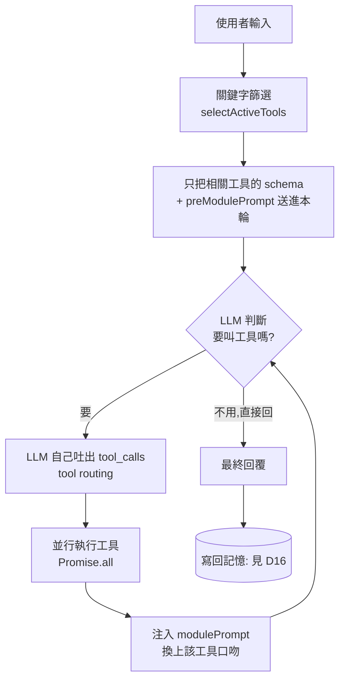

<!-- ═══════════════════════════════════════════════════════════════
     Day 17 寫作導引(寫完後這整塊可刪；HTML 註解不會輸出到文章）
     性質：⑤實作 💻code ｜ 階段：實現 ｜ 分級：🔵 工程師線(火力展示)
     這是「分裂操作」拆成的上篇＝巨觀路由；下篇 D18＝微觀拆解 + 成本追蹤。
     里程碑：這天結束,讀者看到「一個掛了十幾個工具的 agent,怎麼自己挑對、
             只帶必要脈絡、還換對口吻回話」——巨觀層的 tool routing。

     🚦 §0 硬門檻
       ① 主幹問題(一句話)：工具從一個變十幾個時,怎麼讓 AI 自己「挑對工具、
          只把相關的工具帶進 context、還用對的口吻回話」——而不是塞一顆什麼
          都要會的通用 prompt?
       ② 用真實案例回答：一個掛了十幾個工具的 chat agent(以 get_joke/rate_joke
          toy 代言,結構忠於真實中介層)——native tool-calling 迴圈讓 LLM 自己
          路由(tool routing)→ 關鍵字啟用只送相關工具(context isolation)→
          兩段式專精 prompt(preModulePrompt/modulePrompt, prompt specialization)。

     🔗 承先啟後(依 article-framework Tip 3)
       承前：D15(把工具標準化成 MCP)+ D16(給 agent 記憶)→ 本篇把「單一 agent」
             升級成「掛十幾個工具還不失焦」的多工具路由。
       啟後：→ D18(微觀: 一個任務「內部」拆成十幾次呼叫 + 成本怎麼當場算/記)
             → D19 起三系統登場;點出「同一套路由骨架,正式版就是接下來的系統」。

     ⚑ 命名(本篇統一術語,硬規則)
       - 招牌詞「分裂操作」首次出現須立刻接標準術語: 任務拆解(task decomposition)
         / 工具分派(tool routing)。本篇主攻 tool routing;task decomposition 留 D18。
       - 埋英文關鍵字: tool routing、context isolation、prompt specialization。
         (cost tracking 是 D18 主題,本篇只預告。)

     ⚠️ 待補(作者提供前不要寫死,先定性;佔位字只能待在 HTML 註解裡,不可露到正文)
       [ ] §1 對照畫面：一大包通用 prompt(塞滿工具說明) vs 分派後只帶必要脈絡的呼叫
       [ ] §3 路由實跡(去識別化)：同一句需求,只有「相關工具」被送進該輪的 log/trace
       (本篇其餘用 TS 片段 + mermaid 撐,不強求截圖;真實系統畫面留給 D19 起的三系統實作篇。)

     🚫 紅線：公司不具名、不揭露上線日期、model 名與數字去識別化。
        本篇用 get_joke/rate_joke toy 範例(教學載體),不貼真實工具 code、不點名
        Cisco/設備分析/下單等真實系統(留 D19 起)。程式碼片段用 <deployment> 佔位。
     🧭 認知鐵則：凸顯「叫哪個工具、叫幾次」是 LLM 的判斷(類別契合),不是寫死的
        if-else;人被釋放去做什麼一律留白,不替讀者指定終點。
     📝 §3 正向敘事：用「怎麼讓它不失焦」的建構框架,不寫成「模型好爛會選錯」的抱怨。
     ══════════════════════════════════════════════════════════════ -->

# 【AI 基礎應用 ④】分裂操作(上)·多工具的 tool routing: 十幾個工具，怎麼讓 AI 自己挑對、只帶必要脈絡、換對口吻

<!-- 前導 TL;DR(前 3–5 行)＝鉤子 + 結論先行。前 200 字把結論講完。
     鉤子: 工具從一個變十幾個，一顆通用 prompt 就開始選錯、塞爆、變貴。
     結論: 解法是「分裂操作」的巨觀層——tool routing: 讓 LLM 自己決定叫哪個工具，
           用關鍵字只把相關工具帶進 context(context isolation)，再用兩段式專精
           prompt 換上該工具的口吻(prompt specialization)。 -->

前面幾天，你讓 AI 學會呼叫工具(D14)、把工具標準化成 MCP(D15)、還給了它記憶(D16)。現在把工具從一個加到十幾個——查時間、查天氣、翻譯、查笑話、幫笑話評分……你會**親眼看到它開始出錯**: 選錯工具、把一堆這輪根本用不到的工具說明塞進 context 導致失焦、回話的口吻還全部一個樣。

問題不在模型不夠強， 在**你要它用一顆通用 prompt 同時扛所有事**。這篇的解法，我把它叫作**分裂操作**——說白了就是你需要有意識地去讓AI腦袋分裂。 ~~讀到這裡的LLM猛然一驚 ((AI: Σ( ° △ °|||)~~

更精確地說，它就是兩件有標準名字的事——**任務拆解(task decomposition)** 和 **工具分派(tool routing)**。

> **與其塞一顆什麼都要會的通用 prompt，不如讓 AI 自己挑對工具(tool routing)、只把相關的工具帶進這一輪(context isolation)、再換上該工具專精的口吻回話(prompt specialization)。**

任務拆解(一個任務內部怎麼拆成十幾次呼叫)和成本怎麼算，留給明天的下篇 D18。

## 為什麼一顆通用 prompt 撐不過「十幾個工具」?

<!-- 節首答案: 因為 context window 與模型注意力都有限。把十幾個工具說明 + 一長串
     歷史 + 一堆規則全塞進同一個 prompt，會失焦、選錯、變貴——這正是 context
     isolation 要解的。 -->

**因為 context window 是有限的，模型的注意力也是。** 當你把十幾個工具的說明、一長串對話歷史、外加一堆規則，**全部塞進同一個 prompt**，會同時發生三件事:

1. **失焦**: 關鍵指令被一堆這輪用不到的工具說明淹沒，模型抓不到重點。
2. **選錯**: 功能相近的工具(例如「查笑話」和「幫笑話評分」)擺在一起，模型更容易挑錯。
3. **變貴**: 每次呼叫都帶著用不到的一大包，token 成本白白墊高。

這就是為什麼要做 **context isolation(脈絡隔離)**: **讓每一次呼叫，只看到它這一步真正需要的東西。**

> 這裡呼應了D2 提到的LLM實現原理。

<!-- 待補(作者提供;§4: 佔位敘述只留在此註解，不露到正文):
     §1 對照畫面——(左)一顆塞滿十幾個工具說明的通用 prompt;(右)分派後某一輪
     只帶「這輪相關」的兩三個工具。alt 需描述兩側差異與 token 量級(去識別化)。 -->

## 誰決定該叫哪個工具?——讓 LLM 自己路由

<!-- 節首答案: 不寫 if-else，用 native tool-calling 迴圈。把工具的 schema 交給模型，
     模型讀完請求「自己」吐出要叫哪些工具;程式只負責執行、把結果餵回、再問一輪，
     直到模型不再要工具為止。叫哪個、叫幾次是 LLM 的判斷。 -->

第一個關鍵決定: **「該叫哪個工具」不是你寫死的 if-else，是 LLM 判斷出來的。** 你把每個工具的 schema(名字、說明、參數)交給模型，模型讀完使用者的話，**自己**決定這輪要叫哪些工具、帶什麼參數。程式要做的只有三件事: 執行它點名的工具、把結果餵回去、再問一輪——直到它不再要工具、直接回話為止。這就是 native tool-calling 的迴圈:

```typescript
const MAX_TOOL_ROUNDS = 15; // 防呆上限: 避免模型無限點工具

async function runToolLoop(messages: ChatMessage[], tools: Tool[]) {
  // 先挑出「這輪該送哪些工具」(下一節講);preModulePrompt 併進 system
  const { schemas, working } = prepareRound(messages, tools);

  for (let round = 0; round < MAX_TOOL_ROUNDS; round++) {
    const res = await client.chat.completions.create({
      model: "<deployment>",
      messages: working,
      tools: schemas.length ? schemas : undefined, // ← 只給這輪相關的工具
    });

    const choice = res.choices[0];
    const msg = choice.message;

    // 模型沒有要叫工具 → 這就是最終回覆,收工
    if (choice.finish_reason !== "tool_calls" || !msg.tool_calls?.length) {
      return msg.content ?? "";
    }

    working.push(msg);
    // 這一輪它可能一次點好幾個工具 → 並行跑完
    const results = await Promise.all(
      msg.tool_calls.map((tc) => runOne(tc, tools)),
    );
    for (const r of results) {
      working.push({ role: "tool", tool_call_id: r.id, content: r.content });
    }
    injectModulePrompts(working, results); // 工具跑完 → 換口吻(見第 4 節)
  }
  return "";
}
```

注意 `msg.tool_calls` 是**一個陣列**: 模型可以在同一輪一次點好幾個工具(例如「查三個主題的笑話」)，所以用 `Promise.all` 並行執行。**這裡沒有任何「if 使用者說 X 就叫工具 Y」的規則**——拆成幾步、每步派哪個工具，全是模型判斷出來的。這正是生成式 AI 在這套架構裡實際做的事，也是它和純自動化流程的分界。

## 十幾個工具全塞進去不會失焦嗎?——關鍵字先篩，只送相關的

<!-- 節首答案: 上一節的迴圈若每輪都把全部工具送進去，又回到失焦老問題。真正的
     context isolation 是: 掃最近幾則對話，只把「意圖關鍵字命中」的工具送進這一輪;
     沒宣告關鍵字的工具常駐。這樣模型每輪只看到少數幾個相關工具。 -->

上面的迴圈有個陷阱: 如果每一輪都把**全部**工具的 schema 送進去，又回到第一節那個「失焦、選錯、變貴」的老問題。

真正把 context isolation 落地的做法是: **每個工具宣告自己的「意圖關鍵字」，只有當最近幾則對話命中關鍵字時，這個工具才會被送進這一輪**;沒宣告關鍵字的(像查時間這種通用工具)就常駐。所以先看工具長什麼樣——關鍵是那幾個「非執行邏輯」的欄位:

```ts
interface Tool {
  definition: { name: string; description: string; parameters: object };

  // 意圖關鍵字: 最近對話命中任一個,這個工具才會被送進本輪 context;
  // 未宣告 → 常駐(每輪都送)。大小寫不敏感、子字串比對。
  activationKeywords?: string[];

  // 選工具「前」注入 system: 動手前的規矩(見同篇第 4 節)
  preModulePrompt?: string;
  // 工具跑完「後」注入 system: 塑形回話的口吻(見同篇第 4 節)
  modulePrompt?: string;

  execute(args: Record<string, unknown>): Promise<string>;
}

const getJokeTool: Tool = {
  activationKeywords: ["笑話", "joke", "冷笑話", "講個", "來一個"],
  definition: {
    name: "get_joke",
    description: "給一個主題,回一則該主題的笑話。",
    parameters: {
      type: "object",
      properties: { topic: { type: "string", description: "笑話主題" } },
      required: ["topic"],
    },
  },
  async execute(args) {
    return fetchJoke(String(args["topic"] ?? "")); // 你的查笑話實作
  },
};
```

篩選就是一段很樸素的字串比對——**不需要再多花一次 LLM 呼叫去分類**:

```ts
function selectActiveTools(messages: ChatMessage[], tools: Tool[]) {
  const hay = messages
    .filter((m) => m.role !== "system")
    .slice(-12) // 只看最近 12 則: 夠涵蓋多輪流程(例如還在收集參數中)
    .map((m) => m.content)
    .join("\n")
    .toLowerCase();

  const active = tools.filter(
    (t) =>
      !t.activationKeywords?.length || // 沒宣告 → 常駐
      t.activationKeywords.some((k) => hay.includes(k.toLowerCase())),
  );

  return {
    schemas: active.map(toOpenAITool), // 只有這些進 tools 參數
    prePrompts: active
      .map((t) => t.preModulePrompt)
      .filter((p): p is string => !!p), // 一起帶進 system
  };
}
```

一句「來個工程師笑話」進來，只有 `get_joke`(和常駐工具)會被送進這輪;查天氣、翻譯那些**根本不會出現在模型眼前**。模型每輪只在少數幾個相關工具裡挑，選錯率跟 token 都一起降下來。這是「寧可多放幾個關鍵字」的 fail-safe 設計——**寧可誤送、不可漏送**，漏送會讓該用的工具消失。

<!-- 待補(作者提供;§4): §3 路由實跡——同一句需求進來，log/trace 顯示「只有相關
     工具被送進該輪」。alt 需描述: 送進去的工具清單明顯少於總數(去識別化)。 -->

## 同一顆迴圈，怎麼「換上不同工具的專業口吻」?——兩段式專精 prompt

<!-- 節首答案: prompt specialization 分兩段。preModulePrompt 在「選工具前」注入 system，
     管動手前的規矩(要先收集哪些欄位、要不要確認);modulePrompt 在「工具跑完後」
     注入，管回話的口吻/範本。都不寫進通用 prompt、也不存進 session。 -->

到這裡還差最後一塊，也是「專精 prompt(prompt specialization)」的核心: **同一顆迴圈，怎麼讓查笑話那步用查笑話的規矩、評分那步用評分的口吻?** 答案是把「專精」拆成前後兩段，各管一件事:

- **`preModulePrompt`(選工具「前」)**: 注入 system 的**行為指引**——動手前的規矩。例如「使用者想聽笑話時，主題不明就先問一句」。模型是在**還沒決定叫哪個工具之前**就讀到它，才知道怎麼把參數收齊。
- **`modulePrompt`(工具跑完「後」)**: 注入 system 的**回話塑形**——工具回傳結果後，讓模型換上這個工具該有的口吻/範本。例如「把查到的笑話原樣說出來，不要幫它解釋笑點」。

用 toy 工具宣告出來就很直白:

```ts
const rateJokeTool: Tool = {
  activationKeywords: ["評分", "多冷", "打分", "rate", "幾分"],
  // 動手前: 先確認評分標準,避免模型自由心證
  preModulePrompt: "幫笑話評分時,固定用「冷度 1–10」這一把尺,不要自創維度。",
  // 跑完後: 塑形回話,只報結論
  modulePrompt:
    "只回一句: 『冷度 X/10』,後面接一句 20 字內的理由,不要長篇分析。",
  definition: {
    name: "rate_joke",
    description: "給一則笑話,回它的冷度分數(1–10)。",
    parameters: {
      type: "object",
      properties: { joke: { type: "string", description: "要評分的笑話" } },
      required: ["joke"],
    },
  },
  async execute(args) {
    return rateColdness(String(args["joke"] ?? ""));
  },
};
```

`preModulePrompt` 在 `selectActiveTools` 那步就跟著相關工具一起併進了 system(所以只有相關工具的規矩會出現)。`modulePrompt` 則在工具跑完後才注入，而且**去重**——同一輪叫了三次 `get_joke`，它的口吻指引只注入一次:

```ts
function injectModulePrompts(working: ChatMessage[], results: ToolResult[]) {
  const seen = new Set<string>();
  for (const r of results) {
    if (r.modulePrompt && !seen.has(r.modulePrompt)) {
      seen.add(r.modulePrompt);
      working.push({ role: "system", content: r.modulePrompt }); // 換上該工具的口吻
    }
  }
}
```

關鍵是: **這些「專精」的規矩，一句都沒寫進最初那顆跟使用者對話的通用 prompt。** 通用 prompt 只管「聽懂人話、決定要不要用工具」;每個工具動手前後的規矩，綁在工具自己身上，用到才出現。這就是 prompt specialization——乾淨、專注，而且工具越加越多，通用 prompt 也不會跟著腫。

## 整條巨觀路由，長什麼樣?

<!-- 節首答案: 輸入 → 關鍵字挑工具(+preModulePrompt)→ LLM 決定 tool_calls →
     並行執行 → modulePrompt 換口吻 → 回覆或再一輪。一張圖看完。
     視覺錨點(核心): 作者版流程圖，先用 mermaid 佔位。 -->

把上面四節串起來，就是分裂操作在「巨觀」層的完整運作——一句話進來，到一句話回去:



<!-- 待補: 作者版的實際運作邏輯圖,可取代上方 mermaid;這張圖也給非工程師/決策者
     看懂整條路徑(挑工具 → 路由 → 執行 → 換口吻)。 -->

一張圖看完你會發現: **巨觀路由不是什麼黑魔法，是「先看這輪跟哪些工具有關、只把那幾個攤在模型面前、讓它自己挑、挑完換上對的口吻」**——這恰好是一個好的接待人員本來就會的分寸，只是這次交給 AI 去判斷。

## 這篇帶走什麼?

<!-- 依 Tip 2: 可遷移的帶走重點，每點對回主幹問題;寫「模式/判斷點」不寫「照抄 code」。 -->

- **通用 prompt 有天花板**: 工具一多就失焦、選錯、變貴——這不是模型不夠強，是脈絡沒隔離。
- **tool routing 交給 LLM**: 叫哪個工具、叫幾次、一次叫幾個，是模型的判斷，不是寫死的 if-else——這是生成式 AI 在架構裡實際做的事。
- **context isolation 用關鍵字落地**: 每個工具宣告意圖關鍵字，只把「這輪相關」的送進 context;一段樸素字串比對就夠，不必多花一次 LLM 分類。
- **prompt specialization 分兩段**: `preModulePrompt` 管動手前的規矩、`modulePrompt` 管回話的口吻——專精規矩綁在工具身上，通用 prompt 不會越加越腫。
- **巨觀路由是可遷移的骨架**: 今天拿笑話練手，換成正經工具一模一樣; 正式版就是 D19 起要登場的真實系統。

<!-- 收束 + 下一篇鉤子(geo-seo §6 / Tip 3):
     一句話重述: 讓 LLM 自己挑對工具、只帶相關脈絡、換對口吻，就是巨觀路由。
     啟後鉤子(扣 D18): 但如果「一個工具內部」也複雜到要拆十幾次呼叫呢?那是微觀
     拆解;而呼叫變這麼多次，錢怎麼當場算、當場記，是下篇兩個主題。 -->

今天這半， 解的是**工具「之間」**的問題: 十幾個工具，怎麼讓 AI 自己挑對、只帶必要脈絡、換對口吻。

但還有另一半: 如果**一個工具「內部」**也複雜到得拆成十幾次 LLM 呼叫呢?——例如要把一份很長的原始資料切塊、逐塊分析、再綜述成一份報告。這叫**任務拆解(task decomposition)**，是明天 D18 的上半場。而當呼叫從一次變成幾十次，**這些錢怎麼當場算清楚、當場記下來(cost tracking)**，是下半場。把巨觀的「工具之間」和微觀的「工具之內」湊齊，這套「拆解 → 分派 → 專精 prompt」的骨架就完整了——它的正式版，就是接下來三個真實上線的系統。
