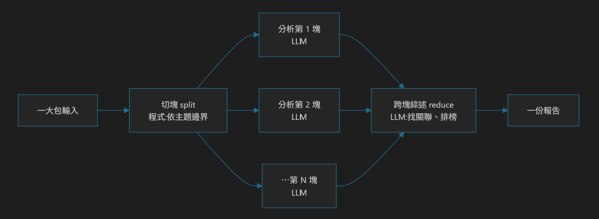

# 【AI 基礎應用 ④】分裂操作(下)·任務拆解 + 成本追蹤:一個任務拆成幾十次呼叫，怎麼分頭做、又算得清帳

昨天 D17 解的是**工具「之間」**的問題:十幾個工具，怎麼讓 AI 自己挑對、只帶必要脈絡、換對口吻。今天解另一半——**工具「之內」**:當**一個任務**複雜到一次 LLM 呼叫根本做不完呢?

例如:「把我這一大包笑話草稿，整理成一份『本週最冷笑話報告』——每則抓重點、標冷度，找出重複的哏，最後排個 Top 榜。」草稿太長，一次塞進去要嘛超出 context、要嘛模型讀到後面就開始胡言亂語。這時候要做的，是**分裂操作**的另一半:**任務拆解(task decomposition)**。

> **與其硬要一次呼叫吃下整個大任務，不如把它切塊、逐塊並行分析、再跨塊綜述;每一步用剛好夠的力氣，並把這幾十次呼叫的 token 當場算清楚、記下來(cost tracking)。**

一份這樣的報告，做完可能就是**十幾、幾十次** LLM 呼叫疊起來。所以這篇有兩件事:怎麼拆得開，以及拆這麼多次、錢怎麼算得清。

## 一個大任務，怎麼拆成幾十次呼叫?

拆解的骨架就三步，順序不能反:

1. **切塊(split)**:把大輸入切成一個個獨立單元——依主題、依段落、依指令邊界都行。
2. **逐塊並行分析(map)**:每一塊丟給一次**專精呼叫**，用只講「怎麼分析這一塊」的 prompt。塊與塊之間互不相干，所以可以並行。
3. **跨塊綜述(reduce)**:把各塊的結果收集起來，餵給綜述呼叫——找跨塊的關聯、排 Top 榜、寫總結。

用 toy 管線寫出來就是這樣(結構就是真實系統裡那個「把長輸入變成一份報告」的工具):

```ts
async function buildColdJokeReport(draft: string) {
  // 1. 切塊:把一大包草稿依主題切成獨立單元
  const blocks = splitByTopic(draft);
  if (blocks.length === 0) return "[EMPTY] 找不到可分析的主題。";

  // 2. 逐塊並行分析:每塊各自一次 LLM 呼叫(限並發,見第 3 節)
  const groups = groupByTopic(blocks);
  const sections = await mapWithConcurrency(
    groups,
    CONCURRENCY,
    analyzeOneTopic,
  );

  // 3. 跨塊綜述:把各塊結果餵給「找重複哏 → 排 Top 榜」的專精呼叫
  const digest = buildDigest(sections);
  const repeated = await findRepeatedGags(digest); // 跨塊關聯(一次呼叫)
  const summary = await writeTopList(digest, repeated); // 收尾綜述(一次呼叫)

  return renderReport(summary, sections, repeated);
}
```

**注意這其實就是 D17「context isolation」在任務內部的版本**:上篇是把「這輪相關的工具」隔離出來，這篇是把「這一塊要分析的東西」隔離出來。每次呼叫都只看一小塊乾淨、專注的 context。

這裡有一條界線值得講清楚，因為它決定了這套東西是「生成式 AI」還是「排程腳本」:**怎麼切、切幾塊，是程式決定的**(依主題邊界，規則寫死、可複現，`splitByTopic` 那一行);但**每一塊裡到底發生了什麼事、跨塊之間有什麼關聯、最後該排出什麼榜——那三步全是 LLM 判讀與生成出來的**，沒有任何一條 if-else 規定它該說什麼。這條界線跟後面 D20、D23 是同一條:**能算的交給程式，要判讀的才交給 LLM。**

整條管線攤成圖是這樣:


中間那排是 **map**——每一塊各自一次 LLM 呼叫、彼此互不相干，所以可以並行(限並發見下一節);兩端的 split 由程式做、reduce 由 LLM 做，各一次。**這就是 map/reduce 這個老名字在 LLM 時代的樣子:把一件做不完的大事，拆成很多件做得完的小事，再收攏成一件。**

## 每一步都要用同樣的力氣嗎?——差異化 reasoning effort 與 token 預算

拆成幾十次呼叫，最怕「每一步都用最貴的力氣」。真實做法是**差異化**——按每一步真正需要的腦力給資源:

```ts
// 這條報告管線的旋鈕(示意值):每一步各自的 token 上限 + reasoning effort
export const CONCURRENCY = 4; // 同時最多跑幾塊(見第 3 節)

// per-call max_completion_tokens:reasoning 模型的「隱藏推理」也吃額度,要拉夠
const SECTION_MAX_TOKENS = 12_000; // 逐塊分析
const CORRELATION_MAX_TOKENS = 20_000; // 跨塊關聯(較燒)

// 差異化 reasoning_effort:不是每一步都需要深度思考
const EFFORT_FACTS = "low"; // 純抓事實/重點 → 低
const EFFORT_SECTION = "medium"; // 描述性分析 → 中
// 跨塊推論、主管導向的總結 → high(只有這種才值得花深度思考的錢)
```

每次呼叫就帶著這一步該有的力氣:

```ts
const raw = await reasoning_LLM.complete(
  [
    { role: "system", content: ANALYZE_ONE_TOPIC_PROMPT }, // 這一步的專精 prompt
    { role: "user", content: block },
  ],
  undefined,
  {
    maxCompletionTokens: SECTION_MAX_TOKENS,
    reasoningEffort: EFFORT_FACTS, // 抓重點用 low;跨塊綜述那步才換 high
  },
);
```

還有**省錢的第零招，比調 effort 更狠**:能用規則算出來的，根本別叫 LLM。像「總共幾則、每個主題幾則、最高分是誰」這種統計/計數，寫個 parser 掃一遍就有了——把 LLM 留給真正需要判斷的地方。

## 呼叫變幾十次，怎麼不撞到配額?——限並發 + 退避重試

拆解會讓呼叫次數暴增:一份報告十幾到幾十次，幾份報告同時跑，瞬間就是上百次 in-flight——直接撞上供應商的配額，回你 `429 Too Many Requests`。

所以要兩層節流:

- **每份任務內部**:`mapWithConcurrency(groups, CONCURRENCY, …)` 限住同時分析幾塊(示意:4 塊)，不要一口氣把幾十塊全丟出去。
- **全域**:所有呼叫共用一個 **semaphore(號誌，一個限制「同時最多幾個人進場」的計數鎖)**，限住整個服務同時 in-flight 的呼叫總數;撞到 429 就**讓出名額、退避重試**——等待時間一次比一次長(指數退避)，再各自加一點隨機偏移(**jitter**，避免所有失敗的呼叫在同一秒一起重試、把下游再打爆一次)，並優先讀對方回的 `retry-after`。退避期間不佔用併發名額。

```ts
async function throttledLLMCall<T>(fn: () => Promise<T>): Promise<T> {
  for (let attempt = 0; ; attempt++) {
    await semaphore.acquire();
    try {
      return await fn();
    } catch (err) {
      if (!isRetryable(err) || attempt >= MAX_RETRIES) throw err; // 429/連線層才重試
      await sleep(backoffMs(err, attempt)); // 指數退避 + jitter,讓出名額
    } finally {
      semaphore.release();
    }
  }
}
```

拆解拆得爽是一回事，不把下游打爆是另一回事——**呼叫變多，節流就得跟上**。

## 這幾十次呼叫的成本，怎麼當場算、當場記?

好消息:**每次呼叫回來都附一個 `usage`**——用了多少 token，連 cached(前綴命中快取)和 reasoning(推理模型的隱藏思考)都分開給。當場把它撈出來記一行就好:

```ts
const usage = completion.usage;
if (usage) {
  recordUsage("<deployment>", {
    prompt: usage.prompt_tokens,
    // 前綴命中快取的 token:system+tools 穩定 → 通常命中,實際計費遠低於 prompt 原始數
    cached: usage.prompt_tokens_details?.cached_tokens,
    completion: usage.completion_tokens,
    // reasoning tokens 隱含在 completion 內,是 reasoning 模型的成本大宗
    reasoning: usage.completion_tokens_details?.reasoning_tokens,
  });
}
```

分開記這四個數很重要:同樣是 prompt token，**cached 的實際計費遠低於原始數**;而 reasoning 模型的成本大宗，其實藏在你看不見的 reasoning tokens 裡。混在一起記，帳就是糊的。

實際跑起來長這樣:

![單次 LLM 呼叫的 token 用量紀錄實跡(console 展開的 [llm] usage 物件):列出 model、prompt 2251、cached 1920、completion 299、reasoning 0、tools 3——這一筆有近 85% 的 prompt token 命中前綴快取(1920/2251),所以實際計費遠低於 prompt 原始數;reasoning 為 0 是因為這筆走的是聊天模型、沒有隱藏推理,換成推理模型時這一格才會變成成本大宗;tools 3 是這一輪實際被送進 context 的工具數](../docs/D18/d18-sample01.png)
_四個數分開記，帳才不會糊:這一筆 prompt 是 2251，但其中 1920 命中快取——只記一個 prompt 總數，你會以為它比實際貴上好幾倍。實際跑的版本還多記了一個 `tools`(這一輪送進去幾個工具)，因為它直接決定 prompt 會多大——那正是 D17 那道關鍵字篩選的成績單:這次只有 3 個工具被攤到模型面前。_

## 拆成幾十次、還跨背景任務，歸屬怎麼不亂?——AsyncLocalStorage

問題來了:這幾十次呼叫散在切塊分析、跨塊綜述、甚至**背景任務**裡，`recordUsage` 怎麼知道「這是誰、哪個對話」花的?把 `senderId` 一路當參數傳到每個巢狀呼叫，又醜又漏。

真實做法是用 **`AsyncLocalStorage`**:處理每則訊息時綁一次歸屬，之後這個 async 範圍內**任何**呼叫(包含背景 fire-and-forget)記錄時，都能自己取到歸屬——不用傳參數:

```ts
// 進站處理每則訊息時,綁一次歸屬到 async 範圍
runWithUsageContext(
  { accountId, platform, threadId, sessionId },
  () => handleMessage(msg), // 裡面所有巢狀/背景 LLM 呼叫都繼承這個歸屬
);

// 記錄時:歸屬自動取,不必一路傳 senderId
export function recordUsage(model: string, usage: TokenUsage, label?: string) {
  const attr = currentUsageAttribution(); // ← 必須在 await 前同步讀(ALS 只在同步線有效)
  const line =
    JSON.stringify({
      ts: new Date().toISOString(),
      accountId: attr?.accountId ?? "system",
      model,
      ...(label ? { label } : {}),
      prompt: usage.prompt ?? 0,
      cached: usage.cached ?? 0,
      completion: usage.completion ?? 0,
      reasoning: usage.reasoning ?? 0,
    }) + "\n";
  // 逐筆 append 一行 JSONL(一行一筆 JSON 的純文字檔)、按日切檔;寫檔失敗只 warn,絕不拖垮對話
  void appendFile(dailyFile(), line, "utf8").catch((e) =>
    console.warn("[usage] append failed", e),
  );
}
```

兩個刻意的取捨:**逐筆 append、不在程式內聚合**(誰花最多、哪個模型最貴，查詢時自己 grep / 匯試算表);而且**只記 token 量，不算 $ 金額**。

為什麼只記 token、不算錢?因為「一次呼叫花幾個 token」是**技術事實**，當場就能定量;但「這樣到底划不划算、跟請一個人比省多少」是**另一本商業帳**——那本帳，連同 token 換算成錢、跟人力成本擺一起算的部分，留到 **D28** 的成本專篇一次算清楚，這裡不重複。

## 這篇帶走什麼?

- **task decomposition = 切塊 → 並行分析 → 跨塊綜述**:一次做不完的大任務，拆成 map/reduce 型的多次呼叫;每次只看一小塊專注的 context。
- **差異化力氣才省錢**:按每一步真正需要的腦力，給不同的 reasoning effort 與 token 預算;能用規則/parser 算的，根本別叫 LLM。
- **呼叫變多，節流要跟上**:限並發 + 全域 semaphore + 429 退避重試，別讓拆解把下游配額打爆。
- **成本當場算、當場記**:每次回應的 `usage` 分開記 prompt / cached / reasoning——cached 計費低、reasoning 是大宗，混記帳就糊了。
- **歸屬用 AsyncLocalStorage 帶**:綁一次，巢狀與背景呼叫都自動歸帳，不必一路傳 senderId;只記 token、$ 的划算與否交給 D28。

到這裡，「分裂操作」的兩半湊齊了:**巨觀路由**(工具之間，D17)+ **微觀拆解**(工具之內，本篇)。再往回看，D14–18 這條學習曲線的四個能力也集滿了——**會呼叫工具、會標準化工具、會記憶、會拆解分派**。這四樣合起來，就是一套能接真實系統的骨架。

剛剛你都是拿笑話在練手，但**這套「路由 → 拆解 → 分派給專精 prompt、順手把成本記下來」的手法，換成正經場景一模一樣**。它的正式版，就是接下來要登場的三個真實上線系統。第一個，是要面對一台設備吐出來、**幾萬行讀不完、又要跨領域才看得懂**的狀態檔——設備運作分析。為什麼這件事靠人工定期巡檢永遠看不完、也看不懂，非得讓機器來讀，是明天 D19 的事。
