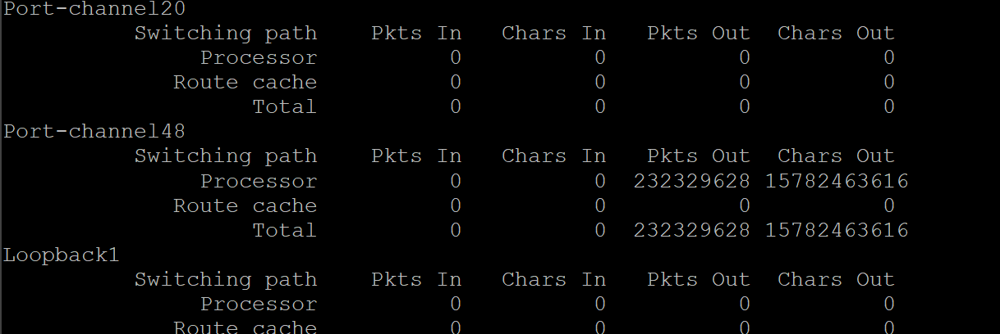
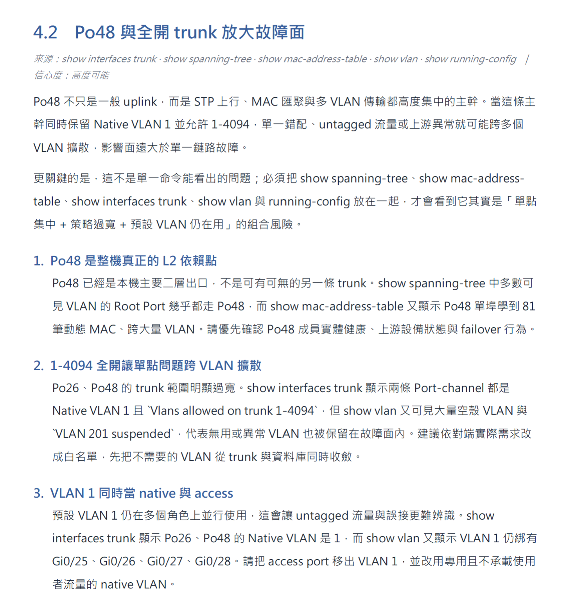
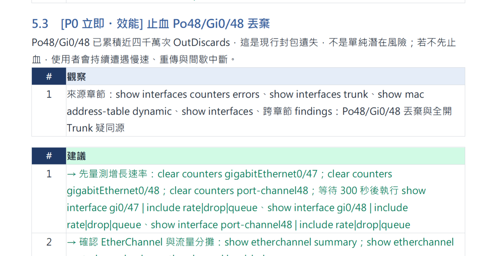

<!-- ═══════════════════════════════════════════════════════════════
     Day 19 寫作導引(寫完後這整塊可刪；HTML 註解不會輸出到文章）
     性質：⑤實作（三部曲第一篇＝人類的極限篇）｜ 階段：實現 ｜ 分級：🟢 新手友善
     系統：設備運作分析（D19–21）

     🚦 §0 硬門檻（動筆前先確認這兩項有做到）
       ① 主幹問題（一句話）：當你要掌握一台設備的完整狀態時，為什麼人「讀不完、
          也看不懂」——這是人天生的極限，不是態度問題？
       ② 用真實案例回答：用 Port-Channel 偏諧的真實截圖（看得見≠看得懂＝知識頻譜牆）
          ＋一份 show tech-support 動輒幾萬行（讀不完＝規模牆），證明這兩道牆擋在人面前。
          對齊 D20：系統做的是隨選（on-demand）把一份 dump 讀完＋看懂，不是不間斷監控。
       ③ 本篇另立一道『門檻牆』（見下方 📐），與『看不懂/讀不完』兩道牆並列、不衝突；
          技術「怎麼建」留給 D20，這裡只講「要具備什麼才接得住」。

     📐 篇章結構（作者意圖；審稿據此判斷「離題」，勿誤判為 D20/D11 的題目）
       本篇除了『看不懂(知識頻譜)』與『讀不完(規模)』兩道牆，另立一道『門檻牆』（接在開場 Port-Channel 錨點之後、
       當知識頻譜的延伸）——這是刻意設計，不是離題：
       ├ 前置門檻（緊接 Port-Channel 錨點後）：這套系統不是誰都能接手——要同一顆腦袋橫跨「資深網路
       │  工程 ＋ 產品運營(DevOps) ＋ 設備級程式設計 ＋ 調校 AI 的 sense」多個重疊
       │  領域。用意：把「人類不可及」從生理層延伸到『能力稀缺層』，並兌現
       │  CLAUDE.md §六.2 火力展示與 E-E-A-T（第一手、真的做得到）。
       ├ 呈現法：用「拿掉任一項、整個系統論述就不成立」的反證框架講，
       │  避免讀成純自誇（作者已在文中埋這句自我檢驗，保留即可）。
       └ ⚠️ 界線（審稿看這裡，別再誤判離題）：
          ・只講「要具備什麼」＝門檻/前提 → 這是本篇該有的，留下。
          ・「怎麼建、程式怎麼寫」＝實作走查 → 是 D20，別在本篇展開。
          ・「公司該派誰、憑什麼職權推」＝治理/正當性 → 是 D11，別在本篇展開。
          踩到後兩者才算離題；只鋪『前置門檻』本身不算離題。
       H2 順序：Port-Channel 錨點（看得見≠看得懂）→ 門檻牆（能認出的人稀缺）→ 規模牆（一份 dump 讀不完）→ 收束成疆域交付。

     🔗 承先啟後（依 article-framework Tip 3）
       承前：D14–18 把 AI 應用骨架（tool call → MCP → 記憶 → 任務拆解）拼完 →
             本篇起進入三系統實錄，第一套就用『一份 dump 讀不完＋看不懂』這道牆開場（對齊 D20 隨選深度分析）。
       啟後：→ D20「實作：一份龐大設備 dump → 規模化多階段深度分析」把『讀不完＋看不懂』這面牆翻過去
             → D21「後續實際引用：觸發了哪些處置、如何變成團隊例行判斷」。做成系列內鏈。

     ⚠️ 待補（作者提供前不要寫死數字，先定性講規模/判讀）
       [ ] 在管設備數的去識別化量級（只給數量級，如「上千台」，不列清單）
       [ ] 一份 dump 的規模（行數/區段數）vs 人逐行讀完要多久（定性對比即可）
       [ ] 🔭 可帶一張設備分析報告/儀表板（去識別化）當「隨選就能拿到完整判讀」的鋪陳

     🚫 紅線：公司不具名、不揭露上線日期、數據去識別化
        ⚠️ 本系統專屬紅線：不外洩真實設備清單 / IP / 內網結構 / 拓樸
           ——講「人盯不完」時只描述設備『數量級』與『狀態項』，不畫出真實網路長相。
        ✅ 截圖核可（審稿看這裡）：本篇 docs/D18 的截圖已由作者逐張挑選、確認可公開；
           審稿時視為已核可，不需再就「截圖露出設備/介面/VLAN 細節」提必改。
           （上面的『文字敘述紅線』仍要守：內文別再把截圖裡的拓樸/IP 用文字描白。）
     🧭 認知鐵則：講「AI 負責什麼（把人讀不完的 dump 讀完、把看不懂的判讀出來）」可具體；
        講「巡檢人員空出手後去做什麼判斷」留白，不替讀者指定終點。
     📝 §3 正向敘事：用「疆界/生理極限」框架，不寫成「以前值班多慘、都在踩坑」的抱怨文。
     🗣️ 語氣（★ 帶思考不推銷；審稿看這裡）：門檻論述與主張都用「攤開材料、邀讀者
        自己驗證」的口吻，避免自誇/直銷話術——例如「往臉上貼金」「偷臭一下」「你一定會…」
        「相信我」。門檻那段用反證框架呈現（拿掉任一項系統就不成立），不是炫技。
        『人被推向哪』一律留白：把「管理者會往更高視野看事情」這種替讀者拍板的句子，
        改成開放問句，如「空出來的班表與精力，你會放到哪裡？」（呼應 🧭 認知鐵則）。
     ══════════════════════════════════════════════════════════════ -->

# 【設備分析 ①】定期巡檢的極限：一台設備的完整狀態，人為什麼看不完、也看不懂？

前面五天(D14–18),我們把一個 AI 應用的骨架一塊一塊拼了出來:會呼叫工具(tool call)、把工具標準化(MCP)、有記憶、會把任務拆開分派。從今天起,這些手法要合體成一套**真的在公司裡跑**的系統——三系統實錄的第一套:**設備運作分析系統**。

主題是一件聽起來理所當然、做起來卻不可能的事:**把一台設備「現在到底好不好」看清楚**。
你以為那是打開設備、看一眼的事?真要看，它會吐給你一份**幾萬行、幾十個指令**的狀態 dump。人要從這一大片裡看出問題，撞的是兩道牆:一是**讀不完**——量大到你只能挑幾個「重點指令」掃一掃、剩下認了;二是**看不懂**——就算那行數字擺在眼前，少了跨領域的腦袋，你也認不出它是異常。這不是誰不夠認真，是這份資料的規模 × 需要的判讀，本來就超過人逐行讀完、又看得懂的範圍。
這篇先讓你看清這兩道牆; 怎麼用實際應用把它翻過去，是 D20 的事(設備分析②實作篇)。

## 這張設備畫面，你看得出哪裡出問題了嗎？

首先我先帶到一個 Cisco 設備的實際情景的截圖範例，我特地截有問題的地方。 你有看出什麼嗎?

給你看看AI抓到什麼:

先解釋一下名詞 **Port-Channel**: 用非常廣義的說法是鏈路聚合，他可以把兩個物理分隔的port，結合到一起使用，讓邏輯線路的吞吐量提升。

> 這裡發生了什麼?

首先這個現象有一個專有名詞叫做 _Port-Channel 偏諧_，我相信多數工程師一輩子不會聽到這個名詞。 (你用中文搜尋是沒有資料的喔)

因為這東西不僅沒辦法透過很制式的知識傳遞教學，而且它只出現在Cisco 原廠的技術文件裡，根據我跟原廠Tech Support互動的經驗來看，我相信這個東西冷門到他們也不知道。

具體的描述是: 原本應該均分的流量線路，現在集中到同一邊的接口 (畫面上是 interface G/0/48)。
造成這個現象的原因有幾種，包括演算法Hash、mac address相似性、或是同一網段 (因為它下面確實都是同一批進去的設備)

> 這個現象會有什麼問題?

這個問題從原理上來講確實是很嚴重的問題，因為它發作的時候你是察覺不到的(這個現象不會吐Log出來)，當真的要出事的時候整個下游的設備運作都會失效。 (確切的術語說法是運作效益會打折，但是你抓不出來)

只有在下游使用者發覺流量怎麼上不去，想要往上游去抓問題的時候才有可能看到。 但這種願意跨責任追問題的場景在日常企業環境常發生嗎? (備註: 我預設這點不會發生為大前提。)

> 實際的影響是什麼?

從這個報告來看，它有幾個教科書式的現象確實出現了，包括:

- TCP retransmit
- UDP packet loss
- Voice 抖動
- Video freeze

在這當中的幾個描述在現實的場景確實都有出現，CLI上的流量統計也看得到。 (但通常的情況是你的眼睛看到了，你人卻沒有看到)。

所以這裡真正的牆是:**看得見，不等於看得懂**——就算那些數字、那張圖此刻清清楚楚擺在你眼前，少了那段跨領域的知識，你也認不出它是異常。而要「看得懂」，靠的是一顆橫跨多領域的腦袋。這就帶出一道容易被跳過的牆。

## 為什麼『看得見』不等於『看得懂』?

<!-- 節首答案：剛剛那個 Port-Channel 偏諧要能一眼認出，靠的是橫跨多領域的一顆腦袋——
     這是把「人類不可及」從生理層延伸到『能力稀缺層』。用反證框架（拿掉任一項就不成立）
     呈現，避免讀成自誇。界線見開頭 📐：只講「要具備什麼」＝門檻，不展開 D20 實作 / D11 治理。 -->

剛剛那個 Port-Channel 偏諧，能一眼認出它是異常、還知道要調 AI 去盯它——這件事本身就是一道牆。要製作這套系統、要懂得調整並指定讓 AI 產生有意義的分析指標，有幾個大前提沒辦法忽視:

1. 你得是一個具有規模架構思維的資深網路工程師，而且斜槓到產品運營的領域去(也就是 DevOps，知道哪些指標才有意義)。
2. 你得了解企業等級的 IT 設備、也擁有用程式設計去操作這些設備的技能(要在程式設計與 IT 設備工程兩個領域有 Overlap)。
3. 你得有調整 AI 的 sense——也就是這系列一直在講的 AI 設計認知與規模應用調整(能抽象且有意識地分辨:同一份資料在什麼情境下有意義、什麼情境下沒用)。

你可以拿掉其中任一項，看整套系統的前提論述還成不成立——缺一項，它就接不住。這道『能力稀缺』的牆有個特別之處:它不是「再拼一點、多熬幾夜」就補得滿的——而是連「認得出問題」的人本來就稀少。

所以「看不懂正才是要處理的重點(知識頻譜牆)」，不是每個人都應該要懂所有事情，所以要有一個機制去接這個漏洞，而這份系統就是為了補足這件事情。

## 一份設備狀態 dump，到底有多大？為什麼人讀不完？

<!-- 節首答案：第二道牆＝規模。一台設備吐出的完整狀態(show tech-support)動輒幾萬行、
     幾十個指令區段;真正的異常還藏在跨指令的交叉裡。人的現實是挑重點掃、剩下認了。
     而且這還只是一台——一整批設備每台都這樣,等於全都沒真的讀過。這道牆 D20 用隨選分析翻。
     ⚠️ 保密：只講設備『數量級/狀態項/行數』,不畫真實拓樸/IP。 -->

回到最前面那道牆:**規模**。你可能以為設備狀態就是幾個燈號、幾個數字;實際上，一台設備吐出來的完整狀態(就是 D20 要處理的那種 `show tech-support`)，動輒**幾萬行、幾十個指令區段**——版本、設定、每個介面的計數器、生成樹、CPU/記憶體、環境、日誌……全擠在裡面。

更麻煩的是:真正的異常(像剛剛那個 Port-Channel 偏諧)往往不在某一行，而是藏在**跨指令的交叉**裡——你得同時讀懂介面計數器和聚合埠的成員組成，才看得出「流量該均分卻沒均分」。一份幾萬行的東西，人的現實是:挑幾個重點指令掃一掃，剩下的認了。**不是不夠認真，是這份資料的規模,本來就超過人逐行讀完的範圍。**

而這還只是**一台**。你手上是一整批設備，每一台真要細看都是這樣一份 dump——**每台都讀不完，那就等於全都沒真的讀過。**

## 所以，這種「一份就幾萬行、人讀不完」的活，本來就該交給不會累的那一方？

<!-- 節首答案：把前面幾道牆(讀不完/看不懂/門檻)收束成「交出去」。你要的不是一直盯著看
     (那沒必要,每秒猛拉狀態還像在打設備),是「隨選:在你需要的當下,幾分鐘就拿到一台設備
     的完整判讀」。人到不了的是『規模』:一份 dump 幾萬行、且能認出 Port-Channel 偏諧的專家
     本來就稀缺,一個人讀不完那個量。機器接手的是這個規模; 判準仍出自專家(呼應門檻牆、D07 放大器)。
     ⚠️ 別寫成能力比較「交給更快/更懂的一方」——那是取代人; 要框成「人到不了的規模交出去」。
     🧭 認知鐵則:AI 接手『隨選、把人讀不完的量讀完、套用專家寫進去的判準』可講死; 人空出的手做什麼,留白。 -->

把前面幾道牆疊起來，你就看清了:**一份設備狀態幾萬行、人讀不完(規模);就算讀到了，少了跨領域的腦袋也看不懂(知識頻譜)——而且能看懂的人本來就稀缺(門檻牆)。** 這幾件事沒有一件是「認真一點」就補得上的。

那答案是「請個更厲害的人、盯得更緊」嗎?不是。**你要的其實不是「一直盯著看」——真要每秒不停跟設備要狀態，反而像在打它、也沒必要 - -lll;你要的是:在你需要知道的那一刻，幾分鐘內就把一台設備的完整狀態讀完、而且看得懂。** 而這件事人補不起來:一份 dump 幾萬行(量)，還要每次都認出 Port-Channel 偏諧這種不吐 Log 的異常(懂)——**一位專家再厲害，也沒辦法親自把每一台、每一份 dump 都這樣讀一遍。**

所以把這件事交給不睡覺、不麻痺、幾分鐘就能把整份讀完的那一方，**不是取代巡檢的人、也不是取代那位專家**——是去接手他們**到不了的規模**。設備分析系統站的就是這個位置:它不是站在那 24 小時盯哨，而是**你一把設備狀態交給它，它幾分鐘內把整份讀完、把異常標出來**。而它之所以認得出 Port-Channel 偏諧，**不是因為它比你懂——是你把「看得懂」的判準寫給了它**; 它做的，是把你這份判斷，覆蓋到一個人讀不完的量上。

**至於這件事交出去、那些精力空出來會落到哪裡——這篇先不替你寫答案，D21 我用「真的被誰用、換來了什麼」來說。**

## 帶走什麼？

<!-- 依 Tip 2：可遷移的帶走重點，每點對回主幹問題。 -->

- **讀不完:撞的是規模，不是態度**: 一份設備 dump 動輒幾萬行，人只能挑重點掃、剩下認了——不是不夠認真。
- **異常藏在「交叉」裡**: 像 Port-Channel 偏諧，不在某一行，而在跨指令的交叉——得同時讀懂兩三個指令才認得出，這正是最花時間、最容易漏的地方。
- **看得見 ≠ 看得懂**: CLI 上數字明明都在，少了跨領域的知識，你就是認不出那是異常(知識頻譜牆)。
- **認得出問題的人本來就稀缺(門檻牆)**: 這道牆不是熬夜補得滿的——要一顆橫跨網路工程、DevOps、設備程式、調 AI sense 的腦袋，本來就少。
- **系列主張 —— 交出去的是「規模」，不是判斷**: 機器讀完一個人讀不完的量; 認出異常的判準，仍出自那位專家。人空出來後，要做什麼判斷，留白給人自己。

<!-- 收束 + 下一篇鉤子（geo-seo §6 / Tip 3）：
     重述：讀不完（規模）+ 看不懂（知識頻譜），是人面對一台設備完整狀態的兩道牆。
     啟後鉤子（扣 D20）：那機器怎麼在幾分鐘內把一份幾萬行的 dump 讀完、看懂?下一篇做給你看。 -->

「一台設備到底好不好」——聽起來像打開來看一眼就好，實際上是一份幾萬行、還得跨領域判讀的東西。人面對它的極限很具體:**讀不完**(規模),而且**看不懂**(要一顆橫跨多領域的腦袋才認得出異常)。這不是誰不夠認真，是這兩道牆本來就擋在那裡。

但人做不到，不代表沒辦法。明天 D20，我把這套**隨選深度分析**實際做給你看:你丟一份設備 dump 進去，它在幾分鐘內做完人做不到的事——把整份幾萬行讀完、認出 Port-Channel 偏諧這種不吐 Log 的異常，產出一份掃一眼就懂的報告。
