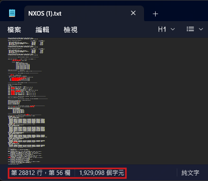
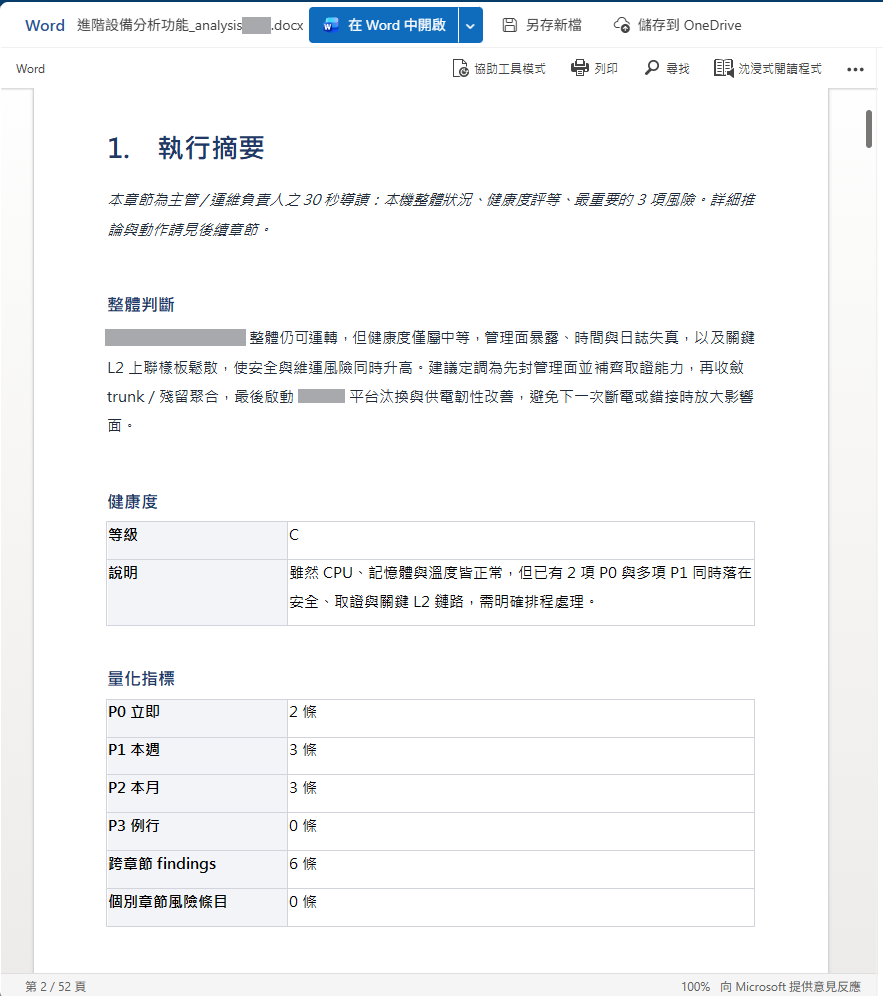

# 【設備分析 ②】實作:一份 28K 行的設備狀態檔,怎麼被拆成規模化的多階段分析——事實靠程式、判讀靠 AI

D19 給你看了一個畫面:一台 Cisco 交換器的 Port-Channel 流量嚴重偏斜(該均分的流量全集中到單一成員埠),它**不會吐 Log**、CLI 上也只是一堆數字——**看得見,不等於看得懂**。要認出這是異常,得靠一顆橫跨網路工程的腦袋。

這篇把「看得懂」這件事做給你看:一份**數萬行、幾十個指令**的設備狀態檔(工程師常說的 dump,也就是 `show tech-support` 的完整輸出)丟進來,系統怎麼把它拆解、規模化分析,最後產出一份「掃一眼就掌握這台設備狀況」的報告。先講兩個前提,免得你誤會:

- 這是**隨選深度分析**——維運**上傳一份 `show tech-support`**(或 PuTTY log)、要求「分析」,系統才跑一次。它翻的是 D19 的「**人讀不完 + 看不懂**」那道牆,不是「不間斷監控」。
- 它的骨架立在一條之後三系統共用的分工線上——這條線我給它一個名字:**「確定性事實層 + 生成式判讀層」(Deterministic Fact Layer + Generative Judgment Layer)**。**能算的事實一律交給確定性程式(事實層),只把「判讀與行文」交給 LLM(判讀層)。**

## 一份設備狀態檔到底有多「人讀不完」?

**因為一份 `show tech-support` 動輒上萬行,而真正的異常往往藏在你不會逐行讀的地方。** 拿一台 Cisco Nexus 交換器(NX-OS)的實際設備狀態檔來說(去識別化):

- **約 28K 行**、**33 個指令區段**(version、running-config、interface、port-channel summary、spanning-tree、cpu/memory、env、logging、mac address-table、platform…)、**38 個介面 stanza**。

  

- Port-Channel 偏諧這種問題,不是單看某一個指令就跳出來的——它藏在 `show interface` 的**計數器**(某成員埠的 OutDiscards 暴衝、但實體層 CRC/錯誤全 0)**交叉** `show port-channel summary`(成員組成)之間。**人要抓出它,得同時讀懂兩三個指令、還要知道「流量該均分卻沒均分」代表什麼。**

一個維運人員面對這份 28K 行的東西,現實是:挑幾個「重點指令」掃一掃,剩下的認了。**不是不夠認真,是這份資料的規模 × 需要的跨領域判讀,超過人逐行讀得完的範圍。** 這就是 D19 那兩道牆(規模 + 看得懂)疊在一份設備狀態檔上的樣子。

## 怎麼把一份 log 先拆成「可分析的單位」?

**分析之前,得先把這坨純文字變成結構。** parser 做三件事:

1. 依 `hostname#command` 的 prompt 邊界,把整段 log 切成一個個 **CommandBlock**(帶 `deviceName / command / output / category`)。
2. `show tech-support` 是一個大 bundle,再依內部的 `------ show xxx ------` 分隔線**二次切分**成各指令區段。
3. 依指令關鍵字把每個 block **歸類**成十幾種類別(介面、系統健康、生成樹、平台…),再把同類別的 block **合併成一組**(`groupByCategory`)。

```typescript
// parser.ts:把「prompt#command」當邊界切區塊
const PROMPT_RE = /^([A-Za-z][\w.\-]*?)#(.+?)\s*$/;
// …classify() 依關鍵字歸類、groupByCategory() 合併同類別 → CategoryGroup[]
```

為什麼要先分組?因為下一步的規模化,就是**以「類別組」為單位**去並行分析——一份設備狀態檔從此不再是 28K 行的一大片,而是十幾個可以各自處理的小單元。

## 規模化:一份設備狀態檔怎麼不撐爆 LLM?

**靠「分組 → 並行 → 設上限」把一份龐大設備狀態檔拆成一堆可控的小 LLM 呼叫。** 這套管線的規模旋鈕全集中在一個設定檔:

```typescript
// analyze/config.ts —— 規模化調校旋鈕
export const PER_BLOCK_MAX_CHARS = 18_000; // 單一指令輸出送 LLM 前的字元上限
export const PER_CATEGORY_MAX_CHARS = 40_000; // 同類別合併的總字元上限
export const CONCURRENCY = 4; // 同時並行的分析呼叫數
// 差異化 reasoning_effort:不是每一步都需要深度思考
export const EFFORT_FACTS = "low"; // 事實抽取 → 便宜
export const EFFORT_SECTION = "medium"; // 描述性逐章分析
// 跨章節推論 / 主管導向摘要 → high(這兩步才值得深想)
```

分析本體是一條 **4 階段管線**,能並行的就並行、有依賴的就排順序:

```typescript
// tool.analyze.ts —— Phase 1:各類別細部分析 + 設備資訊抽取(並行)
[sections, deviceFacts] = await Promise.all([
  mapWithConcurrency(groups, CONCURRENCY, (g) => analyzeCategory(g)), // 逐類別、上限 4 個同時跑
  synthesizeDeviceFacts(deviceIdentityBlocks),
]);
// Phase 2:跨章節關聯分析(吃 Phase 1 全部結果)
// Phase 3:角色推測 + 行動計畫(並行,吃關聯結果)
// Phase 4:執行摘要(最後跑,吃前面全部)
```

兩個 production 才會在意的細節:①**單一類別若還是太大**,內部再切批(每批最多幾個 subsection),批次間也並行;②**差異化 reasoning effort**——事實抽取用便宜的 low,跨章節推論才用 high。**把貴的深度思考只花在真正需要深入判讀的步驟上**,這是規模化必然要面對的成本控制(商業帳留 D28,這裡只講技術面的分配)。

## 哪些交給程式算、哪些交給 AI?

**這套系統最重要的一條線(後面 CVE 通報也會照走):凡是有標準答案的事實,一律程式算;凡是要把事實講成判讀與人話的,才交給 LLM。** 健康指標抽取器的檔頭就把這條線寫死了:

```
設備健康指標抽取器(deterministic,不經 LLM)。
- 掃所有 block,不依賴 category —— 內容 pattern 穩定,即使指令歸錯類仍抓得到。
- 數值抽取與門檻判定都由程式做,LLM 不碰;要可複現、不被竄改。
```

具體切給誰:

| 要處理的項目                             | 哪邊處理 | 執行邏輯                                                        |
| ---------------------------------------- | -------- | --------------------------------------------------------------- |
| 健康儀表板(CPU/記憶體/溫度/風扇/電源)    | **程式** | regex 抽值 + 門檻判紅黃綠燈號(如 CPU 5 分鐘均 >85% 判紅燈/危險) |
| 介面/埠流量指標(Top N 計數器)            | **程式** | 逐 stanza 抽廣播/多播/CRC/OutDiscards                           |
| 系統事件時間軸(開機原因/uptime)          | **程式** | regex 抽 + 排序                                                 |
| 逐章判讀、跨章關聯、角色推測、行動、摘要 | **LLM**  | 拿上面算好的事實,寫成判讀與敘述                                 |

為什麼健康表要程式算?因為 **CPU 是不是 85%、這是可複現的事實,不該讓一個會飄的模型去「感覺」**。連報告裡的視覺(紅黃綠燈號上色、文字長條圖)都由程式產,LLM 只寫底下那句判讀。**把不能錯的鎖死在程式,把需要判讀的放給 AI。**

## AI 實際做了什麼判讀?——抓出人會漏看的東西

**事實備好之後,LLM 上場做的是人最花時間、也最容易漏的那件事:判讀與跨指令關聯。** 分析分成五顆專精 prompt:逐章分析、跨章關聯、角色推測、行動清單、執行摘要,每顆只做自己那一步、輸出格式寫死。

其中**跨章關聯**那顆,抓的正是 D19 給你看的那種 Port-Channel 偏諧——**這裡示範用的是另一台 NX-OS 設備的狀態檔,同一種異常**。它的檢查清單裡明白寫著要找這種東西(去識別化節錄):

```text
- Po(port-channel)成員間流量是否極度偏斜(如某成員獨佔 99%)。
- 介面 OutDiscards 是否 > 10,000,且 CRC/FCS/Rcv-Err 全 0
  (代表是壅塞,而非物理層問題)。
```

於是它會產出像這樣的關聯發現:**「某成員埠 OutDiscards 集中,疑為聚合層壅塞——99.997% 集中在單一成員埠」**。這就是 D19 給你看的那種「AI 抓到 Port-Channel 偏諧」,系統實際判讀時的樣子——**把散在 `show interface` 計數器和 `show port-channel summary` 兩處的線索,交叉起來認出一個不吐 Log 的異常。**

這顆 prompt 還被要求「別偷懶」:跨章關聯至少要找出幾條,**「若真的找不到也不可回空陣列——空陣列代表『我沒思考』」**。逼模型真的把整台設備當一個整體看,而不是逐章交差了事。

## 分析完長什麼樣?

**最後輸出是一份固定骨架的 DOCX 報告**,讓維運(甚至主管)打開第一頁就掌握全局:

1. **執行摘要**:A–F 健康評等 + Top 風險 + 2×2 風險矩陣(衝擊 × 可能性)。
2. **設備資訊**、**角色與定位推測**(這台目前扮演什麼角色 vs 型號設計定位、有沒有過度或不足部署)。
3. **跨指令關聯分析**(前面那些交叉發現)。
4. **建議的執行動作**(P0–P3,附可直接貼的 CLI)。
5. **各指令詳細分析**,章首掛**程式算出的健康儀表板紅黃綠燈號表**。

一份 28K 行、人只會挑重點掃的設備狀態檔,變成一份**掃一眼就知道「這台健不健康、有什麼風險、該先動哪個」**的報告。



## 也就是說

- **先結構化再分析**:把一份 log 依指令邊界切成 block、依類別分組,一份設備狀態檔才從「28K 行混在一起」變成十幾個可並行處理的單元。
- **規模化 = 分組 + 並行 + 設上限 + 差異化 effort**:並發上限、每類字元上限、貴的深度思考只花在跨章推論——這是把大輸入餵給 LLM 的必要紀律。
- **事實 vs 判讀,切開(＝「確定性事實層 + 生成式判讀層」)**:可量測的事實(健康/介面/時間軸)確定性程式算、要可複現;判讀與跨章關聯才交給 LLM(這條分工線後面 D23 的 CVE 通報也照走)——**而「要不要動、動哪個」的最終判斷,仍在人手上。**
- **AI 的價值在「交叉」**:把散在多個指令裡的線索關聯起來,認出 Port-Channel 偏諧這種不吐 Log、人會漏看的異常——這正是 D19「看得懂」那道牆。
- **逼模型別偷懶**:用 prompt 約束(不可回空陣列)讓它把整台設備當整體看,而不是逐章交差。

一份人讀不完、看不懂的設備狀態檔,經過「拆解 → 規模化多階段分析 → 事實靠程式、判讀靠 AI」,變成一份掃一眼就掌握健康度、風險與優先處置的報告——把 D19 那道「看得見不等於看得懂」的牆翻了過去。

但報告做得出來,不等於它真的改變了什麼。**這份分析上線後,實際觸發了哪些處置?怎麼變成團隊每天的判斷依據?這塊本來沒人接得住的事,補上之後又替團隊長出了什麼?** 那是 D21 引用篇要交代的。
