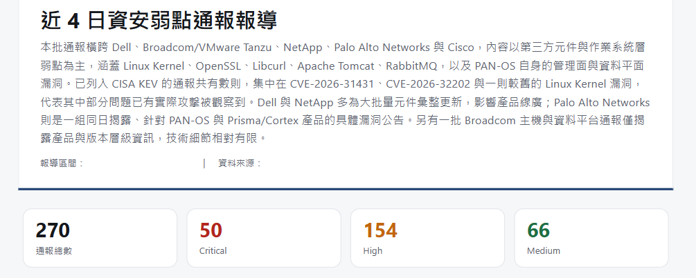
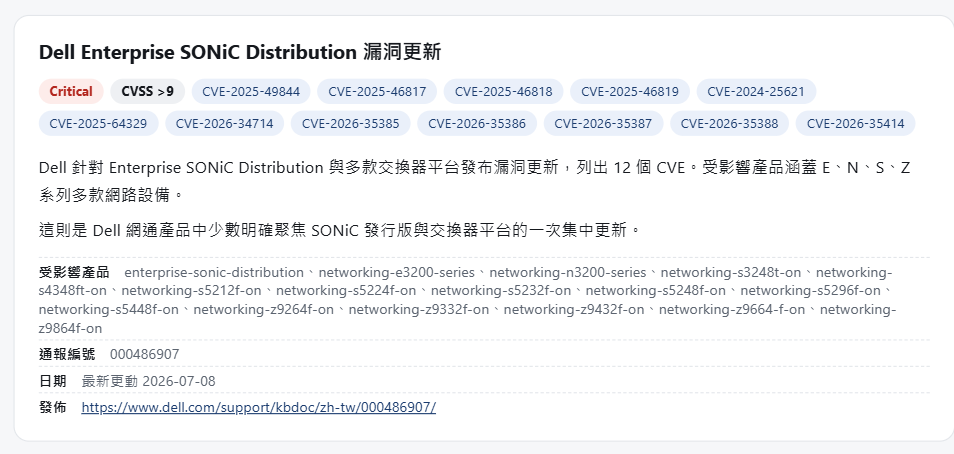

<!-- ═══════════════════════════════════════════════════════════════
     Day 22 寫作導引(寫完後這整塊可刪；HTML 註解不會輸出到文章）
     性質：⑤實作（三部曲第一篇＝人類的極限篇）｜ 階段：實現 ｜ 分級：🟢 新手友善
     系統：每日 CVE 通報（D22–24）｜ 對應疆域座標：速度／時效 ＋ 規模

     🚦 §0 硬門檻（動筆前先確認這兩項有做到）
       ① 主幹問題（一句話）：為什麼「每天讀完全球漏洞、還逐台比對自家設備」
          是人力天生做不到的事？
       ② 把『時效牆』立體化——攻擊者跟你讀同一份公開清單，你慢一天就多曝一天。
          再疊上「每天新增 × 自家每台設備版本」的規模比對，證明這是規模 × 時效的雙重牆。
          翻牆兩半:『跟我有關』的版本比對由一支確定性程式(SQL/JSON,無 AI)解決;
          『讀完全球洪流 → 生成人看得懂的通報』才是 D23 主秀(生成式 AI)。
       ※ 這個真實 CVE 是「全球公開事件」，不是自家設備現況——援引它強化 E-E-A-T，
         同時嚴守下方本系統專屬紅線（不揭露自家未修補現況）。

     🔗 承先啟後（依 article-framework Tip 3）
       承前：D19–21 用「設備運作分析」翻過『不間斷』那座牆 → 本系統換一個
             座標：『速度／時效』。漏洞的難不在單一一條多複雜，在它天天新增、且會過期。
       啟後：→ D23「實作:把全球 CVE 洪流用 LLM 生成每日通報(事實靠程式、行文靠 AI)」
             翻過『讀不完』那半;『跟我有關』的版本比對由另一支確定性程式處理,D23 一句帶過
             → D24「後續實際引用：誰在看、擋掉了什麼」。做成系列內鏈。

     ⚠️ 待補（作者提供前不要寫死數字，先定性講規模/時效）
       [ ] 全球每日新增 CVE 的量級（引公開來源：NVD / CVE.org 年度統計，定性「以百計」）
       [ ] 自家在管設備數 / 版本組合數的去識別化量級（只給數量級，不列清單）
       [ ] 🔭 可帶一張 CVE 通報成果畫面（去識別化）當「這片疆域真的有人在守」的鋪陳

     🚫 紅線：公司不具名、不揭露上線日期、數據去識別化
        ⚠️ 本系統專屬紅線：不揭露自家「目前未修補的漏洞現況 / 可被利用的版本弱點細節」
           ——講「人做不到」時只描述比對規模，不要洩漏自家哪台跑著哪個有洞的版本。
     🧭 認知鐵則：講「AI 負責什麼（把每天的漏洞逐台比完）」可具體；
        講「維運人員空出手後去做什麼」留白，不替讀者指定終點。
     📝 §3 正向敘事：用「疆界/規模」框架，不寫成「以前多慘、都在踩坑」的抱怨文。
     ══════════════════════════════════════════════════════════════ -->

# 【CVE 通報 ①】沒人能每天讀完全球漏洞：規模與時效的人力極限

<!-- 前導 TL;DR（前 3–5 行）＝鉤子 + 結論先行。前 200 字把結論講完。
     鉤子：漏洞公開的那一刻，攻擊者跟你拿到的是同一份清單——差別只在誰先讀完、先比對。
     結論：「每天讀完全球漏洞並逐台比對」是規模 × 時效的雙重牆——量大到讀不完、
           又新到讀完就過期。這不是誰不夠勤勞，是人力結構天生追不上。 -->

前面用「設備運作分析」翻過了**不間斷**這座牆(D19–21)——那撞的是人的生理與時間天花板。這篇換第二套系統、也換一個座標:**速度與時效**。

這就是這篇要講的牆。 每天早上都在發生、卻幾乎沒有一家公司真正做完的一件事:**讀完當天全球新增的漏洞，然後逐一比對「這些漏洞會不會打中我自家的設備」**。先講結論:這件事之所以沒人做得完，不是因為它難，是因為它同時撞上兩面牆——**量大到讀不完(規模)、又新到你讀完就過期(時效)**。這篇不談技術，先讓你看清這兩面牆有多高; 怎麼翻過去，是 D23 的事。

## 為何弱點通報如此重要?

這系列同時寫給不同背景的讀者，所以進正題前，先把幾個維運現場的基本背景同步一下——尤其對還在學、剛轉行、對資安攻防只有新聞印象的人:

1. **大企業多半是「大內網」**:最外層用防火牆擋住，內部自成一個天地，要申請或特殊用途才會跟外網互動——所以弱點的風險常常是在「內部」被放大，不是只有門口那道牆。
2. **弱點攻擊的目的，多半是讓主機停擺或中斷服務**(手法百百種:記憶體溢出、未授權訪問…)，達成目的的路徑從來不只一條。
3. **CVE 的揭露時機不一**:多數會在原廠釋出修補後才正式公布;無法靠改設定解決的，通常由原廠直接公告、請使用者升級。
4. **但「升級」在維運現場不是按一下 Update**:對外提供服務的設備要停機更新，背後有一整套行政流程要跑。
5. **資安通報是企業體質的照妖鏡**:ISO 27001 這類規模化認證，會直接要求把「資安通報與處理流程」列為受稽核的機制。

資安攻防與弱點揭露，是 IT 每天都要面對的日常維運課題，不是出事了才想起來的東西。

## 為什麼「今天把漏洞讀完」是一個假動作？

> 「因為全球每天新增的 CVE 以百計,一個人光是『讀完』就耗掉一整天,還沒開始做真正該做的事——比對自家設備。」

先Show一張我自己做的系統截圖，然後看一下「讀完」這一步有多重:

(截圖內的簡介與報導文字是AI生成的應用，我單純不想讓整篇報告失去閱讀性，所以選擇應用記者報導的風格呈現)

全球公開的漏洞編號(CVE)，**每天新增的數量是以百計的**。

而這還只是「新增」——每一條背後又牽著:受影響的產品、版本範圍、修補建議、風險評分、有沒有已知的攻擊程式在流傳。一個人就算整天什麼別的都不做、坐在那裡逐條讀，讀到下班也只是「看過標題」的程度，遠談不上「判斷它跟我有沒有關係」。

所以「每天把漏洞讀完」聽起來像個勤奮的目標，實際上是個**假動作**:光是追上「新增」這條輸送帶，就已經吃掉一個人的一整天，而真正有價值的工作——比對、判斷、處置——**還沒開始**。

## 就算你讀完了，為什麼「隔天才知道」已經太慢？

假設你真的有超人般的耐力，把今天的漏洞全讀完了。問題是——**你讀完的那一刻，它已經不是「今天」了**。

漏洞跟一般資訊不一樣，它的**風險是有時效的** (具體的說法是補漏洞要跑升級行政流程、所以連處理都有時效)。

一條漏洞剛公開的那段時間，是風險最高的時候——因為攻擊者看的是**跟你一模一樣的那份公開清單**，誰先把「這個洞打中哪些設備」想清楚，誰就先動手。你晚一天才盤點完，不是「晚一天完成功課」，是**把自家設備多曝了一天**在一個別人早就知道、你卻還沒補的缺口上。

這面牆叫**時效**。它殘忍的地方在於:**你越認真、讀得越仔細，花的時間越久，反而曝險的窗口拉得越長**。認真在這裡不是解法，速度才是——而速度，正是人最補不上的那一塊。

## 把規模乘上時效，人力的天花板到底在哪？

<!-- 節首答案：真正的工作不是「讀漏洞」，是「今天每一條新漏洞 × 自家每一台設備的版本」
     的交叉比對；這是兩個量相乘，不是相加——正是 D3/D4 講的組合爆炸，
     只是這次還加了「每天都要重跑一遍」的時效壓力。
     ⚠️ 保密：只講比對的『規模』，不點名自家哪台跑著哪個有洞的版本。 -->

到這裡你可能會說:那我不要每條都細讀，只挑「跟我有關的」不就好了?——沒錯，這正是重點，但「挑出跟我有關的」本身，才是真正那面牆。

因為「跟我有關」不是讀一條漏洞就能判斷的，它是一次**交叉比對**:

> **今天新增的每一條漏洞** ×(比對)**你在管的每一台設備、各自跑的每一個版本**

這兩個都是大數字。漏洞每天新增以百計;

設備那邊，一家系統整合商在管的設備、乘上每台各自跑的版本，又是另一個攤開來會嚇到人的量——兩邊相乘，就是你每天真正要跑完的比對量。這正是 D3、D4 講過的**組合爆炸**:不是相加，是相乘。

<!-- 待補（正文勿露）：設備側去識別化數量級（如數千台 × 上百種版本組合）。作者給值後，把「另一個攤開來會嚇到人的量」替換成具體數量級，規模側說服力更強。 -->

而 CVE 這面牆**還多一層壓力**:**一般的比對可以慢慢比，漏洞的組合你每天都得重跑一遍**——因為漏洞天天新增、設備版本也會隨升級而變。規模已經夠大了，再乘上「每天重來、而且要快」，人力這條線在起跑點就被甩開了。

最要命的是，你有時候會被原廠的通報打到。 例如: 通報A標註了某某產品線共通應用有資安弱點，但偏偏你的設備不是該產品線，用到該產品線的底層，一起被納入弱點。

記住前面的文章敘事: **原廠不一定是什麼弱點資訊都懂的人士**

<!-- 🔭 視覺錨點：可帶一張 CVE 通報系統「今天比對出幾條命中」的去識別化畫面，
     show「這片疆域真的有人(某種東西)在守」，預告 D23/D24。待補。 -->

## 所以，這件事其實從來沒有人真正做完過？

<!-- 節首答案：對。撞到規模 × 時效的雙重牆，人只有三條路：硬扛（加班追不上）、
     降精度（憑經驗抽查、漏了就漏了）、或乾脆不做（明知做不完）。三條都有缺口。
     這正是這套系統要站進來的位置——不是取代誰，是接手一件人怎麼選都有洞的事。
     🧭 認知鐵則：AI 接手『把漏洞逐台比完』可講死；人空出的手要做什麼，留白。 -->

把兩面牆疊起來，答案其實很誠實:**「每天讀完全球漏洞並逐台比對」這件事，在自動化之前，多數公司根本沒真正做完過**。撞到規模 × 時效，人只有三條路，而且每條都有代價(這和 D4 的結論是同一個形狀):

- **硬扛**:排人天天追，用線性的力氣追指數的量，追得很累還是漏。
- **降精度**:只抽查「重點設備」「高分漏洞」，接受「大概顧到了」——省了時間，漏掉的那條剛好可能是關鍵。
- **不做**:很多公司乾脆沒在每天盤，等出事了再回頭查——因為明知做不完。

這三條重點不在誰失職，是**被規模與時效逼出來的合理妥協**。

這正是「每日 CVE 通報」要切進來的位置:它不睡覺、不會讀到一半分心、也不在乎今天新增幾百條——把「每條新漏洞 × 每台設備」這張**每天都要重跑**的比對表，穩定地跑完。

所以這個CVE系統的真實應用意義，正是AI的最強項: **語意關聯與分析觀察**。

## 帶走什麼？

<!-- 依 Tip 2：可遷移的帶走重點，每點對回主幹問題。 -->

- **資安攻防與企業的關係**: IT維運日常以及行政流程概述。
- **CVE 是規模 × 時效的雙重牆**: 量大到讀不完、又新到讀完就過期，兩面牆一起壓。
- **「讀完漏洞」是假動作**: 真正的工作是「今天每條新漏洞 × 自家每台設備版本」的交叉比對，而且每天都要重跑。
- **時效讓「認真」變成反效果**: 讀得越久、曝險窗口拉得越長——這裡缺的是速度，不是努力。
- **人只有硬扛/降精度/不做三條路，每條都有缺口**—— 這不是失職，是被結構逼出來的妥協。

「每天讀完全球漏洞、還逐台比對自家設備」——這不是一句抱怨，是一面可以被歸納出來的牆:
規模讓你讀不完，時效讓你讀完就過期。攻擊者跟你讀同一份清單，人力這條線，從起跑點就被甩開。

但牆再高，也是拿來翻的。

明天 D23，我把翻牆的關鍵那段做給你看。這面牆其實是兩半:「跟我有關」那半，一支不起眼的比對程式默默用版本比對解決掉——它無聊，正因為它不需要 AI;真正難、也真正需要生成式 AI 的，是把每天讀不完的全球漏洞洪流，濃縮成一份人看得懂、又不會被 AI 唬爛的通報。那才是 D23 的主秀。

> 有人說Dell最近不好過，新的通報一大堆。 但他肯持續更新是負責任的體現，我都有看在眼裡:

