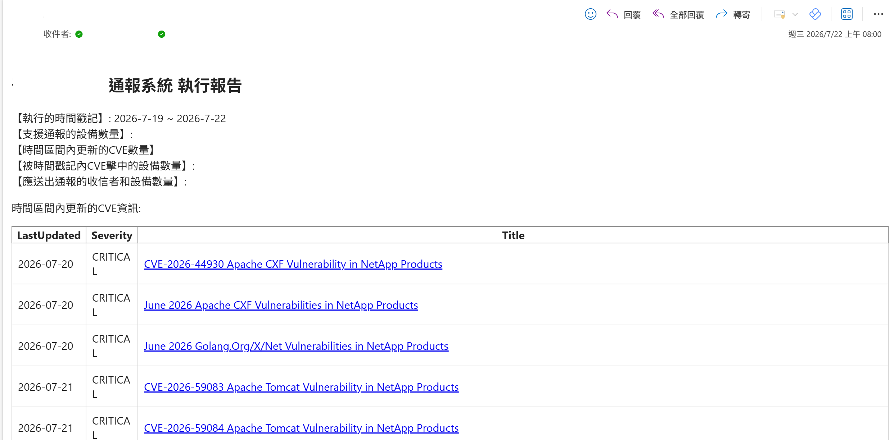
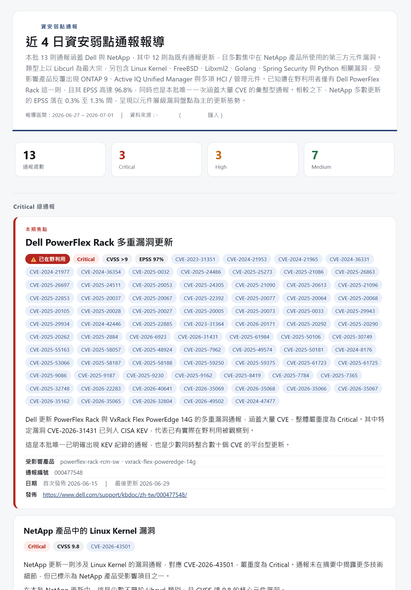

# 【CVE 通報 ②】實作:把全球 CVE 洪流，用 LLM 生成看得懂的每日通報——事實靠程式、行文靠 AI

[D22](https://ithelp.ithome.com.tw/articles/10404400) 講了那道牆:全球每天新增的漏洞以百計，一個人光是「讀完」就耗掉一整天。

這篇把「讀完並濃縮成一份人願意每天看的通報」需要什麼細節，實際做給你看。

其實 [D22](https://ithelp.ithome.com.tw/articles/10404400) 那面牆有兩個部份，先把定位講清楚。

- 「這條漏洞跟我家設備有沒有關」——逐台比對版本這件事，我早在 AI 出現前就用另一套獨立系統做完了，再用 AI 做一次我實在提不起興趣:
  純 SQL 比版本、JSON 挑欄位，又快又不會錯。
  **它無聊，正因為它不需要 AI**——這種有標準答案的比對，硬套 LLM 反而是過度工程。

- 這篇講另一半:**把每天讀不完的全球漏洞洪流，變成一份人看得懂的通報**——那才是有趣的地方。生成式 AI 真正該上場的地方。**知道哪裡不該用 AI，跟知道哪裡該用，一樣重要。**

但先這裡有一件反直覺的地方——這也是我認為這系統最值得寫的點:**我沒有讓 AI 去判斷「哪條漏洞重要」。** 嚴重度、有沒有被在野利用、被利用機率有多高，這些**焦慮敘事**我都覺得很無聊，而且不重要 (非常認真)。

AI 只負責一件事:**把這些冷冰冰的資料，寫成人看得懂的中文報導。**，而且是要考慮到可讀性跟資訊壓力，還有心理學誘導之類的，做這個系統讓我學到很多寫報導跟寫文章要注意的事情，所以這個系列的內容也有運用到類似的技巧。

## 為什麼非用生成式 AI 不可?

主要是我覺得很有趣，但更重要的原因是**因為資料庫裡那份 CVE 資料，沒有一句是人話。** 上游系統把全球原廠通報抓回來、正規化存進資料庫，每一筆長這樣: 一個英文的 `advisoryTitle`、一串 `cves` 編號、一個 `cvssBaseScore` 分數、一個嚴重度標籤 `sir`、受影響產品清單、發佈連結——**就是沒有一段給人看的敘述**(存摘要的欄位永遠是空字串)。

維運不會想每天讀一張塞滿英文標題和編號的表。要讓這堆資料變成「今天有哪些漏洞、跟你有沒有關係、哪幾條特別要留意」的**一篇中文通報**，中間那道「把資料寫成人話」的工，只有生成式 AI 做得來。**所以 LLM 在這裡不是加分項，是這套系統的存在理由。**

> 我的個人角度是: 我想要像看新聞一樣的看CVE消息，一點都不想被一堆系統術語還有一堆*完全沒有意義的*『潛在的系統性危險』、『造成不可逆的損害』的焦慮性字眼淹沒。

## AI 最愛唬爛，怎麼讓它只寫事實、還不亂給建議?

**用一顆把 LLM 關進「記者、不是顧問」邊界的 system prompt。** 這直接接續 [D6](https://ithelp.ithome.com.tw/articles/10401734)——AI 會自信地錯——所以考慮到這點的情形下，我作了以下設計。prompt 裡最關鍵的三條規則(去識別化節錄):

```text
你是一位具備專業資安知識的資深記者，為企業讀者報導每日資安弱點通報; 你是記者，不是技術顧問。

1. 只根據提供的資料撰寫，禁止杜撰資料中沒有的事實(CVE、版本、產品、攻擊手法等)。
3. 你是記者不是顧問:只陳述事實與影響，不得提供處置建議或行動指示
   (禁止出現「建議升級/套用修補/應立即…」這類祈使句)。
4. 允許以「事實」標出每則的看點(是否已在野利用、漏洞類型、被利用機率…)，
   但不得替讀者下價值判斷或排序(不要說「最該優先處理」)。
```

看第 3 條——**「不得提供處置建議」**。 這不是保守，是刻意的權責設計，而且它正好是 **[D7](https://ithelp.ithome.com.tw/articles/10401848) 三問的實體化**:CVE 這件事「出事誰扛責?」——責任在維運與資安人員身上，不能轉移給 AI。所以系統設計上就**不讓 AI 開口給處置建議**:它只把「今天發生什麼」講清楚，「要不要停機、要不要升級」那個要扛責的決定，留給人。AI 是把資訊整理到位的記者，不是替你拍板的顧問。

## 那「事實」誰來算?——是程式，不是 AI

**這系統的核心設計，是一條「判斷 vs 行文」的切割線——就是 [D20](https://ithelp.ithome.com.tw/articles/10404021) 命名的「確定性事實層 + 生成式判讀層」(Deterministic Fact Layer + Generative Judgment Layer),三系統共用:凡是有標準答案的事實，一律程式算; 凡是要把事實講成人話的，才交給 LLM。**

系統自己在 prompt 檔開頭就寫明這條原則:

```text
- 制式資料(advisoryId/cves/cvss/sir/連結)由程式從 DB 取得，不交給 LLM。
- LLM 僅產生「敘述」:在地化標題、客觀 summary、看點 angle、整體 overview。
- 富集事實(在野利用 / 被利用機率 / 漏洞類型)由 enrich 層提供，連同制式欄位餵入。
```

具體切給誰:

| 這件事                     | 誰算     | 怎麼算                                       |
| -------------------------- | -------- | -------------------------------------------- |
| 嚴重度分級(Critical/High…) | **程式** | 取嚴重度標籤與 CVSS 分數的較高者，確定性函式 |
| 漏洞類型                   | **程式** | 純正則關鍵字比對，規則表寫死                 |
| 是否已在野利用             | **程式** | 比對 CISA KEV 公開清單，命中即標記           |
| 被利用機率                 | **程式** | 打 FIRST EPSS API 查分數                     |
| 標題、摘要、看點、跨則概述 | **LLM**  | 拿上面算好的事實，寫成中文報導               |

連 LLM 呼叫的溫度設定，都圍著這條線走:

```typescript
const res = await client.chat.completions.create({
  model: config.azure.deployment,
  messages: [
    { role: "system", content: SYSTEM_PROMPT_DAILY },
    { role: "user", content: userPrompt },
  ],
  temperature: 0.6, // 稍高溫度,避免每則塌縮成同一句型;
  response_format: { type: "json_object" }, // 事實由制式欄位與富集資料把關,不怕它飄
});
```

註解那句是精髓:**溫度敢調到 0.6 讓行文有變化，正是因為「事實」根本不歸 LLM 管**——它會飄逸的頂多是措辭，飄不了 CVSS 分數或在野利用標記，因為那些不是它產的。**把不能錯的交給確定性程式，把要靈活的交給 LLM，兩邊各取所長。**

## 資料從哪來?只讀不寫 + 動態發現廠牌表

**這系統對資料庫是唯讀的:抓取與寫入都在上游的抓取服務，本系統只負責讀出來、生成報導。** 讀的時候有兩個實作細節值得看。

一是**動態發現廠牌表**。每家原廠的通報存成一張表(`cve` 是 Cisco，其餘廠商各一張 `cve_xxx`)，系統不寫死表名，而是查 `information_schema` 把所有 `cve`/`cve_*` 表撈出來、再 `UNION ALL`——上游日後多接一家原廠，這裡不用改碼:

```sql
SELECT TABLE_NAME FROM information_schema.TABLES
 WHERE TABLE_SCHEMA = ?              -- DB 名走設定，不寫死
   AND (TABLE_NAME = 'cve' OR TABLE_NAME LIKE 'cve\_%')
```

二是**JSON 字串的安全解析**。上游把 `cves`、`productNames` 這類清單欄位用 `JSON.stringify` 存成字串，所以讀出來要 parse——而且要防呆，非法或空值一律退回空陣列，不讓一筆髒資料炸掉整份報導:

```typescript
function parseJsonArray(raw: string | null | undefined): string[] {
  if (!raw) return [];
  try {
    const v: unknown = JSON.parse(raw);
    return Array.isArray(v) ? v.map(String) : [];
  } catch {
    return []; // 髒資料不擋報導，靜默退回
  }
}
```

跨表查詢用參數化日期條件、表名先過白名單正則(`/^cve(_[a-z0-9]+)?$/`)才拼進 SQL——**動態拼表名、但不開注入的門。**

> 抓原廠CVE來源這點屬個人造化，不在本系列的 AI 相關範圍裏面。

## 有 AI 跟沒 AI，到底差在哪?

**把 LLM 那層關掉，系統照樣跑得出一份報表——但那份報表沒人想讀。** 這套系統留了一個「無 LLM」的預覽版，兩相對照，生成式 AI 加了什麼值一目了然:

- **無 LLM 版**:開頭是公式化的計數句(「本期共 N 則，其中 Critical X 則、High Y 則…」);每張卡片**零敘述**，標題直接是原廠那串英文 `advisoryTitle`。資訊都在，但你得自己一條一條啃。



- **有 LLM 版**:開頭是一段**跨則概述**(這批涉及哪些廠商、哪類漏洞、有幾則已在野利用、彼此有沒有關聯);每則有**在地化的中文標題** + 一兩句**客觀摘要** + 一句**看點**(這則跟別則不一樣在哪)。同一批資料，一個是待辦清單，一個是讀得下去的通報。



舉個示意的例子(CVE 編號與產品皆虛構)。同一筆通報，程式算出的事實是「CVSS 9.1、已列入 CISA KEV」，原廠給的標題是冷冰冰一句 `Multiple Vulnerabilities in Example Web Console`——無 LLM 版就照抄這句英文;有 LLM 版則生成:

> **標題**:某網管主控台多個高風險漏洞，其中一項已遭在野利用
> **看點**:本則是今天唯一同時「Critical 且已列入 KEV」的通報——不只分數高，已有實際攻擊被觀察到。

兩版的事實一字不差(CVSS 9.1、KEV 都是程式標記的);差別只在後者是給人讀的話。

差別不在「資訊多寡」——事實兩版一模一樣(因為事實都是程式算的)。差別在**可讀性**:AI 把一張要人費力解讀的表，變成一份掃過去就掌握重點的報導。這正是它擅長、而人力做起來又慢又煩的規模工。

## 整條路徑長什麼樣?

把上面串起來，一份每日通報從資料到信箱的路:


整條線每天由排程批次自動跑一輪(每日報前一日、月報跑上月)，不需要人守著。**上游負責『抓』、程式負責『算事實』、LLM 負責『寫』、mailer 負責『送』**——每一段各司其職，壞一段不會拖垮其他段(富集任一層抓失敗都靜默退回，報導照出)。

## 帶走什麼?

- **判斷 vs 行文，切開**:有標準答案的事實(嚴重度/在野利用/機率)用確定性程式算;把事實寫成人話才交給 LLM。這是這系統最重要的一條線。
- **用 prompt 把 LLM 關進邊界**:「你是記者不是顧問、禁止杜撰、不得給處置建議」——防幻覺(呼應 [D6](https://ithelp.ithome.com.tw/articles/10401734))、也把責任留給人(呼應 [D7](https://ithelp.ithome.com.tw/articles/10401848))。
- **溫度敢調高，是因為事實不歸它管**:LLM 飄的頂多是措辭，飄不了分數與標記——因為那些不是它產的。
- **唯讀 + 動態發現表 + 安全解析 JSON**:對上游資料庫只讀不寫;表名動態發現但過白名單;髒 JSON 靜默退回不炸報導。
- **有 AI vs 沒 AI 的差別是「可讀性」不是「資訊量」**:同一批事實，AI 把待辦清單變成讀得下去的通報。

這套系統每天自動把全球 CVE 洪流，濃縮成一份維運掃一眼就掌握的中文通報——把 [D22](https://ithelp.ithome.com.tw/articles/10404400) 那道「人讀不完」的牆，用「事實靠程式、行文靠 AI」的分工翻了過去。

但做得出來、每天自動寄出去，不等於它真的被用起來。**這份通報上線後，到底誰在看?它其實進了哪些流程、被拿去做了什麼——甚至可能不是你以為的用途?** 那是 [D24](https://ithelp.ithome.com.tw/articles/10404771) 引用篇要交代的——也是這整套系統最扣主張的一篇。
