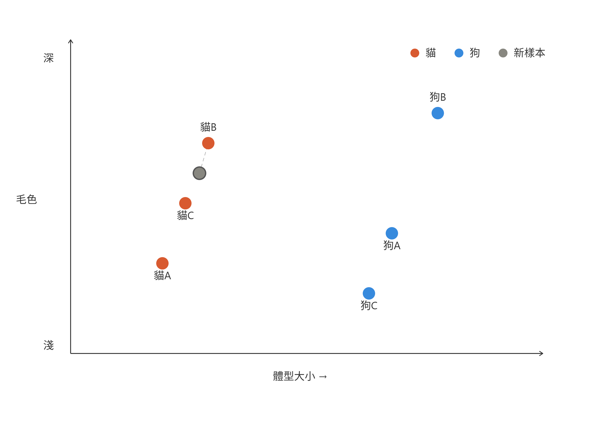
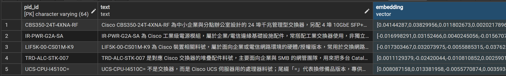

<!-- ═══════════════════════════════════════════════════════════════
     Day 25 寫作導引(寫完後這整塊可刪；HTML 註解不會輸出到文章）
     性質：⑤實作（三部曲第二篇＝實作篇）｜ 階段：實現 ｜ 分級：🟡 進階（工程師線）
     系統：向原廠互動的下單系統（D24–26）｜ 對應疆域座標：規模（組合爆炸）

     🚦 §0 硬門檻（動筆前先確認這兩項有做到）
       ① 主幹問題（一句話）：面對 16 萬組可下單型號，AI 怎麼「自己」把這棵組合樹
          爬完——不用人去手刻每一種料號規則、又不讓 context 爆掉？
       ② 用真實案例回答：兩道技術關卡——（A）先用向量檢索把「跟需求相關的那幾十組」
          從 16 萬組裡撈出來，壓住 token 成本與幻覺；（B）用 CCW GraphQL introspection
          讓 AI 去問出原廠自己的 schema，再自動查 SKU / 配件 / orderable / 即時價。
       ③ 這篇是 D24（人為什麼做不完）的「翻牆」篇——凸顯 LLM 實際做了什麼判斷/生成
          （語意檢索、schema 推理），別讀成純自動化（CLAUDE.md §六.1 類別契合最優先）。

     🔗 承先啟後（依 article-framework Tip 3）
       承前：D24 立起「型號 × 相容 × 折扣的組合爆炸」規模牆 → 本篇把牆翻過去。
       啟後：→ D26「後續實際引用：業務/售前怎麼用它出報價、省下多少時間、人改去做什麼」。

     ⚠️ 待補（作者提供前不要寫死，先定性；佔位字只能待在 HTML 註解裡，不可露到正文——§4 硬規則）
       [ ] introspection 實際查詢片段（去識別化的 GraphQL query／回傳 schema 節選，示意值）
       [ ] 自動查 SKU / 配件 / orderable / 即時價的關鍵流程或程式碼片段（示意）
       [ ] 向量庫規模的去識別化量級（如「事先建了數萬筆型號向量」，只給數量級）
       [ ] 嵌入模型與維度的實際選擇（若要寫死，補上你實際用的模型/維度；否則維持定性）

     🚫 紅線：公司不具名（「某系統整合商」）、不揭露上線日期、數據去識別化
        ⚠️ 本系統專屬紅線：內部 SKU/報價/折扣/專案價明細一律示意值（標「示意」），
           GraphQL introspection 範例用去識別化或公開層級的 schema，不外洩真實客戶/折扣結構。
     🧭 認知鐵則：講「AI 負責什麼（語意撈相關型號、問 schema、驗到可下單與即時價）」可具體；
        講「業務/售前空出手後去做什麼」留白，不替讀者指定終點。
     📝 §3 正向敘事：用「怎麼把牆翻過去」的建構框架，不寫成「原廠文件多爛、我卡多久」的抱怨文。
     ══════════════════════════════════════════════════════════════ -->

# 【向原廠下單系統 ②】實作:用 CCW GraphQL introspection 自己問出 schema + 向量檢索 16 萬組型號

<!-- 前導 TL;DR（前 3–5 行）＝鉤子 + 結論先行。前 200 字把結論講完。
     鉤子:昨天那面「16 萬組型號 × 相容 × 即時價」的組合牆，今天用兩道技術把它翻過去。
     結論:第一道是向量檢索——先從 16 萬組裡撈出「跟這個需求相關」的那幾十組，壓住 token
           成本與幻覺;第二道是 GraphQL introspection——讓 AI 去問出原廠自己的 schema，
           再自動驗 SKU/配件/orderable/即時價。人不用手刻每一種料號規則。 -->

昨天 D24 把最後一面牆立了起來:一張正確的原廠報價單，是**型號 × 相容 × 折扣/即時價**相乘出來的組合爆炸，而 Cisco 可下單的型號超過 **16 萬組**。 人工撐得住單純的場景、但撐不住相乘。

今天這篇有 3 件事，順序不能反——第 1 件是**進場前提**，後 2 件才是真正翻牆的兩道技術:

1. **原廠下單資訊同步**—— 這是沒辦法跨過的坎，你必須要先有原廠可下單的型號組合才能進行開發。
   (這篇是以Cisco 下單系統作為範例，如果你要參考需要替換成自己想做的內容)。
2. **向量檢索**——從 16 萬組PID中，建立規格簡介，並且加入應用場景以及產品定位，組合成判定context，最後製作成 vector (向量資料)，壓住 token 成本、也不讓 LLM 被雜訊淹死。
3. **GraphQL introspection**——讓 AI 去問出原廠 CCW 自己的 schema，再自動查 SKU、配件、能不能下單(orderable)、即時單價，還缺什麼。

原廠資訊同步是進場前提、這篇不展開;先講第一道技術——為什麼不能把 16 萬組型號直接丟給 LLM。

## 為什麼不能把 16 萬組型號「整包丟給 LLM」?

<!-- 節首答案：因為 Token 有成本、context 有上限。16 萬組型號連同規格從頭掃到尾，
     還沒掃到一半就會因為 context 太雜，讓 LLM 開始胡言亂語、亂組型號。 -->

**因為 Token 有成本，context 也有上限。** Cisco 原廠可以下單的型號總共超過 **16 萬組**(比較生動的描述是: 蒐集做成一個 Excel 會超過 8MB)。

不可能每次搜尋都把「所有可下單型號 + 各自規格」從頭掃到尾——這樣光是掃表，還不到一半就會因為 context 太雜，讓 LLM 直接瘋掉(開始胡言亂語、亂組型號規格)。

所以真正的做法是:**先用「相似度」把候選收斂到幾十組，再交給 LLM 細看。** 而「相似度」這件事，正是向量資料庫的主場。

## 向量資料庫是什麼?為什麼它能做「語意相似」?

**向量資料的本質是: 把每個東西變成空間中的一個座標點，相似的東西座標會彼此靠近。**

比較抽象的解釋是，把特徵一個一個編碼成數字，以寵物作為例子:

- `[0, 0.2, 0.8, 0]` (貓、體型中、虎斑、公)
- `[0, 0.1, 0.8, 0]` (貓、體型小、虎斑、公)

這兩個座標幾乎重疊，因為牠們只差在體型。比對兩個向量的**內積(dot product)**，越相似的內容越接近 1——這就是拿來量「兩筆東西有多像」的尺，也是 LLM 語意檢索(semantic retrieval)的本質。

> LLM 實際運作時，會先把語言文字轉成向量數字，再拿去跑各自權重的計算。向量的「長度(維度)」有幾個常見規格:

| 維度 | 定位                     | 代表場景                                   |
| ---- | ------------------------ | ------------------------------------------ |
| 384  | 輕量級                   | 運算資源有限的本地端專案、行動裝置         |
| 768  | 經典黃金比例             | 傳統 BERT 系列與許多開源模型               |
| 1024 | 進階開源                 | 對檢索精準度要求較高的企業應用             |
| 1536 | 目前最普及的商用標準之一 | OpenAI `text-embedding-3-small`、`ada-002` |
| 3072 | 高維度                   | 需要分辨細微語意差異的大型 RAG(檢索增強生成)系統 |

維度有個概念就好，因為把語言轉成向量這一步，本來也是 LLM 在做的工。

## 這套下單系統怎麼用向量?

**具體操作:我在資料庫事先把每一個可下單的型號建好〔型號 ID + 規格資料 + 規格對應的向量〕。** 查詢時，把使用者的需求也轉成向量，去撈語意上最接近的那幾十組候選——而不是把 16 萬組整包丟進 context。

> 具體操作出來就會變成這樣:

到這裡，「規模」這一半的牆已經被壓下來了: LLM 每次只需要看幾十組相關候選，而不是 16 萬組。接下來是第二道——怎麼確認這幾十組**真的能下單、配件相容、價格即時**。

## 用 GraphQL introspection 讓 AI 自己問出原廠 schema

<!-- 節首答案：與其人去讀原廠文件、手刻每一種料號規則，不如用 GraphQL 的 introspection——
     讓程式直接問「你這個 API 有哪些型別、哪些欄位」，AI 拿著 schema 就能自己組查詢。
     ⚠️ 待補：這一節請補上去識別化的 introspection query 片段 + 回傳 schema 節選（示意值）。 -->

<!-- ⚠️ 本節為骨架，待作者補真實(去識別化)材料——請勿讓「待補」字樣出現在正文。
     建議填入：
       1) 一句話定義 introspection：GraphQL 內建能力，可以反過來問 API「你有哪些型別/欄位」。
       2) 去識別化的 introspection query 片段 + 回傳的 schema 節選（示意）。
       3) AI 如何拿著 schema「自己組」出查 SKU/配件的查詢——凸顯這是 LLM 的判斷/生成，
          不是人寫死的規則（呼應 §六.1 類別契合）。 -->

GraphQL 有一個內建能力叫 **introspection**: 你可以反過來問這個 API「你到底有哪些型別、哪些欄位、每個欄位吃什麼參數」。對接原廠 CCW 時，這件事的價值在於——**不必人去逐頁啃文件、再手刻每一種料號規則**，而是讓 AI 拿著 API 自己吐出來的 schema，自己組出要問的查詢。

## 帶走什麼?

<!-- 依 Tip 2：可遷移的帶走重點，每點對回主幹問題。 -->

- **規模牆先用「檢索」壓下來**:16 萬組型號不整包丟給 LLM，先用向量檢索撈出相關的幾十組，省 token、也避免 context 太雜導致幻覺。
- **向量 = 語意的尺**:把資料變成座標點，用內積(dot product)量相似度，就是語意檢索的本質。
- **introspection 讓 AI 自己問 schema**:不用人手刻料號規則，讓程式直接問原廠 API「你有哪些欄位」，AI 拿著 schema 自己組查詢。
- **系列主張 —— 把「窮舉與查證」交給機器**;把「判斷與談判」留給人，業務空出來要做什麼，留白給人自己。

<!-- 收束 + 下一篇鉤子（geo-seo §6 / Tip 3）：
     一句話重述：向量檢索壓規模、introspection 問 schema——兩道技術把 16 萬組的組合牆翻過去。
     啟後鉤子（扣 D26）：牆翻過去之後，真正的問題是「誰在用、省下多少、人改去做什麼」。 -->

牆翻過去了。但一套系統做得出來，不等於它真的被用起來。明天 D26，我講這套下單系統上線後**業務/售前實際怎麼用它出報價、省下多少時間、人被釋放去做了什麼**——這是三部曲最扣主張的一篇。
