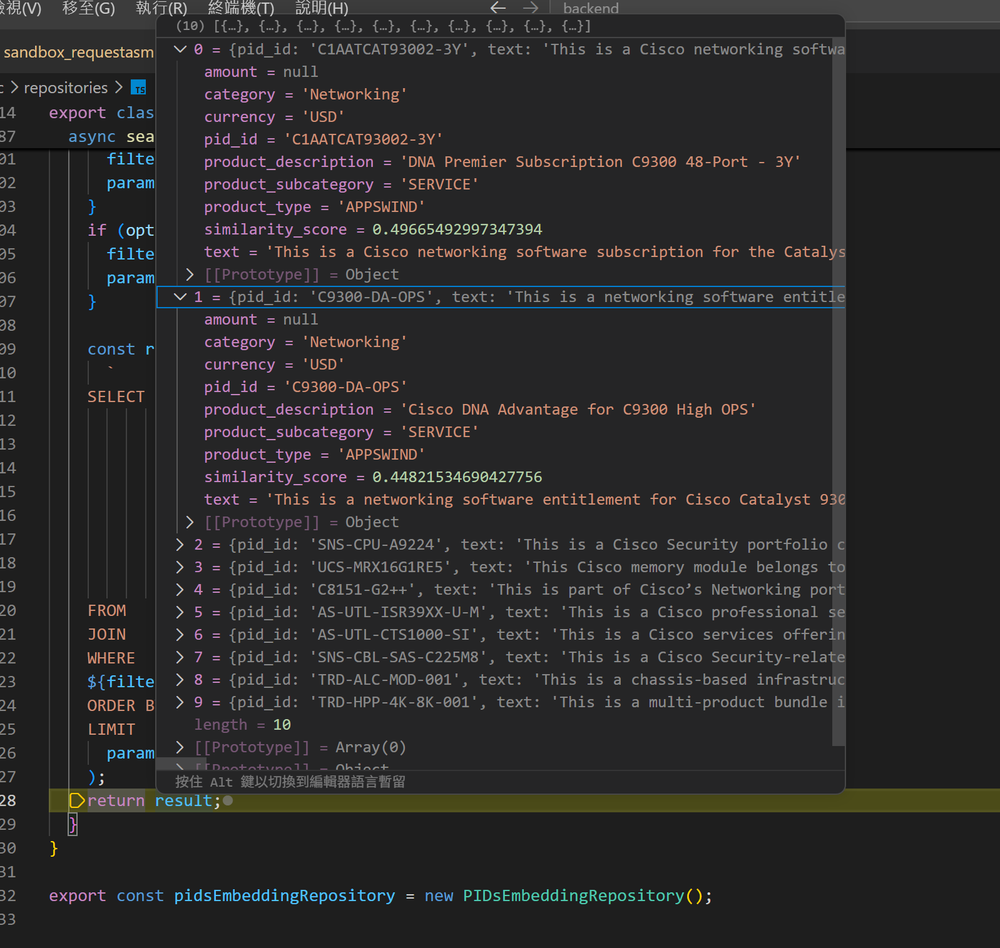

# 【向原廠下單系統 ②】實作:用 CCW GraphQL introspection 自己問出 schema + 向量檢索 16 萬組型號

昨天 [D25](https://ithelp.ithome.com.tw/articles/10405044) 把最後一面牆立了起來:一張正確的原廠報價單，是**型號 × 相容 × 折扣/即時價**相乘出來的組合爆炸，而 Cisco 可下單的型號超過 **16 萬組**。 人工撐得住單純的場景、但撐不住相乘。

今天這篇有 3 件事，順序不能反——第 1 件是**進場前提**，後 2 件才是真正翻牆的兩道技術:

1. **原廠下單資訊同步**—— 這是沒辦法跨過的坎，你必須要先有原廠可下單的型號組合才能進行開發。
   (這篇是以Cisco 下單系統作為範例，如果你要參考需要替換成自己想做的內容)。
2. **向量檢索**——從 16 萬組PID中，建立規格簡介，並且加入應用場景以及產品定位，組合成判定context，最後製作成 vector (向量資料)，壓住 token 成本、也不讓 LLM 被雜訊淹死。
3. **GraphQL introspection**——讓 AI 去問出原廠 CCW 自己的 schema，再自動查 SKU、配件、能不能下單(orderable)、即時單價，還缺什麼。

原廠資訊同步是進場前提、這篇不展開;先講第一道技術——為什麼不能把 16 萬組型號直接丟給 LLM。

## 為什麼不能把 16 萬組型號「整包丟給 LLM」?

**因為 Token 有成本，context 也有上限。** Cisco 原廠可以下單的型號總共超過 **16 萬組**(比較生動的描述是: 蒐集做成一個 Excel 會超過 8MB)。

不可能每次搜尋都把「所有可下單型號 + 各自規格」從頭掃到尾——這樣光是掃表，還不到一半就會因為 context 太雜，讓 LLM 直接瘋掉(開始胡言亂語、亂組型號規格)。

所以真正的做法是:**先用「相似度」把候選收斂到幾十組，再交給 LLM 細看。** 而「相似度」這件事，正是向量資料庫的主場。

## 向量資料庫是什麼?為什麼它能做「語意相似」?

**向量資料的本質是: 把每個東西變成空間中的一個座標點，相似的東西座標會彼此靠近。**

比較抽象的解釋是，把特徵一個一個編碼成數字，以寵物作為例子:

- `[0, 0.2, 0.8, 0]` (貓、體型中、虎斑、公)
- `[0, 0.1, 0.8, 0]` (貓、體型小、虎斑、公)

這兩個座標幾乎重疊，因為牠們只差在體型。比對兩個向量的**內積(dot product)**，越相似的內容越接近 1——這就是拿來量「兩筆東西有多像」的尺，也是 LLM 語意檢索(semantic retrieval)的本質。

> LLM 實際運作時，會先把語言文字轉成向量數字，再拿去跑各自權重的計算。向量的「長度(維度)」有幾個常見規格:

| 維度 | 定位                     | 代表場景                                         |
| ---- | ------------------------ | ------------------------------------------------ |
| 384  | 輕量級                   | 運算資源有限的本地端專案、行動裝置               |
| 768  | 經典黃金比例             | 傳統 BERT 系列與許多開源模型                     |
| 1024 | 進階開源                 | 對檢索精準度要求較高的企業應用                   |
| 1536 | 目前最普及的商用標準之一 | OpenAI `text-embedding-3-small`、`ada-002`       |
| 3072 | 高維度                   | 需要分辨細微語意差異的大型 RAG(檢索增強生成)系統 |

維度有個概念就好，因為把語言轉成向量這一步，本來也是 LLM 在做的工。

## 這套下單系統怎麼用向量?

**具體操作:我在資料庫事先把每一個可下單的型號建好〔型號 ID + 規格資料 + 規格對應的向量〕。** 查詢時，把使用者的需求也轉成向量，去撈語意上最接近的那幾十組候選——而不是把 16 萬組整包丟進 context。

> 具體操作出來就會變成這樣:

所以真正會被傳入LLM的內容就從16萬組資料被縮減到語意最接近的10組了。

> 至於怎麼讓 AI 把需求問清楚、再組出有效的查詢，是前幾篇 [D17](https://ithelp.ithome.com.tw/articles/10403407) 的主題，你需要做成自己的版本。

到這裡，「規模」這一半的牆已經被壓下來了: LLM 每次只需要看幾十組相關候選，而不是 16 萬組。接下來是第二道——怎麼確認這幾十組**真的能下單、配件相容、價格即時**。

## 用 GraphQL introspection 讓 AI 自己問出原廠 schema

接下來的示範因為Cisco原廠的實際下單端點不是公開的，所以我這邊拿其他同樣是GraphQL的端點作為示範。

> ~~讓我舉個栗子~~

> GraphQL 有一個內建能力叫 **introspection**——規格要求相容伺服器都得支援: 你可以反過來問這個 API「有哪些型別、哪些欄位、每個欄位吃什麼參數」。對接原廠 CCW 時，這件事的價值在於——**不必人去逐頁啃文件、再手刻每一種料號規則**，而是讓 AI 拿著 API 自己吐出來的 schema，自己組出要問的查詢。

以下範例是 GitHub API 的 GraphQL端點，然後使用Postman這個工具提供的功能，讓他自己去要求出來的query method跟Request類型。

剩下具體的操作無非就是讓LLM去讀每個端點跟結構的描述，然後讓AI嘗試去組可以達成你要求的query組合，最後定型成你想要的function即可。

> 如果你是一個對於這類原廠資料應用不熟悉的人，這是一個可以很輕鬆寫意完成的開始方式。

說歸說，直接看 AI 實跑一次的樣子，它**自己問結構、自己組出查詢、自己跑完**:

## 這篇帶走什麼?

- **規模牆先用「檢索」壓下來**: 16 萬組型號不整包丟給 LLM，先用向量檢索撈出相關的幾十組，省 token、也避免 context 太雜導致幻覺。
- **向量 = 語意的尺**: 把資料變成座標點，用內積(dot product)量相似度，就是語意檢索的本質。
- **introspection 讓 AI 自己問 schema**: 不用人手刻料號規則，讓程式直接問原廠 API「你有哪些欄位」，AI 拿著 schema 自己組查詢。
- **系列主張 —— 把「窮舉與查證」交給機器**; 把「判斷與談判」留給人，業務空出來要做什麼，留白給人自己。

牆翻過去了。但一套系統做得出來，不等於它真的被用起來。明天 [D27](https://ithelp.ithome.com.tw/articles/10405470)，我講這套下單系統上線後**業務/售前實際怎麼用它出報價、省下多少時間、人被釋放去做了什麼**——這是三部曲最扣主張的一篇。
