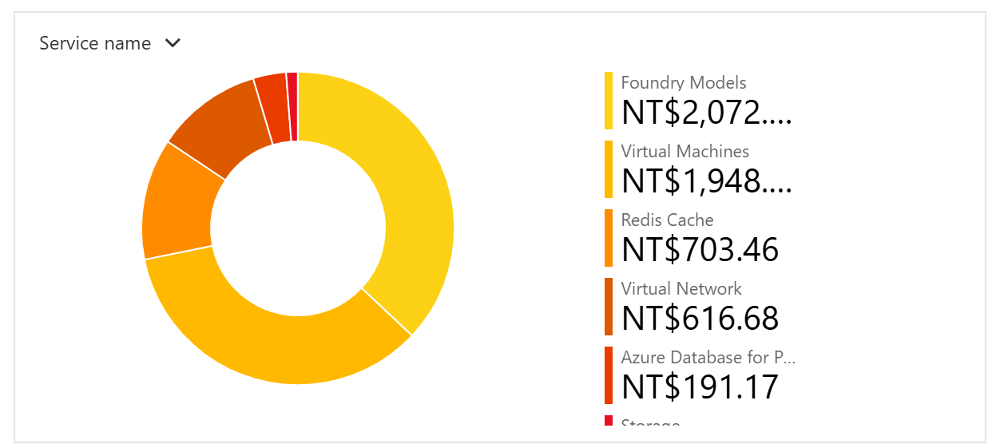
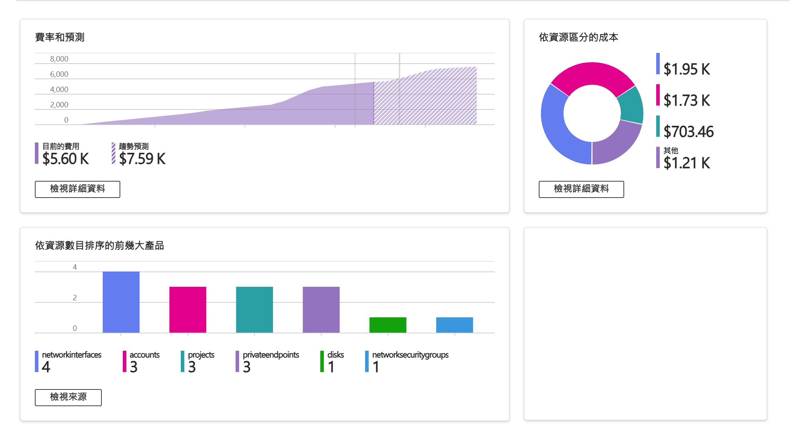

<!-- ═══════════════════════════════════════════════════════════════
     Day 28 寫作導引(寫完後這整塊可刪；HTML 註解不會輸出到文章）
     性質：⑥收尾 ｜ 階段：收尾 ｜ 分級：🟠 資深/管理視角(開發成本/維運決策，無深 code)
     主題：開發這套 AI 到底花多少——開發成本的真實帳 + 上線後怎麼讓它活下去

     ⚠️⚠️ 主軸紅線(作者拍板，務必遵守):
       本篇重點是【開發成本】(建這套系統花了什麼)，【不是營運成本】(每月跑它多少)。
       ・docs/D28 三張 Azure 成本圖 = 開發期間(不同開發月份)的花費，框成「開發成本」，
         【絕對不要】寫成「每月營運帳單 / 上線後每月跑多少 / 生產環境每月」。
       ・因為「營運規模」會被反推出公司實際部署多大 → 有意識避開。全篇不出現:
         每月營運總量、營運規模、效益/省下多少人力的數字、production 每月成本。
       ・只講:開發成本、開發期間累積、單位(每次呼叫/每份任務)花費、人的開發投入。

     🚦 §0 硬門檻
       ① 主幹問題：秀了 27 天，一定有人問——開發這套 AI(三系統)到底花多少?燒得起、值得投入嗎?
       ② 用真實案例回答：開發期間的 Azure 成本圖(docs/D28)——模型呼叫(token)便宜到
          可以放心狂實驗、跟一台開發用 VM 差不多;真正貴的是人花在判斷與運用上的時間，不是 API 帳單。
          再加上線後「怎麼活下去」的四件維運手法。

     🔗 承先啟後
       承前：D14–27 一路做出三套系統。本篇算「開發這些到底花多少」。
             成本的技術面紀錄在 D18(usageRecorder 逐次記 token)，本篇講開發/決策面，不重講技術。
       啟後：→ D29 責任與邊界(AI 角色光譜、權責、部門對立)。

     🧭 認知鐵則：開發成本大頭是「人的判斷與運用」是案例事實，可講具體;不寫成「用 AI 取代人省錢」。
     💰 分工：D18 = 技術上怎麼記 token;本篇 = 開發這套系統的成本結構 + 上線存活。不重複技術。
     ══════════════════════════════════════════════════════════════ -->

# 開發這套 AI 到底花多少錢?——開發成本的真實帳(token 是零頭，貴的是判斷與運用)

<!-- 前導 TL;DR（前 3–5 行）＝鉤子 + 結論先行。
     鉤子：秀了 27 天三套系統，最務實的問題是——開發這些，到底花了多少?燒得起嗎?
     結論：把開發期間的帳單攤開，反直覺的是:模型呼叫(token)便宜到可以放心狂實驗，
           跟一台開發用 VM 差不多、不是帳單裡最大的一塊。開發一套這種系統，真正貴的從來
           不是 API 帳單，是人花在判斷與運用上的時間。 -->

秀了 27 天 AI，~~我人也累了 (笑)~~

最後一定會有人問那個最現實的問題:**開發這些東西——設備分析、CVE 通報、下單報價三套系統——到底花了多少?**

這篇把**開發階段**的帳攤開來算。先講一個跟直覺相反的結論:**大家最怕的「呼叫 LLM 很燒 token」，在開發這件事上根本不是重點**，雖然這點很看開發者平衡計算負擔的功力。

## 先攤開發帳單:建這套系統，token 燒了多少?

<!-- 節首答案：把開發期間的 Azure 成本攤開——模型呼叫(Foundry Models)只是其中一塊，
     跟一台開發用 VM 差不多，不是最大的。
     🚫 這是「開發成本」，不是每月營運帳;alt 與內文都不得寫成營運/生產每月規模。 -->

**先看開發這幾套系統期間、依服務別拆開的雲端花費(去識別化):**

> **「Foundry Models」——也就是模型呼叫(token)的花費——大約 NT$2,072，跟旁邊那台拿來開發的 Virtual Machine(約 NT$1,948)差不多。** 這是我開發這幾套系統的整段過程裡，反覆實驗、重跑、調 prompt 累積下來的所有模型呼叫。

再看另一段開發期間的整體花費:

> 這是另一個開發月份的樣子。

換句話說: **在開發期間是「隨便測、大膽重跑」的情況下，token 燒了跟一台開發機差不多的量。** 對一個要從零把系統做出來的人來說，這個數字的意義是——**你可以放心地失敗、放心地重試。**

## 那真正貴的是什麼?——在判斷系統後續運用的處境

**開發這幾套系統，真正燒掉的不是 API 帳單，是人的時間——而且是花在判斷上的時間。** 回想這一路做過的事:

- 把「事實」和「行文」切開，決定**哪些交給程式算、哪些才交給 LLM**(D20 的設備分析、D23 的 CVE 通報)。
- 設計 analyze 的 4-phase 管線、決定哪一步用多深的思考(D20)。
- 判斷**哪裡根本不該用 AI**——報價的相容比對、CVE 跟自家設備的版本比對，都是無聊但可靠的確定性程式(D17、D23)。
- 一顆 prompt 反覆調到它「只做記者、不當顧問」(D23)。

這些沒有一件是 token 買得到的，全是人坐在那裡想、試、砍掉重來換來的。

**API 呼叫是零頭，服務包裝的判斷才是系統運用真正的成本——也是真正的價值所在。**

這也剛好呼應這系列從頭到尾的主張: 機器接手窮舉與查證，人負責判斷和運用。

## 開發完，上線後怎麼讓它活下去?

**開發完成、成本也算得起，只是能上線;能「活下去」是另一回事。** 一套要天天自己跑的 AI 系統，有四件事不做，遲早半夜出事:

1. **版本追蹤跟效益調整**: 模型部署名走設定檔——不讓底層模型某天悄悄換版。你就算有調好的 prompt，模型的聰明度在未來是有機會被AI公司調整的。

2. **監控**: 每一次 LLM 呼叫都逐筆記下 token 用量(prompt / cached / completion / reasoning)，寫成一行紀錄。**看得到每次花在哪，才控得住**。

3. **成本控制**: cached tokens(重複的 prompt／工具定義命中快取)與差異化 reasoning effort(只有需要深想的步驟才調高檔位)，把「每次呼叫的單價」壓下來;開發時省的是實驗的累積，上線後省的是每次跑的累積。

4. **優雅降級**: 壞一塊，不能拖垮全部。真實系統裡到處是這種設計——用量記錄寫檔失敗只警告、不擋主流程(fire-and-forget);富集資料某一層抓失敗就靜默退回、成品照出;LLM 回空就走 fallback 而不是崩掉。**有一塊壞掉時還能降級續跑，而不是整台停。**

這四件沒有一件是「AI 技術」，全是**把一個 demo 變成一套敢讓它天天自己跑的系統**該有的工。做 demo 誰都會，讓它上線後不用人半夜爬起來救，才是真的。

## 帶走什麼?

- **開發時別怕 token 燒錢**:把它當工具按需呼叫，模型花費跟一台開發機差不多，cached + 差異化 effort 還能再壓——便宜到你該放心大膽實驗。
- **開發成本的大頭不是 API**:調 prompt、切事實/行文、判斷哪裡不用 AI、事後改進與調教——這些人花的判斷時間，才是真正的價值。
- **看得到才控得住**:每次呼叫逐筆記 token，帳才是「記的」不是「估的」——這是開發階段就應該要有的紀律。
- **demo 誰都會，敢放出去在公司讓它天天自己跑才難**:上線後不用人半夜救，靠的是這些不性感的維運工。

開發這套 AI 的帳算清了: token 是零頭，便宜到你可以放心把系統做出來;真正貴的是人花在判斷與運用上的時間——而那，正是這件事值得投入的地方。加上版本追蹤、監控、降級，它撐得住天天自己跑。

但還有一件事，是錢和技術都解決不了的:**當 AI 真的接手了一部分工作、甚至開始吃掉某些舊流程，「出事了誰負責」「哪些決定絕不能交給它」「舊團隊會不會覺得被架空」——這些責任與邊界的問題，才是導入 AI 最後、也最難的一關。** 明天 D29，把這條線劃清楚。
